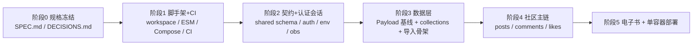

## 需求来源

用户希望在空目录 `c:\Users\User\Documents\studyplan-rebuild-test` 中**新建项目**的方式重建 StudyPlan，并交付两件事：

1. **检视 `PROJECT-ANALYSIS.md` 方案的可行性** —— 该文档 §7 给出的是面向存量仓库的"绞杀式迁移"8 步流程，需要裁定哪些保留、哪些重排、哪些在新建语境下失效、新增哪些风险。
2. **把它收敛成一条"初次开发流程"** —— 面向空目录、分阶段、每阶段有明确产出物与可执行验收判据。

## 已确认范围

| 维度 | 决定 |
| --- | --- |
| 复用策略 | 代码完全从零重写，仅参考文档与旧仓库；30 篇电子书 Markdown 作为内容资产从 `studyplan-v2.0\apps\web\content` 复制（该假设需显式标注、可推翻） |
| 第一批范围 | ① 脚手架 + CI 闸门 ② 契约与认证会话闭环 ③ 社区主链（帖子列表/详情/发布、评论、点赞）④ 电子书 `/ebook` |
| 数据策略 | 空库起步，同时定义 id 映射表结构与导入脚本骨架，真实数据迁移留作后续批次 |
| 交付标准 | 本地全链路可跑 + 产出单容器部署配置与 smoke 验证，不要求真实上线 |


## 产品概述

重建后的 StudyPlan 是一个学习/技术分享社区全栈应用：用户注册登录后可发布、浏览、评论、点赞技术帖子，并在线阅读一本内置的学习路线电子书。第一批只交付"身份 + 社区主链 + 电子书"这条最小闭环。

## 核心功能（第一批）

- **账号与会话**：注册、登录、刷新页面后自动恢复会话、Access Token 过期时静默续期并重放原请求一次、退出登录彻底失效
- **帖子**：分页与标签筛选的列表、Markdown 正文详情与 SEO、登录用户发布帖子
- **评论**：查看、发表、删除（作者本人），带乐观插入与失败回滚，帖子评论数原子增减
- **点赞**：点赞/取消点赞，唯一约束保证幂等，计数原子增减，刷新后恢复"我是否点赞"
- **电子书**：`/ebook` 路由下 30 篇中文 Markdown 全部可达，含目录导航与上一篇/下一篇
- **工程机制**：统一响应/错误包络、共享运行时契约 schema、环境校验 fail-fast、结构化脱敏日志、CI 发布闸门、单容器部署产物

## 第一批明确不做

GitHub 趋势与仓库详情、AI 简介/AI 助手、每日推荐与 cron、pgvector 向量检索、Meilisearch、路线进度与面试题、帖子编辑/删除 UI、个人主页、旧 Mongo 数据导入的真实执行。

## 一、技术栈（沿用目标态选型，版本对齐 v2.0 已落地/PoC 已验证的组合）

| 层 | 选型 | 版本 | 依据 |
| --- | --- | --- | --- |
| 运行时 | Node.js | 24（本机实测 v24.18.1），engines ≥22.19 | Nuxt 4 依赖要求 |
| 包管理 | pnpm workspace | 11.20.0（corepack 锁定） | v2.0 `packageManager` |
| 语言 | TypeScript | 5.9.3，全仓库统一 **ESM**（`"type": "module"` + `module: NodeNext`） | 消除 v2.0 的 ESM/CJS 冲突 P0 |
| 前端 | Nuxt 4 / Vue 3 / Nuxt UI / Pinia / Tailwind 4 | 4.5.2 / 3.5.42 / 4.11.x / 4.0.3 / 4.3.3 | v2.0 `apps/web` |
| 内容 | @nuxt/content + better-sqlite3 | **3.16.1 / 12.4.1** | PoC `poc/p19-docs` 实测组合，v2.0 未声明是 P0 根因 |
| 后端 | Express 4 薄转接 + Payload 3 Local API | 4.22.3 / 3.90.2 + `@payloadcms/db-postgres` 3.90.2 | 文档目标态 |
| 逃生舱 | drizzle-orm | 0.45.2 | 仅用于 Payload 表达不了的原子计数与 JSONB 标签查询 |
| 校验/限流/日志 | zod 4.6.5 / rate-limiter-flexible 11.2.1 / pino 9.14.0 | — | 文档目标态 |
| 数据库 | PostgreSQL 16 + pgvector（`pgvector/pgvector:pg16`） | — | 首批不接向量检索，但镜像一次到位 |
| 测试 | Jest 30.5.1 + ts-jest（`maxWorkers: 1` on win32）、`node --test` 契约测试、Playwright 1.63.0 | — | v2.0 提交 `5b5ba7a`/`5ce3ab0` 实证 Windows 写竞争 |
| 部署 | Vercel Container Runtime 单容器 | node:24-alpine，`Dockerfile.vercel` + `entrypoint.mjs` | 沿用 v2.0 模式，去掉 VitePress 分流 |


**不引入**（v2.0 遗留）：NestJS 全家桶、Mongoose/MongoDB、Passport/jsonwebtoken/bcryptjs、class-validator/class-transformer、VitePress、`@huggingface/transformers`。

## 二、可行性检视：对文档 §7.2 八步的逐条裁定

| 原步骤 | 裁定 | 理由 |
| --- | --- | --- |
| 1 冻结契约与基线（含恢复 CI） | **保留，前置为阶段 0/1** | 契约冻结在任何语境下都必要；其中"记录旧轨接口样例"降级为"把 v2.0 当只读行为规格" |
| 2 让新轨成为真实可构建产物 | **并入阶段 1 脚手架** | 新建项目可直接统一 ESM，v2.0 的"`type: module` vs CJS 编译目标"冲突自然消失；`server.mts` 不在 tsconfig 内的问题由统一构建配置根除 |
| 3 补认证和通用响应 | **保留，作为阶段 2** | 仍是最难且最该先做的部分；文档 §3.2 的 7 条断链有 5 条集中在这里 |
| 4 落地 PostgreSQL migrations | **保留，降为阶段 3** | 无历史包袱：Payload 基线即唯一来源，PoC DDL 与 Payload 在 tags/vector/auth 字段上的冲突整类消失；仅需处理 tags JSONB 查询与首批索引 |
| 5 预迁移并影子对拍 | **删除** | 没有旧轨可供对拍，也没有 Mongo 快照 |
| 6 绞杀式按域切流 | **删除，改为"按域增量交付"** | 没有可绞杀的 Nest 模块；且顺序需倒置——先交付社区主链与内容，GitHub/AI/每日推荐留作后续批次 |
| 7 短只读窗口最终切换 | **删除** | 空库一次性上线，不存在双写窗口与回滚边界问题 |
| 8 收口部署和文档 | **提前到阶段 5（第一批内交付）** | 用户明确要求第一批就产出单容器配置与 smoke |


### 新增的三条（原流程没有，新建语境下必须补）

- **N1 规格先行 + 决策日志**：从零重写失去了"已知缺口"这份信息，必须把文档 §4.6 不变量与 §5 实现剖析**翻译成可执行的验收标准**（`docs/SPEC.md`）并记录关键取舍（`docs/DECISIONS.md`），否则取舍会退化为口头约定。
- **N2 浏览器级回归**：阶段 2 完成判据必须是浏览器实测"注册 → 登录 → 发布 → 刷新恢复 → 401 续期 → 重放 → 退出"，而不是服务端 curl 通过。
- **N3 Windows 原生构建验证**：`better-sqlite3` 必须在 Windows + Node 24 上先跑通，再进 Alpine 镜像（两段都需放行原生构建）。

### 与文档 §7.1 的分歧（必须正面记录）

文档 §7.1 明确"**不建议推倒重来**"，理由是会从"已知缺口"变成"未知缺口"、丢失已验证的并发语义与迁移约束。用户选择了相反路径。**该判断在本项目上部分成立**：新建确实丢掉了 v2.0 里已被验证的 likes 幂等语义、observability 脱敏设计、OID→UUID 映射思路。

**补偿机制（写进流程，不是口号）**：

1. v2.0 全程**只读**，作为行为规格引用源（不复制代码，但复制其语义约定）；
2. 每阶段**先写测试再写实现**：契约测试 → 迁移测试 → 并发测试，分别对应文档 §7.4；
3. 阶段 0 先把 §4.6 六条不变量写成验收条目，后续每个阶段逐条勾选；
4. 内容资产（30 篇 Markdown）作为不可再生资产复用，避免重写一本书。

### 诚实给出的新增风险

- **工作量**：v2.0 产品源码 25,143 行；第一批覆盖的域虽少，仍属 8k–10k 行量级，不能按"小项目"排期。
- **无对拍基线**：新系统行为回归只能靠自写测试，测试覆盖不足即等于没有回归网。
- **Payload 3 Token scheme**：Payload 侧期望 `Authorization: JWT`，前端习惯 `Bearer`。必须在 Express 侧一次性归一化并写进契约测试，而不是两端各猜一次。
- **版本组合未在本机实测**：`@nuxt/content@3.16.1` + `better-sqlite3@12.4.1` 在 Windows/Node 24 上的原生构建是阶段 5 的头号阻塞点，应尽早做一次 spike。

## 三、收敛后的初次开发流程（6 个阶段）



### 阶段 0 — 规格冻结（无业务代码）

- **产出**：`docs/SPEC.md`（success/error 包络、AuthResult、Token scheme、refresh/logout 语义、错误码表、id 兼容规则、§4.6 六条不变量的验收条目）、`docs/DECISIONS.md`
- **验收**：前后端后续所有类型/schema 都能追溯到 SPEC 条目；SPEC 中每条不变量都对应一个可执行的验收方式

### 阶段 1 — 脚手架 + CI 闸门

- **产出**：`pnpm-workspace.yaml`、根 `package.json`（`build:shared && pnpm -r` 编排）、`apps/api`、`apps/web`、`packages/shared`、`docker-compose.yml`（pgvector/pgvector:pg16 + healthcheck）、`.github/workflows/ci.yml`
- **验收**：`pnpm install` 成功（allowBuilds 放行 esbuild/better-sqlite3）；`pnpm typecheck`、`pnpm build`、`pnpm test` 在空壳状态下全绿；`docker compose up` 后 PG 健康且可从宿主连接

### 阶段 2 — 契约 + 认证会话闭环（最难，先做）

- **产出**：`packages/shared` 的 **zod 运行时 schema**（不只是 TS 类型）；`apps/api/src/routes/context.ts`（`ok/fail/unwrap`）、`auth.ts`（register/login/refresh/logout/me）、`currentUser()`（scheme 归一化）、`env.ts`（Zod 校验 + 生产禁止默认值 + fail-fast）、`observability/`（pino 结构化脱敏 + OTel 可选，失效不阻断启动）
- **验收**：契约测试（同一套用例对成功/错误/认证三种包络断言）通过；浏览器实测 注册 → 登录 → 刷新恢复 → 401 → 仅重放一次 → 退出后 Cookie 与内存态均失效；`PAYLOAD_SECRET` 缺失时生产启动直接退出

### 阶段 3 — 数据层

- **产出**：`payload.config.ts`、首批 collections（`users`/`posts`/`comments`/`likes`/`id-migrations` 映射表骨架）、Payload 基线 migration、migration 验证脚本、`scripts/import-skeleton.mjs`（dry-run + skipped-rows 台账结构）
- **验收**：空库跑全量 migration → 结构校验（索引/FK/唯一性/认证登录）→ 重复执行幂等 → 导入脚本 dry-run 成功且台账可落盘；生产启动**禁止**自动 push schema

### 阶段 4 — 社区主链

- **产出**：`routes/posts.ts`、`comments.ts`、`likes.ts` + Drizzle 原子计数逃生舱（有注释、有测试）、Zod `.strict()` 校验、`useApi/useAuth/useAccessToken`、Pinia `stores/post.ts`（乐观插入与回滚）、页面与组件
- **验收**：单测 + 契约测试 + 并发测试（重复 PUT、并发 DELETE）通过；浏览器走通 列表分页/标签筛选 → 详情 → 发布 → 评论/删除 → 点赞/取消 → 刷新后 liked 状态恢复

### 阶段 5 — 电子书 + 单容器部署

- **产出**：`apps/web/content`（30 篇 md，从 v2.0 复制）、`content.config.ts`、`/ebook` 列表与 `[...slug]` 页、Nuxt server 同源代理 `/api` → :3000（消除 CORS 整类问题）、`Dockerfile.vercel` + `docker/vercel/entrypoint.mjs`（`/api/**` → Express+Payload，其余 → Nuxt，含 `/ebook`）
- **验收**：本地 30 篇全部 200 且站内资源可达；`docker build` 成功；容器 `:80` smoke：`/api/health`、`/`、`/ebook/<slug>` 均 200

## 四、目标目录结构

```
studyplan-rebuild-test/
├── PROJECT-ANALYSIS.md              # [KEEP] 只读输入
├── docs/
│   ├── SPEC.md                      # [NEW] 契约规格与验收条目（阶段0）
│   └── DECISIONS.md                 # [NEW] 决策日志：Token scheme、包络、同源代理、镜像选择
├── pnpm-workspace.yaml              # [NEW] apps/* + packages/*，allowBuilds 放行 esbuild/better-sqlite3
├── package.json                     # [NEW] packageManager pnpm@11.20.0；engines node>=22.19；编排 build:shared→typecheck→build→test
├── docker-compose.yml               # [NEW] pgvector/pgvector:pg16（目标态，不留 Mongo）
├── Dockerfile.vercel                # [NEW] 多阶段：deps→build→prod-deps→runtime；node:24-alpine
├── vercel.json                      # [NEW] 单 service + rewrites；cron 本批次不注册
├── .github/workflows/ci.yml         # [NEW] install→typecheck→build→jest→契约测试→迁移验证→冷启动smoke
├── packages/shared/
│   ├── package.json                 # [NEW] 叶子依赖；exports 同时给类型与 zod schema
│   └── src/
│       ├── schemas/                 # [NEW] 运行时契约 schema（成功/错误/认证/帖子/评论/点赞）
│       └── types/                   # [NEW] 由 schema 推导的类型
├── apps/api/
│   ├── package.json                 # [NEW] type:module；payload 3.90.2 / express 4 / zod 4 / pino 9 / drizzle 0.45.2；Jest（win32 maxWorkers=1）
│   └── src/
│       ├── server.mts               # [NEW] 装配顺序：trust proxy → 观测 → request span → JSON → getPayload() → 路由
│       ├── env.ts                   # [NEW] Zod 环境变量校验，生产无默认值、启动 fail-fast
│       ├── payload.config.ts        # [NEW] db-postgres adapter + collections
│       ├── collections/             # [NEW] 首批 5 个（users/posts/comments/likes/id-migrations）
│       ├── routes/                  # [NEW] context.ts（ok/fail/currentUser）、auth.ts、posts.ts、comments.ts、likes.ts
│       ├── db/                      # [NEW] Drizzle 逃生舱：原子计数、JSONB 标签查询（有注释有测试）
│       └── observability/           # [NEW] pino 脱敏 logger + OTel（失效可降级，不阻断启动）
├── apps/web/
│   ├── package.json                 # [NEW] nuxt 4.5.2 / vue 3.5.42 / @nuxt/ui 4.11 / pinia 4 / markdown-it 15
│   │                                #       显式声明 @nuxt/content 3.16.1 + better-sqlite3 12.4.1（v2.0 的 P0 根因）
│   ├── nuxt.config.ts               # [NEW] SSR 开启；server 代理 /api → :3000（同源，杜绝 CORS）
│   ├── content/                     # [COPY] 30 篇 Markdown（design/ exercises/ guide/ stages/）
│   ├── content.config.ts            # [NEW] Nuxt Content 集合定义
│   ├── app/
│   │   ├── composables/             # [NEW] useApi / useAuth / useAccessToken（Token 仅内存 + HttpOnly Cookie）
│   │   ├── stores/post.ts           # [NEW] 帖子/评论/点赞数据边界与乐观更新
│   │   ├── pages/                   # [NEW] index / login / posts(list,new,[id]) / ebook(index,[...slug])
│   │   └── middleware/auth.ts       # [NEW] 仅做体验跳转，安全判定一律在 API
│   └── server/routes/sitemap.xml.ts # [NEW] 数据源失败时仍返回静态 URL
└── docker/vercel/entrypoint.mjs     # [NEW] :80 分流；/api/** → API 子进程，其余 → Nuxt；CMD 用 node 绝对路径
```

## 五、关键代码结构

跨前后端的核心契约必须是**运行时 schema**（v2.0 的教训是"shared 类型不会自动约束服务端响应"）：

```ts
// packages/shared/src/schemas/api.ts —— 成功/错误/认证三态的唯一事实来源
export const ErrorBodySchema = z.object({
  statusCode: z.number().int(),
  code: z.string(),            // 机器可读：BAD_REQUEST / UNAUTHORIZED / NOT_FOUND ...
  message: z.string(),         // 可直接展示的中文提示
  requestId: z.string(),
  timestamp: z.string(),
  details: z.array(z.string()).optional(),
});

export const SuccessBodySchema = <T extends z.ZodType>(data: T) =>
  z.object({ statusCode: z.number().int(), data, requestId: z.string(), timestamp: z.string() });

// 认证响应：v2.0 断链点是实际产出 {data:{user,token}} 而前端期望 {user,tokens:{...}}
export const AuthResultSchema = z.object({
  user: PublicUserSchema,
  tokens: z.object({ accessToken: z.string(), expiresIn: z.number().int() }),
});

export type ApiSuccess<T> = { statusCode: number; data: T; requestId: string; timestamp: string };
export type ApiError = z.infer<typeof ErrorBodySchema>;
export type AuthResult = z.infer<typeof AuthResultSchema>;
```

```ts
// apps/api/src/routes/context.ts —— 路由层唯一出口，禁止成长成第二个 service 层
function ok<T>(res: Response, status: number, data: T): void        // 严格产出 SuccessBody
function fail(res: Response, status: number, code: string, message?: string, details?: string[]): void
function currentUser(req: Request): Promise<PayloadUser | null>      // 归一化 Authorization scheme，身份只来自令牌
```

## 六、实现要点（防回归）

- **装配顺序是硬约束**：`trust proxy` → 观测初始化 → request span → JSON 解析 → `getPayload()` → 业务路由。反序会导致所有用户被识别为同一边缘节点，或解析失败请求丢失 request id。
- **同源优先于 CORS**：本地 dev 走 Nuxt server 代理，`NUXT_PUBLIC_API_BASE` 用相对路径 `/api`，从根上消除 v2.0 的跨端口 CORS P0；生产同域同理。
- **禁止裸 `console.*`**：所有错误经结构化脱敏 logger，只记错误码与安全字段，不回显 SQL/堆栈给客户端。
- **计数必须原子**：`UPDATE ... SET like_count = GREATEST(0, like_count + delta)`；互动记录与派生计数仍为两步写，第一批先提供对账查询与修复命令，不假装强一致。
- **限流如实标注**：`RateLimiterMemory` 是单进程语义，第一批保留但必须在代码与文档中写明"不提供跨实例配额"，不提前引 Redis。
- **Windows 特例**：Jest 在 win32 上 `maxWorkers: 1`（v2.0 已实证转译缓存写竞争）；`better-sqlite3` 需先本地验证再进 Alpine。
- **YAGNI**：第一批不接 Meilisearch、不建向量索引、不做帖子编辑/删除 UI、不注册 cron。

## 七、第一批不做（显式边界）

GitHub 趋势/仓库详情/AI 简介、AI 学习助手、每日推荐与 Vercel Cron、pgvector 检索与 HNSW、Meilisearch、路线进度与面试题、帖子编辑/删除 UI、个人主页、`apps/docs` VitePress 独立站与三份内容副本、真实 Mongo 数据导入（仅留骨架）、多实例全局限流。

## 应用类型

Web（桌面优先，移动端响应式适配）。技术载体为 Nuxt 4 + Vue 3 + Tailwind CSS 4；组件层使用 Nuxt UI 4.11（项目既定选型，基于 Tailwind 与无头组件原语，非本计划所列三家库之一，故 component 属性留空）。

## 设计风格

现代简约 + 轻量玻璃拟态的"技术学习社区"气质：大量留白、克制的圆角与阴影、主色用于强调与行动召唤、深色模式一等公民。避免花哨装饰，让 Markdown 内容与代码可读性成为主角。

## 页面规划（5 屏）

1. **首页**：品牌区 + 核心数据概览 + 最新帖子流 + 电子书入口卡片
2. **帖子列表**：搜索/标签筛选 + 分页卡片流 + 侧边热门标签
3. **帖子详情**：标题元信息 + Markdown 正文 + 点赞/评论区（乐观交互）
4. **登录/注册**：单卡片、邮箱+密码、字段级错误提示
5. **电子书阅读**：左侧目录树 + 正文 + 上一篇/下一篇

## 通用区块

- **顶部导航**（全站一致）：Logo、主导航、搜索入口、深浅色切换、登录态头像菜单
- **页脚**（全站一致）：站点链接、电子书入口、版权
- **反馈层**：Toast 提示与加载骨架屏，错误降级为可读中文提示

## 交互与响应式

卡片 hover 抬升与边框高亮；点赞按钮状态微动效；页面切换淡入；目录滚动跟随高亮。桌面三栏、平板两栏、移动单栏 + 抽屉式导航。

## Agent Extensions

### Skill

- **superpowers-writing-plans**
- Purpose：把"可行性检视 + 六阶段初次开发流程"落成可执行的书面计划，明确每阶段产出文件与验收判据
- Expected outcome：产出用户可确认、后续可逐阶段执行的计划文档结构
- **superpowers-test-driven-development**
- Purpose：阶段 2/3/4 先写契约测试、迁移测试与并发测试，再写实现代码
- Expected outcome：弥补"从零重写失去旧轨对拍基线"的回归缺口，让 §4.6 不变量变成可执行断言
- **superpowers-verification-before-completion**
- Purpose：每个阶段收尾时实际运行 typecheck/build/test/docker smoke 并核对输出，再宣布该阶段完成
- Expected outcome：避免"以为通过"——全部完成判定以真实命令输出为证据

### SubAgent

- **code-explorer**
- Purpose：在只读模式下从 `c:\Users\User\Documents\studyplan-v2.0` 提取行为规格（likes 幂等语义、observability 脱敏设计、`/ebook` PoC 配置、entrypoint 分流规则）
- Expected outcome：把 v2.0 中已验证的取舍转成阶段 0 的 SPEC 条目，而不是复制其代码