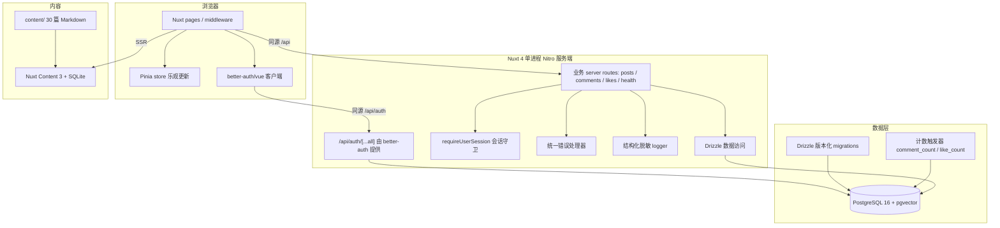
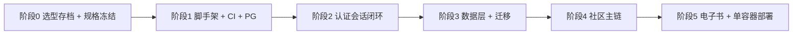

## 产品概述

在空目录 `c:\Users\User\Documents\studyplan-rebuild-test` 中，以**新建项目**的方式重建 StudyPlan：一个学习与技术分享社区，用户注册登录后可发布、浏览、评论、点赞技术帖子，并在线阅读一本内置的学习路线电子书。

本次交付两件事：

1. **检视 `PROJECT-ANALYSIS.md` 方案的可行性** —— 该文档 §7 给出的是面向存量仓库的「绞杀式迁移」8 步流程，需裁定哪些保留、哪些重排、哪些在新建语境下失效；同时需裁定**文档目标态技术栈本身**是否仍然成立。
2. **把它收敛成一条「初次开发流程」** —— 面向空目录，分阶段，每阶段有明确产出物与可执行验收判据。

## 核心原则（用户明确提出的选型号召）

> agent 自写的代码在后续调试与 debug 上效率低于复用现成项目；成熟项目会随 GitHub 推送持续更新维护。**优先选择成熟且持续维护的现成方案，而非自研。**

因此评估标尺是**全生命周期成本（开发 + 调试 + 长期维护）**，不是「第一批开发工作量」。落地方式：**每一层都用成熟方案，只有业务逻辑自研**。

## 第一批范围（四项全选）

- **脚手架 + CI 闸门**：pnpm/Node 约定、统一 ESM、PG + pgvector 本地编排、typecheck/build/test 发布闸门
- **契约与认证会话闭环**：共享运行时 schema、统一错误包络、register/login/session/logout、会话持久化、生产 env fail-fast
- **社区主链**：帖子列表（分页 + 标签筛选）、详情页（Markdown 正文 + SEO）、发布、评论（查看/发表/删除）、点赞（点赞/取消）
- **电子书 `/ebook`**：30 篇中文 Markdown 全部可达，含目录导航与上一篇/下一篇

## 已确认约束

| 维度 | 决定 |
| --- | --- |
| 复用策略 | 代码完全从零重写，不复制 v2.0 代码；**30 篇电子书 Markdown 作为内容资产**（内容非代码）从 `studyplan-v2.0\apps\web\content` 复制。此假设显式标注，可推翻 |
| 技术栈 | Nuxt 4 单进程全栈 + better-auth + Drizzle + PostgreSQL 16/pgvector + Nuxt Content |
| ORM | Drizzle |
| 数据策略 | 空库起步，同时定义 id 映射表结构与导入脚本骨架，真实数据迁移留作后续批次 |
| 部署约束 | **坚持单容器**：`docker build` 出单镜像、单端口对外（Vercel Container Runtime 模式） |
| 交付标准 | 本地全链路可跑 + 单容器部署配置与 smoke，不要求真实上线 |


## 第一批明确不做

GitHub 趋势与仓库详情、AI 简介/AI 助手、每日推荐与 Vercel Cron、pgvector 向量检索与 HNSW、Meilisearch、路线进度与面试题、帖子编辑/删除 UI、个人主页、VitePress 独立站与三份内容副本、真实 Mongo 数据导入（仅留骨架）、多实例全局限流、admin 后台。

## 一、可行性检视

### 1.1 对文档 §7.2 八步流程的逐条裁定

| 原步骤 | 裁定 | 理由 |
| --- | --- | --- |
| 1 冻结契约与基线（含恢复 CI） | **保留，前置为阶段 0/1** | 契约冻结在任何语境下都必要；「记录旧轨接口样例」降级为「把 v2.0 当只读行为规格引用源」 |
| 2 让新轨成为真实可构建产物 | **整条删除** | 单进程 Nuxt 应用不存在「两个构建产物」；v2.0 的 `type: module` vs CJS 编译目标冲突、`server.mts` 不在 tsconfig 内等问题一起消失 |
| 3 补认证和通用响应 | **保留，但形态改变** | 不再自研 register/login/refresh/logout/Token scheme/401 重放，改为「better-auth 配置 + 共享 zod 契约 + 统一错误处理器」 |
| 4 落地 PostgreSQL migrations | **保留，降为阶段 3** | 无历史包袱：Drizzle schema 即唯一来源；PoC DDL 与 Payload 在 tags/vector/auth 字段上的冲突整类消失 |
| 5 预迁移并影子对拍 | **删除** | 没有旧轨可对拍，也没有 Mongo 快照 |
| 6 绞杀式按域切流 | **删除，改为「按域增量交付」** | 无可绞杀的 Nest 模块；顺序倒置——先交付社区主链与内容，GitHub/AI/每日推荐留作后续批次 |
| 7 短只读窗口最终切换 | **删除** | 空库一次性上线，不存在双写窗口与回滚边界 |
| 8 收口部署和文档 | **提前到阶段 5（第一批内交付）** | 用户明确要求第一批就产出单容器配置与 smoke |


### 1.2 对技术栈本身的裁定：目标态 Express + Payload 被替换

文档目标态是「Nuxt SSR + Express 薄转接 + Payload 3 Local API + PostgreSQL」。经 2026-10-09 GitHub 实测，本方案**替换掉 Express 与 Payload 两层**，理由如下。

**Payload 3（45,150★ / MIT / 2026-10-08）被替换的两个理由：**

1. **它是 Next.js-native，不是框架中立的。** 官方自我定位是 "the open-source, fullstack **Next.js** framework"、"first-ever Next.js native CMS"；v4 canary 把最低 Next.js 版本提到 16.4。用 Nuxt 当前端时只能走 standalone/Express 路线——**那是次路径，社区能搜到的答案少得多**，与「优先成熟方案以获得社区支持」的诉求直接相悖。
2. **v4 已在 canary 且近乎每日发布**（canary.37 = 09-24、canary.38 = 10-07、canary.39 = 10-08），最新稳定版仍是 v3.90.2（09-23）。此刻上 v3 意味着不久就要面对一次 v4 大版本迁移。

**低代码平台整类被排除（三轮调研，全部 2026-10-09 实测）：**

| 项目 | Stars | 许可 | 最后推送 | 排除理由 |
| --- | --- | --- | --- | --- |
| supabase/supabase | 111,236 | Apache-2.0 | 2026-10-08 | 自托管是多容器 compose（2026-08 起 envoy 为默认网关）→ **与单容器约束冲突** |
| appwrite/appwrite | 57,597 | BSD-3-Clause | 2026-10-08 | **后端数据库是 MariaDB** → 与 PG/pgvector 冲突 |
| pocketbase/pocketbase | 61,334 | MIT | 2026-10-08 | SQLite only → 与 PG/pgvector 冲突 |
| nocodb/nocodb | 65,214 | NOASSERTION | 2026-10-08 | Airtable 替代（表格数据库），出不了 C 端 SEO 页面 |
| directus/directus | 38,294 | NOASSERTION | 2026-10-08 | v12 起许可改为 **MSCL**（Monospace Sustainable Core License），无许可自建跑受限社区模式 |
| nocobase/nocobase | 24,492 | **NocoBase License Agreement** | 2026-10-08 | 见下 |
| refinedev/refine | 35,798 | MIT | **2026-09-10** | **React** 框架，与 Vue/Nuxt 冲突 |
| baidu/amis | 18,896 | Apache-2.0 | **2026-03-18** | React 实现 + JSON schema，与 Nuxt/Vue 不搭，7 个月未更新 |
| Budibase / Teable | 28,331 / 21,869 | NOASSERTION | 2026-10-08 | 内部工具/电子表格，自带前端，与 Nuxt SSR 抢路由 |


**核心发现：这是品类错配，不是选型问题。** 低代码工具的主流品类是「内部工具 / admin panel / 表单 / 表格」，而 StudyPlan 是「面向公众的 C 端内容社区」——要 SSR/SEO、Markdown 电子书、乐观更新等自定义交互。两者重叠只有 CRUD，而 CRUD 恰恰是本项目最简单的部分。

**NocoBase 专项（用户举例项，虽非选择但需记录）：** 服务端实测为 **Koa 3 + @koa/router + 自研 `@nocobase/database`（Sequelize 系）**，既非 NestJS 也非 Express。许可为「NocoBase License Agreement（2026-02-24 更新）」= Apache-2.0 + 补充条款，**5.2 禁止移除/更改界面上的品牌与许可信息**（除左上角主 LOGO），**5.4 禁止基于它向公众提供任何形式的 no-code/low-code/AI 平台 SaaS/PaaS**，SPDX 为 NOASSERTION。其认证走 `auth:signIn` + `X-Authenticator` 头，改造为「HttpOnly Cookie + 会话」需写认证器插件，难度高于直接写中间件；官方系统要求「源码/插件开发建议预留 4GB 以上空闲内存」。

### 1.3 与文档 §7.1 的分歧（正面记录）

文档 §7.1 明确「**不建议推倒重来**」，担心从「已知缺口」变成「未知缺口」、丢失已验证的并发语义与迁移约束。用户选择了相反路径。**该判断部分成立**：新建确实丢掉了 v2.0 已被验证的 likes 幂等语义、observability 脱敏设计、OID→UUID 映射思路。

**补偿机制（写进流程，不是口号）：**

1. v2.0 全程**只读**，作为行为规格引用源（不复制代码，但复制其语义约定）；
2. 每阶段**先写测试再写实现**：契约测试 → 迁移测试 → 并发测试（对应文档 §7.4）；
3. 阶段 0 先把 §4.6 六条不变量翻译成验收条目，后续每阶段逐条勾选；
4. 内容资产（30 篇 Markdown）作为不可再生资产复用；
5. **每一层横切关注点都用成熟方案**（本次新增，直击用户对调试成本的关切）。

### 1.4 文档 §3.2 七条断链在新架构下的处置

| 断链 | 处置 |
| --- | --- |
| 1 响应包络不一致 | 单进程无跨进程包络；server routes 与前端仍用共享 zod schema 双向校验 |
| 2 认证响应不一致（实际 `{data:{user,token}}` vs 期望 `{user,tokens:{...}}`） | **better-auth 接管，消失** |
| 3 Token scheme 未统一（Bearer vs JWT） | **better-auth 用 session cookie，消失** |
| 4 Refresh/Logout 缺失 | **better-auth 内置，消失** |
| 5 错误体不一致 | 由 Nitro 统一错误处理器收敛 |
| 6 默认浏览器开发链缺 CORS | **单进程同源，整类消失** |
| 7 数据 id 迁移 | **保留**——id 映射表骨架延至第一批 |


## 二、修正后的技术栈（每层都是成熟方案，只有业务逻辑自研）

| 层 | 成熟方案 | 版本 | 规模 / 许可 / 最后推送 | 自研量 |
| --- | --- | --- | --- | --- |
| 运行时 | Node.js | 24（本机实测 v24.18.1） | — | 0 |
| 包管理 | pnpm | 11.20.0（corepack 锁定） | — | 0 |
| 语言 | TypeScript | 5.9.3，全仓 ESM | — | 0 |
| 全栈框架 | **Nuxt 4 + Nitro**（server routes 即后端） | 4.5.2 / vue 3.5.42 | 官方 / MIT | 0 |
| **认证会话** | **better-auth** | **1.7.7** | **30,220★ / MIT / 2026-10-08** | **0（配置即完成）** |
| ORM + 迁移 | **Drizzle ORM + drizzle-kit** | 0.45.2 | 35,979★ / Apache-2.0 / 2026-10-08 | 0（schema + migration） |
| 数据库 | PostgreSQL 16 + pgvector（`pgvector/pgvector:pg16`） | — | — | 0 |
| 内容 | **@nuxt/content + better-sqlite3** | **3.16.1 / 12.4.1** | 官方 / MIT（PoC `poc/p19-docs` 已验证组合） | 0 |
| UI | Nuxt UI + Tailwind 4 + Pinia | 4.11 / 4.3.3 / 4.0.3 | 官方 / MIT | 0 |
| 校验 | zod | 4.6.5 | 成熟 / MIT | 0 |
| 测试 | Vitest + @nuxt/test-utils + Playwright | — / 1.63.0 | 官方 / MIT | 0 |
| 部署 | Vercel Container Runtime 单容器 | node:24-alpine | — | 0 |
| **业务逻辑** | 帖子 / 评论 / 点赞服务层与页面 | — | — | **必须自研（这就是产品本身）** |


**不引入**：NestJS 全家桶、Express、Payload、Mongoose/MongoDB、Passport/jsonwebtoken/bcryptjs、class-validator、VitePress、Prisma、`@huggingface/transformers`、任何低代码平台。

## 三、架构设计



**依赖方向严格单向**：页面只经 store / authClient 访问 API；server routes 负责校验、会话守卫、所有权判断与错误归一；认证原语、密码哈希、会话存储全部由 better-auth 接管；Drizzle 只做数据访问；计数一致性由 PostgreSQL 触发器保证。

**关键简化**：不再有 Express 进程、不再有 entrypoint 分流、不再有跨进程契约、不再有 CORS、不再有 `packages/shared` workspace 包（Nuxt 4 的 `shared/` 目录即可前后端共享）。

## 四、关键技术决策

### 4.1 计数一致性：PostgreSQL 触发器

帖子 `comment_count` / `like_count` 由**数据库触发器**在 comments / likes 行插入或删除时原子增减。

- 选中理由：服务层只写一条互动记录，计数由数据库在同一事务内保证，**从根上消除文档 P1「两步写导致计数漂移」**；触发器是 PostgreSQL 内置成熟机制，不是自研逻辑。
- 代价：测试必须进真实数据库（因此迁移测试站要在 CI 中起 PG）。
- 配套：提供 `scripts/reconcile-counters.mjs` 对账与修复命令；`like_count` 增减用 `GREATEST(0, ...)` 兜底。
- 备选（若触发器在 Windows 本地链路出问题）：降级为列表/详情直接 `COUNT(*)` 子查询，永远正确，数据量上千后再优化。

### 4.2 better-auth 与 Drizzle 的集成

better-auth 自带 user / session / account / verification 表结构，通过 drizzle adapter 接入；业务表（posts / comments / likes）的外键引用 better-auth 的 user 表。**官方示例 `leamsigc/nuxt-better-auth-drizzle` 即为该组合，直接参照其 schema 组织方式。**

### 4.3 better-auth 的 SSR cookie 转发（前端硬约束）

官方文档明确：`authClient` 的 action 在 SSR 下**默认不转发 cookie**，会返回未登录。处理办法：

- 会话读取用 `authClient.useSession(useFetch)`（已内置转发）；
- 其他 action 在 SSR 下需包 `<ClientOnly>` / `import.meta.client`，或自建 `useAuth()` composable 用 `useRequestHeaders(['cookie'])` 转发。

### 4.4 better-sqlite3 原生构建

Windows 本地 + Alpine 镜像两处都必须放行原生构建：pnpm `onlyBuiltDependencies: [esbuild, better-sqlite3]`，Alpine 需 `python3 make g++`。**阶段 1 必须先做一次 spike 验证**，避免拖到阶段 5 才暴露。

### 4.5 单容器部署简化

不再需要 `entrypoint.mjs` 做双进程分流，Dockerfile 简化为「构建 Nuxt 产物 → 运行 `.output/server/index.mjs`」。**但 `CMD` 必须保留 node 绝对路径 `/usr/local/bin/node`**（v2.0 已实证：平台注入的证书包装脚本不保留 PATH，会导致 `exec: not found` 且日志无任何输出）。

## 五、收敛后的初次开发流程（6 个阶段）



### 阶段 0 — 选型存档与规格冻结（无业务代码）

- **产出**：`docs/TECH-SELECTION.md`（三轮调研数据与被排除方案的理由）、`docs/SPEC.md`（success/error 包络、PublicUser、帖子/评论/点赞契约、错误码表、id 兼容规则、**§4.6 六条不变量的可执行验收条目**）、`docs/DECISIONS.md`
- **验收**：后续所有 zod schema 都能追溯到 SPEC 条目；SPEC 每条不变量都对应一个可执行的验收方式（测试或命令）

### 阶段 1 — 脚手架 + CI 闸门

- **产出**：`package.json`（`packageManager: pnpm@11.20.0`、`engines.node >= 22.19`）、`nuxt.config.ts`、`tsconfig.json`、`docker-compose.yml`（仅 `pgvector/pgvector:pg16` + healthcheck）、`.github/workflows/ci.yml`、eslint + prettier
- **含 spike**：`@nuxt/content@3.16.1` + `better-sqlite3@12.4.1` 在 Windows + Node 24 上的原生构建
- **验收**：`pnpm install` 成功；`pnpm typecheck` / `pnpm build` / `pnpm test` 在空壳状态下全绿；`docker compose up` 后 PG 健康且可从宿主连接；CI 在本地可复现同样的命令序列

### 阶段 2 — 认证会话闭环

- **产出**：`server/utils/auth.ts`（better-auth 实例 + drizzle adapter）、`server/api/auth/[...all].ts`（catch-all）、`lib/auth-client.ts`（`better-auth/vue`）、`app/composables/useAuth.ts`（SSR cookie 转发）、`app/middleware/auth.ts`、登录/注册页、`server/utils/session.ts`（`requireUserSession`）、`server/utils/errors.ts`（统一错误体）、`server/utils/logger.ts`、Zod env 校验（生产禁止默认值 + fail-fast）
- **验收**：契约测试通过；浏览器实测 注册 → 登录 → 刷新后会话恢复 → 退出后 Cookie 与前端状态均失效 → 未登录访问受保护路由返回 401；生产缺 `DATABASE_URL` / `BETTER_AUTH_SECRET` 时启动直接退出

### 阶段 3 — 数据层与迁移

- **产出**：`server/db/schema.ts`（better-auth 四表 + posts / comments / likes / id_migrations）、`drizzle.config.ts`、生成并落盘 migrations、`scripts/migrate-verify.mjs`（空库跑全量 → 结构校验 → 重复执行幂等）、`scripts/reconcile-counters.mjs`、`scripts/import-skeleton.mjs`（dry-run + skipped-rows 台账结构）
- **验收**：空库跑全量 migration → 索引/FK/唯一性/触发器校验通过 → 重复执行幂等 → 导入脚本 dry-run 成功且台账可落盘；**生产启动禁止自动 push schema**

### 阶段 4 — 社区主链

- **产出**：`server/api/posts/*`、`server/api/comments/*`、`server/api/posts/[id]/like.*`、`server/api/health.get.ts`；`shared/schemas/*` 的 zod 契约；`app/stores/post.ts`（乐观插入与失败回滚）；首页、帖子列表、帖子详情、发帖页
- **验收**：单测 + 契约测试 + 并发测试（重复 PUT 幂等、并发 DELETE 不产生负计数）通过；浏览器走通 列表分页/标签筛选 → 详情 → 发布 → 评论/删除 → 点赞/取消 → **刷新后 liked 状态与计数恢复**

### 阶段 5 — 电子书与单容器部署

- **产出**：`content/`（30 篇 md，从 v2.0 复制）、`content.config.ts`、`/ebook` 列表页与 `[...slug]` 详情页、`server/routes/sitemap.xml.ts`、`Dockerfile.vercel`、`vercel.json`
- **验收**：本地 30 篇全部 200 且站内资源可达；`docker build` 成功；容器 `:80` smoke：`/api/health`、`/`、`/ebook/<slug>` 均 200

## 六、目录结构（单包单应用，不设 pnpm workspace）

```
studyplan-rebuild-test/
├── PROJECT-ANALYSIS.md              # [KEEP] 只读输入
├── docs/
│   ├── TECH-SELECTION.md            # [NEW] 三轮选型调研数据与被排除方案理由（阶段0）
│   ├── SPEC.md                      # [NEW] 契约规格与 §4.6 六条不变量的可执行验收条目（阶段0）
│   └── DECISIONS.md                 # [NEW] 决策日志：技术栈替换、计数方案、单包化、镜像选择
├── package.json                     # [NEW] packageManager pnpm@11.20.0；engines node>=22.19
│                                    #       onlyBuiltDependencies: [esbuild, better-sqlite3]
├── nuxt.config.ts                   # [NEW] SSR 开启；modules: @nuxt/content / @nuxt/ui / @pinia/nuxt
├── content.config.ts                # [NEW] Nuxt Content 集合定义（/ebook 前缀）
├── drizzle.config.ts                # [NEW] drizzle-kit 配置，指向 server/db/schema.ts
├── tsconfig.json                    # [NEW] 全 ESM，moduleResolution: bundler
├── docker-compose.yml               # [NEW] 仅 pgvector/pgvector:pg16 + healthcheck（不留 Mongo）
├── Dockerfile.vercel                # [NEW] 简化为 deps → build → runtime；node:24-alpine
├── vercel.json                      # [NEW] 单 service + rewrites；本批次不注册 cron
├── .github/workflows/ci.yml         # [NEW] install→typecheck→build→vitest→迁移验证→冷启动smoke
├── content/                         # [COPY] 30 篇 Markdown（design/ exercises/ guide/ stages/）
├── shared/
│   ├── schemas/                     # [NEW] zod 运行时契约（成功/错误/帖子/评论/点赞/用户）
│   └── types/                       # [NEW] 由 schema 推导的类型
├── lib/
│   └── auth-client.ts               # [NEW] better-auth/vue 客户端，导出 useSession/signIn/signUp/signOut
├── server/
│   ├── api/
│   │   ├── auth/[...all].ts         # [NEW] better-auth catch-all handler
│   │   ├── health.get.ts            # [NEW] 健康检查（探活 DB）
│   │   ├── posts/index.get.ts        # [NEW] 列表：分页 + 标签筛选
│   │   ├── posts/index.post.ts       # [NEW] 发布（会话守卫 + zod strict）
│   │   ├── posts/[id].get.ts         # [NEW] 详情（非法 id → 404）
│   │   ├── posts/[id]/comments.get.ts    # [NEW] 评论列表
│   │   ├── posts/[id]/comments.post.ts   # [NEW] 发表评论
│   │   ├── posts/[id]/like.put.ts    # [NEW] 点赞（幂等）
│   │   ├── posts/[id]/like.delete.ts # [NEW] 取消点赞（幂等）
│   │   └── comments/[id].delete.ts  # [NEW] 删除评论（仅作者）
│   ├── db/
│   │   ├── schema.ts                # [NEW] better-auth 四表 + posts/comments/likes/id_migrations
│   │   ├── index.ts                 # [NEW] Drizzle 客户端（连接池单例）
│   │   └── migrations/              # [NEW] drizzle-kit 生成的版本化迁移 + 计数触发器
│   ├── utils/
│   │   ├── auth.ts                  # [NEW] better-auth 实例（drizzle adapter + emailAndPassword）
│   │   ├── session.ts               # [NEW] requireUserSession：身份只来自已验证会话
│   │   ├── errors.ts                # [NEW] 统一错误体 + 错误码表
│   │   └── logger.ts                # [NEW] 结构化脱敏 logger，禁止裸 console.*
│   └── routes/sitemap.xml.ts        # [NEW] 数据源失败时仍返回静态 URL
├── app/
│   ├── app.vue                      # [NEW] 全局壳层：导航、页脚、Toast
│   ├── assets/css/index.css         # [NEW] Tailwind 4 + 主题 CSS 变量
│   ├── composables/useAuth.ts       # [NEW] SSR cookie 转发的 authClient（阶段2关键约束）
│   ├── stores/post.ts               # [NEW] 帖子/评论/点赞数据边界与乐观更新
│   ├── middleware/auth.ts           # [NEW] 仅做体验跳转，安全判定一律在服务端
│   ├── components/                  # [NEW] AppHeader/AppFooter/PostCard/TagFilter/CommentList/LikeButton/EbookToc
│   └── pages/
│       ├── index.vue                # [NEW] 首页
│       ├── login.vue                # [NEW] 登录/注册单卡片
│       ├── posts/index.vue          # [NEW] 帖子列表
│       ├── posts/new.vue            # [NEW] 发布
│       ├── posts/[id].vue           # [NEW] 详情（SEO + 点赞 + 评论）
│       └── ebook/                   # [NEW] index.vue + [...slug].vue
├── scripts/
│   ├── migrate-verify.mjs           # [NEW] 空库迁移 + 结构校验 + 幂等验证
│   ├── reconcile-counters.mjs       # [NEW] 计数对账与修复
│   └── import-skeleton.mjs          # [NEW] 导入骨架（dry-run + skipped-rows 台账）
└── tests/
    ├── contract/                    # [NEW] 契约测试（包络 / 错误体 / 认证）
    ├── db/                          # [NEW] 迁移测试与触发器测试
    └── e2e/                         # [NEW] Playwright 关键流程
```

## 七、关键代码结构

```ts
// server/utils/auth.ts —— better-auth 服务端实例（认证原语全部交给成熟库）
import { betterAuth } from 'better-auth'
import { drizzleAdapter } from 'better-auth/adapters/drizzle'
import { db } from '../db'

export const auth = betterAuth({
  database: drizzleAdapter(db, { provider: 'pg' }),
  emailAndPassword: { enabled: true },
  // session 走 HttpOnly cookie，前端不持有 token
})
```

```ts
// server/api/auth/[...all].ts —— 一个 catch-all 挂载全部认证端点
import { auth } from '../../utils/auth'

export default defineEventHandler((event) => auth.handler(toWebRequest(event)))
```

```ts
// lib/auth-client.ts —— Vue 专用客户端，useSession 返回 Vue ref
import { createAuthClient } from 'better-auth/vue'

export const authClient = createAuthClient()
export const { signIn, signUp, signOut, useSession } = authClient
```

```ts
// shared/schemas/api.ts —— 成功/错误/业务契约的唯一事实来源（运行时 schema，不只是类型）
export const ErrorBodySchema = z.object({
  statusCode: z.number().int(),
  code: z.string(),           // BAD_REQUEST / UNAUTHORIZED / NOT_FOUND / CONFLICT ...
  message: z.string(),        // 可直接展示的中文提示
  requestId: z.string(),
  timestamp: z.string(),
  details: z.array(z.string()).optional(),
})

export const PublicUserSchema = z.object({
  id: z.string(),
  username: z.string(),
  displayName: z.string(),
  createdAt: z.string(),
})

export const LikeResultSchema = z.object({ liked: z.boolean(), likeCount: z.number().int() })
```

```ts
// server/utils/session.ts —— 路由层唯一身份入口
export async function requireUserSession(event: H3Event) {
  const session = await auth.api.getSession({ headers: event.headers })
  if (!session?.user) {
    throw createError({ statusCode: 401, statusMessage: 'UNAUTHORIZED' })
  }
  return session.user   // 身份只来自已验证会话，绝不读 body/query 的用户字段
}
```

```sql
-- server/db/migrations/xxxx_counters.sql —— 计数由数据库触发器原子维护
CREATE OR REPLACE FUNCTION bump_post_comment_count() RETURNS trigger AS $$
BEGIN
  IF TG_OP = 'INSERT' THEN
    UPDATE posts SET comment_count = comment_count + 1 WHERE id = NEW.post_id;
  ELSIF TG_OP = 'DELETE' THEN
    UPDATE posts SET comment_count = GREATEST(0, comment_count - 1) WHERE id = OLD.post_id;
  END IF;
  RETURN NULL;
END;
$$ LANGUAGE plpgsql;

CREATE TRIGGER trg_comment_count
AFTER INSERT OR DELETE ON comments
FOR EACH ROW EXECUTE FUNCTION bump_post_comment_count();
-- like_count 同构，且 likes 表带 (post_id, user_id) 复合唯一索引保证幂等
```

## 八、实现要点（防回归）

- **同源是架构属性，不是配置项**：单进程 Nitro 下 `/api` 与页面同域，v2.0 的跨端口 CORS P0 整类消失。不要再引入任何跨源配置。
- **身份只来自会话**：`requireUserSession()` 是唯一入口；发帖/评论/删除一律不读 body 中的 author/user 字段。请求体用 zod `.strict()`，客户端传入 `authorId` 或 `role` 会被拒绝。
- **禁止裸 `console.*`**：所有错误经 `server/utils/logger.ts`，只记错误码与安全字段，不向客户端回显 SQL 或堆栈。
- **计数不手写两步更新**：写入互动表即可，计数由触发器维护；提供对账命令而非假装强一致。
- **限流如实标注**：第一批若需限流，`RateLimiterMemory` 是单进程语义，必须在代码与文档中写明「不提供跨实例配额」，不提前引 Redis。
- **Windows 特例**：`better-sqlite3` 需先本地验证再进 Alpine；测试运行器若出现转译缓存写竞争，参考 v2.0 提交 `5ce3ab0`/`5b5ba7a` 的经验（单进程/串行执行）。
- **YAGNI**：第一批不接 Meilisearch、不建向量索引、不做帖子编辑/删除 UI、不注册 cron、不做 admin 后台。
- **生产入口、本地 compose、默认 dev 脚本必须指向同一架构**（文档 §4.6 不变量），三者任一偏离即视为该阶段未通过。

## 应用类型

Web（桌面优先，移动端响应式适配）。技术载体为 Nuxt 4 + Vue 3.5 + Tailwind CSS 4；组件层使用 **Nuxt UI 4.11**（Nuxt 官方组件库，基于 Tailwind 与无头组件原语），不属于 mui / shadcn / tdesign 三家，故 component 属性留空。图标统一使用 `lucide-vue-next`。

## 设计风格

现代简约 + 轻量玻璃拟态的「技术学习社区」气质。大量留白、克制的圆角与阴影、主色只用于强调与行动召唤、深色模式为一等公民。避免花哨装饰，让 Markdown 正文与代码块的可读性成为主角。玻璃质感仅用于顶部导航与卡片悬浮层，不铺满页面。

## 页面规划（5 屏）

1. **首页**：品牌区（渐变标题 + 一句话定位）→ 核心数据概览（帖子数 / 用户数 / 电子书章节数）→ 最新帖子流 → 电子书入口卡片
2. **帖子列表**：顶部搜索与标签筛选 → 分页卡片流 → 侧边热门标签云
3. **帖子详情**：标题与作者元信息 → Markdown 正文（代码高亮）→ 点赞按钮 → 评论区（乐观插入）
4. **登录 / 注册**：单卡片，邮箱 + 密码，字段级错误提示，支持深浅色
5. **电子书阅读**：左侧目录树（滚动跟随高亮）→ Markdown 正文 → 底部上一篇/下一篇

## 通用区块

- **顶部导航栏**（全站一致，固定定位）：Logo、主导航（首页 / 帖子 / 电子书）、搜索入口、深浅色切换、登录态头像下拉菜单
- **页脚**（全站一致）：站点链接、电子书入口、版权
- **反馈层**：Toast 提示与加载骨架屏，错误降级为可读中文提示

## 交互与响应式

卡片 hover 抬升并高亮边框；点赞按钮状态切换微动效；页面切换淡入；目录滚动跟随高亮。桌面三栏、平板两栏、移动单栏 + 抽屉式导航。导航栏固定定位，主内容区用 `pt-[导航栏高度]` 留出空间。

## 布局约束

强制使用 flex 布局系统；导航栏固定定位；所有可点击元素使用 `button` 标签而非 div；表单输入使用 `input` 标签；按交互状态设置 `cursor` 与 hover / active / focus 样式。

## Agent Extensions

### Skill

- **reuse-first-flow**
- Purpose：在动手写任何新代码前，先在本仓库、v2.0 与成熟开源方案中检索可复用项，避免自研已有成熟实现
- Expected outcome：每一层横切关注点（认证、ORM、内容、UI、校验、测试）都落到成熟方案，自研代码只保留业务逻辑

- **superpowers-test-driven-development**
- Purpose：阶段 2/3/4 先写契约测试、迁移测试与并发测试，再写实现代码
- Expected outcome：弥补「从零重写失去旧轨对拍基线」的回归缺口，让 §4.6 六条不变量变成可执行断言

- **superpowers-verification-before-completion**
- Purpose：每个阶段收尾时实际运行 typecheck / build / test / docker smoke 并核对输出，再宣布该阶段完成
- Expected outcome：避免「以为通过」——全部完成判定以真实命令输出为证据

- **superpowers-writing-plans**
- Purpose：把「可行性检视 + 六阶段初次开发流程」落成可执行的书面计划，明确每阶段产出文件与验收判据
- Expected outcome：产出用户可确认、后续可逐阶段执行的计划文档结构

### SubAgent

- **code-explorer**
- Purpose：在只读模式下从 `c:\Users\User\Documents\studyplan-v2.0` 提取行为规格（likes 幂等语义、observability 脱敏设计、`/ebook` PoC 配置、计数与并发约定）
- Expected outcome：把 v2.0 已验证的取舍转成阶段 0 的 SPEC 条目，而不是复制其代码