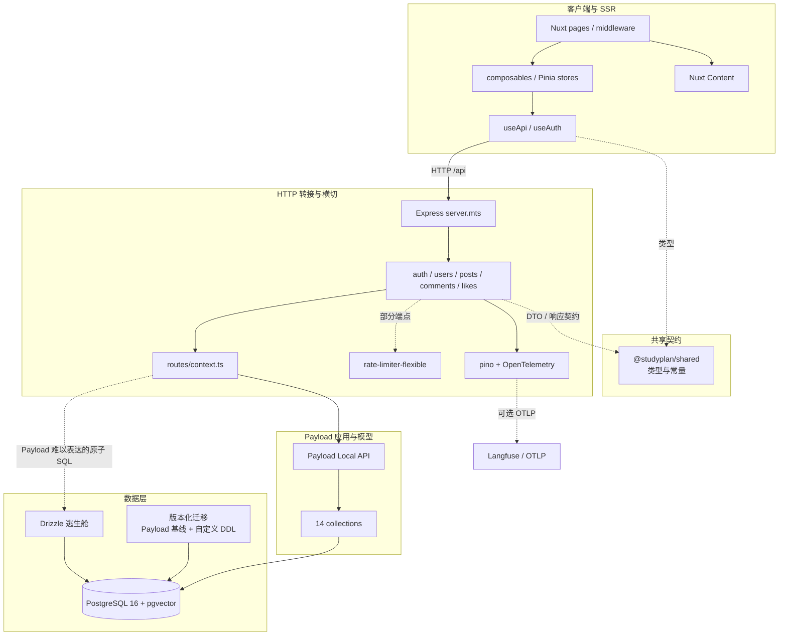
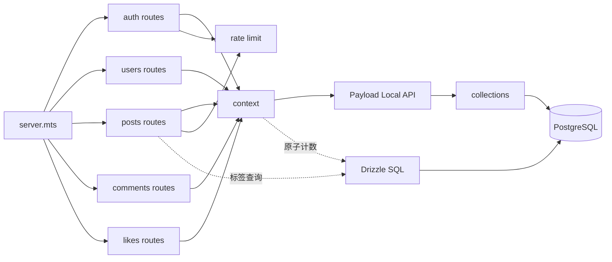
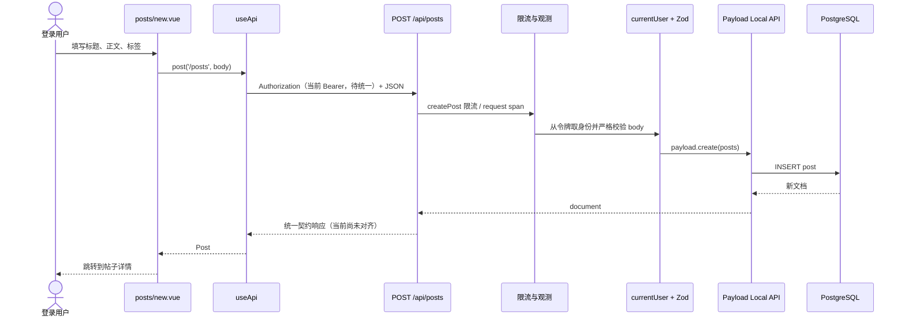
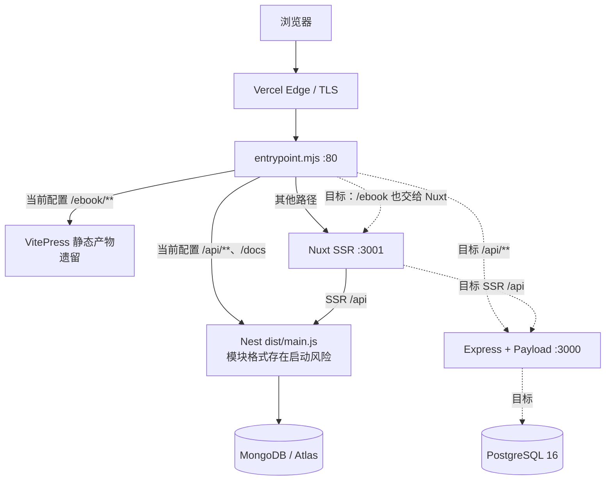
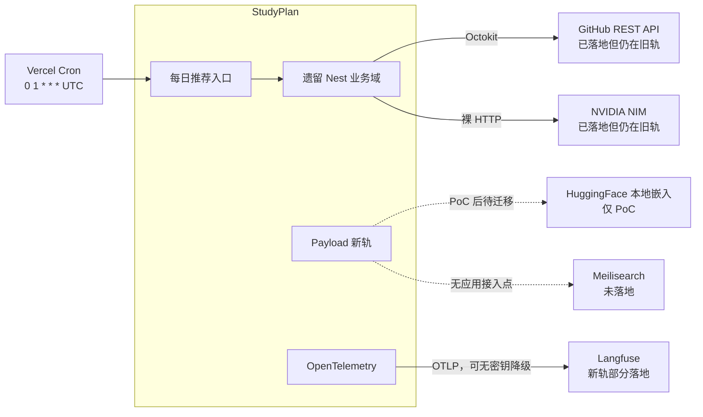

# StudyPlan 项目全景分析

> 审计日期：2026-10-08  
> 主视角：重构目标态；凡目标设计尚未落地，均显式标为“迁移中”或“未落地”。  
> 边界：本文只审计和归纳，不删除、移动或改写仓库既有资料。

## 1. 项目概览

**一句话定位：** StudyPlan 是一个把学习路线、电子书、技术社区、GitHub 趋势发现与 AI 辅助学习整合在一起的全栈学习平台。

仓库采用 pnpm workspace，目标架构是 **Nuxt 4 SSR 前端 + Express 薄转接层 + Payload 3 Local API + PostgreSQL 16**；但当前仍处于迁移期，NestJS/Mongoose/MongoDB 与 VitePress 旧轨代码、配置和部署链尚未全部退出。

### 1.1 规模

产品源码口径仅包含 `apps/api/src`、`apps/web/app`、`apps/web/server`、`packages/shared/src`。测试源码计入；文档、PoC、脚本、锁文件、依赖与构建产物不计入。

| 范围 | 文件数 | 物理行 | 非空行 | 物理行占比 |
|---|---:|---:|---:|---:|
| `apps/api/src` | 120 | 17,036 | 15,207 | 67.76% |
| `apps/web/app` | 43 | 6,850 | 6,217 | 27.24% |
| `packages/shared/src` | 15 | 1,169 | 1,070 | 4.65% |
| `apps/web/server` | 1 | 88 | 80 | 0.35% |
| **合计** | **179** | **25,143** | **22,574** | **100%** |

按文件扩展名统计语言占比：

| 语言 | 扩展名 | 文件数 | 物理行 | 物理行占比 |
|---|---|---:|---:|---:|
| TypeScript | `.ts`、`.mts` | 151 | 19,803 | 78.76% |
| Vue SFC | `.vue` | 27 | 4,519 | 17.97% |
| CSS | `.css` | 1 | 821 | 3.27% |
| **合计** |  | **179** | **25,143** | **100%** |

单列、不并入产品源码占比的内容资产：`apps/web/content` 是目标规范源，共 30 个 Markdown 文件、11,793 个物理行；当前生产仍使用 `apps/docs`，`poc/p19-docs/content` 另含 PoC 副本，因此统计时只计目标规范源一次。`poc/`、`scripts/`、`deploy/` 也不并入产品源码。

### 1.2 模块数口径

“模块数”没有单一自然定义，本文按部署包、业务域和页面分别计数：

| 口径 | 数量 | 定义与证据 |
|---|---:|---|
| Workspace 包 | 4 | `apps/api`、`apps/web`、`apps/docs`、`packages/shared`；见 `pnpm-workspace.yaml` |
| 目标态 API 路由域 | 5 | auth、users、posts、comments、likes；由 `apps/api/src/server.mts` 注册 |
| Payload collections | 14 | 用户、帖子、评论、点赞、AI 用量/缓存、向量、趋势缓存、仓库快照/简介、每日推荐/排除、路线进度、面试题；见 `apps/api/src/collections/index.ts` |
| 遗留 Nest 业务域 | 9 | `apps/api/src/modules` 下 9 个目录；其中 8 个 Module 类，health 是独立 Controller |
| 前端页面 | 10 | `apps/web/app/pages` 下由文件路由生成的页面 |
| 共享契约域 | 8 | `packages/shared/src/types` 下 ai、api、comment、daily-digest、github、post、roadmap、user |

### 1.3 可复现统计口径

```powershell
$roots = 'apps/api/src','apps/web/app','apps/web/server','packages/shared/src'
$files = Get-ChildItem -Recurse -File -Path $roots |
  Where-Object { $_.Extension -in '.ts','.mts','.vue','.css' }

$files | ForEach-Object {
  $lines = [System.IO.File]::ReadAllLines($_.FullName)
  [pscustomobject]@{
    Extension = $_.Extension
    Physical  = $lines.Length
    NonBlank  = ($lines | Where-Object { -not [string]::IsNullOrWhiteSpace($_) }).Count
  }
} | Group-Object Extension
```

排除规则：`node_modules`、`apps/api/dist`、`apps/web/.nuxt`、`apps/web/.output`、锁文件和其他生成物；`poc/` 整体单列；三份同源电子书只把 `apps/web/content` 作为规范源统计。统计命令于 2026-10-08 在当前工作树实际执行。

## 2. 技术栈总览

状态定义：**目标态**表示最终选型；**已落地**表示仓库实现已存在，不等同于当前容器已使用；**迁移中**表示新旧轨并存、依赖/契约或部署未收口；**未落地**表示只有设计/PoC；**遗留**表示仍在仓库但不应继续扩展。涉及运行态时另行区分“默认开发入口”和“当前容器配置”。

| 类别 | 目标栈 | 状态 | 代码证据与判断 |
|---|---|---|---|
| 语言与运行时 | TypeScript 5.9、Node.js 22.19+、pnpm 11.20 | 已落地 | 根 `engines` 写 ≥22，当前 Nuxt 依赖实际要求 22.19+；生产镜像使用 Node 24 |
| 仓库组织 | pnpm workspace monorepo | 已落地 | `pnpm-workspace.yaml` 覆盖 `apps/*`、`packages/*`；共享构建由根脚本编排 |
| Web 框架 | Nuxt 4.5、Vue 3.5、Nuxt UI 4.11、Pinia 4 | 已落地 | `apps/web/package.json`、`apps/web/nuxt.config.ts`；SSR 保持开启 |
| 内容系统 | Nuxt Content，电子书并入 `/ebook` | 迁移中且干净构建受阻 | 页面与配置已存在，但 `@nuxt/content`、`better-sqlite3` 未在 Web 包声明；后者还需要原生构建放行和 Alpine 编译工具；当前容器仍构建/分流 VitePress |
| API 框架 | Express 4 薄转接 + Payload 3 Local API | 迁移中，仅默认开发脚本已切换 | `dev/start` 运行 `src/server.mts`，但 `tsconfig` 不含 `.mts`，容器仍指向旧 `dist/main.js` |
| 领域/数据模型 | Payload collections + 版本化 PostgreSQL migrations | 迁移中 | 14 个 collections 已挂载，但正式 migration 不存在；PoC DDL 与 Payload 的 JSONB、向量和认证字段还需先对齐，不能直接提升 |
| 数据库 | PostgreSQL 16 + pgvector，Drizzle 用于 Payload 难以表达的查询 | 迁移中 | PostgreSQL/Drizzle 依赖与 adapter 已加入；本地 Compose 仍启动 MongoDB 7 |
| 认证 | Payload Auth 原语 + 产品级会话适配 | 迁移中且契约断链 | users collection 已启用 auth；新轨缺 refresh/logout，AuthResult 与 Token scheme 也未统一 |
| 校验 | Zod 4 | 部分落地 | 新轨依赖 `zod@4.6.5`；遗留 `class-validator`/`class-transformer` 尚未移除 |
| 限流与缓存 | `rate-limiter-flexible` 11、`lru-cache` 11 | 部分落地 | 新轨只有注册、登录、发帖挂限流，且使用单进程 `RateLimiterMemory`；其余档位只是预留，不能提供跨实例配额 |
| 日志与追踪 | pino 9 + OpenTelemetry OTLP | 部分落地 | request/DB span 与脱敏 logger 已实现，但 auth/posts 仍有裸 `console.error` 绕过脱敏 |
| GitHub 集成 | Octokit 22 | 部分落地 | Octokit 已在遗留 Nest 业务域使用；trending/intros 路由尚未迁入新轨 |
| AI 集成 | 统一 AI SDK + NVIDIA NIM/兼容端点 | 未落地 | 当前 AI 主链仍位于遗留 Nest 模块并使用裸 HTTP；API 包未声明 `ai`/`@ai-sdk/*` |
| 搜索 | Meilisearch CE | 未落地 | 只见设计资料，应用代码和部署配置无接入点 |
| 测试 | Jest 30、Playwright 1.63、`node --test` 契约测试 | 部分落地 | API 有 23 个 specs；根 `test` 只间接运行 Jest，不会自动执行 Playwright 与 `contract.rc-gates.test.mjs` |
| 部署 | Vercel Container Runtime，单容器编排 API + Nuxt SSR | 迁移中且启动风险未排除 | 容器配置仍指向 Nest/VitePress；API 包 `type: module` 与 CommonJS 编译目标冲突，不能仅凭入口路径认定旧轨可正常启动 |
| 本地编排 | Docker Compose | 遗留配置待更新 | 当前三服务是 MongoDB + API + Web，与 PostgreSQL 目标态不一致；浏览器默认跨端口访问新 Express 还缺 CORS |

### 2.1 应清晰淘汰而非继续并列的技术

- **NestJS/Mongoose/MongoDB**：保留作行为对照和迁移来源，不再承载新功能；对应 `main.ts`、`app.module.ts`、`modules/` 和 Mongo Compose 服务。
- **VitePress 独立站**：`apps/web/content` 是目标规范源，但当前容器仍构建和分流 `apps/docs`；必须在 Nuxt Content 的依赖、构建和内容差异验收后一次性收口。
- **重复校验/限流/HTTP 适配层**：新轨已经选定 Zod、`rate-limiter-flexible`、Octokit；遗留依赖应随对应业务域迁移而删除，避免两套规范继续漂移。
- **目标态但尚无代码的组件**：Meilisearch、统一 AI SDK 不应写成“已上线”；在有明确查询规模或 AI 迁移批次前，保持未落地标签。

## 3. 功能地图

状态判据：**新轨路由已存在**只表示服务端入口具备，不代表前端契约、浏览器 CORS、构建和生产部署已闭环；**仅旧轨**表示只有遗留代码路径；**断链**表示前端已调用而新轨没有兼容端点或契约；**静态本地**表示无需业务 API。

| 用户能做什么 | 前端入口 | API 与后端入口 | 数据/集合 | 状态 |
|---|---|---|---|---|
| 浏览首页与统计 | `pages/index.vue`、`useHomeStats.ts`、`useRoadmapProgress.ts` | `GET /posts` → `routes/posts.ts`；`GET /github/trending` → 遗留 `github.controller.ts` | posts、trending cache | 混合：帖子新轨路由在包络修复前仍断链，趋势仅旧轨 |
| 注册、登录 | `pages/login.vue`、`useAuth.ts` | `POST /auth/register`、`POST /auth/login` → `routes/auth.ts` | users（Payload Auth） | 路由已覆盖，但认证响应契约断链 |
| 恢复会话、401 静默续期 | `plugins/auth-restore.client.ts`、`middleware/auth.ts`、`useApi.ts` | 前端调用 `POST /auth/refresh`；新轨无端点，旧轨 `auth.controller.ts` 有实现 | users、Refresh Cookie | **断链** |
| 退出登录 | `AppHeader.vue`、`useAuth.logout()` | 前端调用 `POST /auth/logout`；新轨无端点 | Refresh Cookie | **断链**；前端仍会在 `finally` 清本地状态 |
| 浏览、分页和标签筛选帖子 | `pages/posts/index.vue`、`stores/post.ts`、`TagFilter.vue`、`PostCard.vue` | `GET /posts` → `routes/posts.ts` | posts；标签为 JSONB | 新轨路由已存在；统一包络修复前仍断链 |
| 发布帖子并预览 Markdown | `pages/posts/new.vue`、`useMarkdown.ts`、auth middleware | `POST /posts` → `routes/posts.ts` | posts | 路由已存在；受认证契约与 Token scheme 阻断，AI 摘要未迁移 |
| 查看帖子详情与 SEO | `pages/posts/[id].vue`、`postStore.fetchOne()` | `GET /posts/:id` → `routes/posts.ts` | posts | 新轨路由已存在；旧 ObjectId/分享链接需迁移映射 |
| 查看、发表、删除评论 | `pages/posts/[id].vue`、`CommentList.vue`、`stores/post.ts` | `GET/POST /posts/:postId/comments`、`DELETE /comments/:id` → `routes/comments.ts` | comments、posts.commentCount | 新轨路由已存在；包络和认证修复前仍断链 |
| 点赞、取消点赞 | `LikeButton.vue`、`postStore.toggleLike()` | `PUT/DELETE /posts/:id/like` → `routes/likes.ts` | likes、posts.likeCount | 新轨路由已存在；顺序重试近似幂等，但初始点赞状态未恢复，并发 DELETE 仍可能竞态 |
| 查看学习路线 | `pages/roadmap.vue`、`components/roadmap/*`、`useRoadmapProgress.ts` | 当前无 API | `ROADMAP_STAGES` 本地常量；roadmap-progress collection 尚未接线 | 静态本地；持久化未落地 |
| 阅读电子书 | `pages/ebook/index.vue`、`pages/ebook/[...slug].vue`、`content.config.ts` | Nuxt Content `queryCollection`，无业务 API | `apps/web/content` Markdown | 目标静态能力；依赖未声明且当前容器仍分流 VitePress |
| 浏览 GitHub 趋势与筛选 | `pages/trending/index.vue`、`RepoCard.vue`、`useRepoIntros.ts` | `GET /github/trending` 仅在遗留 `github.controller.ts` | trending-caches | **仅旧轨** |
| 查看仓库详情与 AI 中文简介 | `pages/trending/[owner]/[repo].vue`、`useRepoIntros.ts` | `GET /github/repos/:owner/:repo`、`GET /github/intros`、`POST /github/intros/batch` 仅旧轨 | repo-snapshots、repo-intros | **仅旧轨** |
| 使用 AI 学习助手 | 全局 `AiAssistant.vue`、`useAiAssistant.ts` | `GET /ai/status`、`POST /ai/ask` 仅遗留 `ai.controller.ts` | ai-daily-usage、ai-answer-cache | **仅旧轨** |
| 查看或生成每日推荐 | `DailyDigestBanner.vue`、`useDailyDigest.ts` | 用户接口仅旧轨；`vercel.json` 只声明 cron 路径，而旧控制器只接受 POST | daily-picks、daily-pick-excludes | **仅旧轨且 cron 方法需核验/修正** |
| 使用全局命令面板搜索 | `app.vue` 的 `UCommandPalette` | 同时调用 `/posts` 与 `/github/trending` | posts、trending cache | 混合：帖子新路由 + 趋势旧轨，均受各自缺口影响 |
| 被搜索引擎发现 | 各页 `useSeoMeta`、`server/routes/sitemap.xml.ts`、`public/robots.txt` | sitemap 通过内部 API 读取 `GET /posts` | posts | 类型仍绑定旧包络；当前 `result.data.items` 读取同时兼容新旧 `{data}` |
| 查看或编辑个人资料 | 当前无页面；页头仅显示用户简要信息 | 新轨 `GET /users/:username`；无前端调用，无更新 UI | users | API 有、UI 无 |
| 查看服务连通状态 | `pages/posts/index.vue` 的客户端探测 | `GET /health` → `server.mts`；旧轨也有 health controller | 用户计数/DB 探活 | 双轨都有路由，响应形状不同；浏览器开发链还受 CORS 影响 |

### 3.1 功能覆盖结论

从服务端代码看，**帖子列表/详情/发布、评论、点赞**是新轨覆盖最完整的一组路由，但成功包络、认证结构、Token scheme 和浏览器 CORS 修复前，尚未形成前端到 PostgreSQL 的端到端闭环。GitHub 趋势与详情、AI 简介、AI 助手、每日推荐仍完全依赖 Nest 旧轨；因此不能只因 `server.mts` 可由 `tsx` 启动就删除旧模块或切换生产入口。

### 3.2 关键断链

1. **成功响应包络不一致**：新轨 `routes/context.ts` 返回 `{ data }`，旧轨返回 `{ statusCode, data, requestId, timestamp }`；`useApi.ts` 只有匹配旧包络才解包。新轨列表会被原样当成 `{data: ...}` 交给 store，出现“请求成功但页面读不到 items”的静默故障。
2. **认证响应不一致**：经 `ok()` 包装后，新轨实际返回 `{ data: { user, token } }`，共享 `AuthResult` 和 `useAuth.ts` 需要 `{ user, tokens: { accessToken, expiresIn } }`；`applySession()` 访问 `result.tokens.accessToken` 时可能直接抛错。
3. **Token scheme 未统一**：前端发送 `Authorization: Bearer`，仓库的新轨契约测试使用 `Authorization: JWT`，而 `currentUser()` 仅把 Express headers 包装成 Web `Headers`，不做 scheme 转换就交给 `payload.auth()`；受保护接口在统一并验证前不能算可用。
4. **Refresh/Logout 缺失**：前端会话恢复、401 重试和退出固定调用 `/auth/refresh`、`/auth/logout`，新轨没有注册这两个路由。
5. **错误体不一致**：新轨是 `{ error: { code, message } }`，前端 `ApiRequestError` 识别的是含 `statusCode`、`message` 的旧错误体；业务错误可能退化成泛化提示。
6. **默认浏览器开发链缺 CORS**：Web 默认运行在 3001、API 在 3000，旧 Nest 配置了 CORS，但新 `server.mts` 没有；跨端口请求会在到达业务路由前被浏览器拦截。
7. **数据 id 迁移**：新轨路由按 UUID 校验，旧 Mongo ObjectId 与历史分享链接需要确定性映射或兼容查询，否则迁移后会统一 404。

### 3.3 后端已有但产品入口缺失

- `PATCH /posts/:id`、`DELETE /posts/:id` 已实现，但没有帖子编辑/删除 UI。
- `GET /auth/me` 已实现，但前端恢复会话仍只调用缺失的 refresh。
- `GET /users/:username` 已实现，但没有个人主页；用户更新 access 也没有对应 HTTP 入口。
- roadmap-progress 与 interview-questions collections 已定义，但尚无路由和 UI，不应计为已交付功能。

## 4. 架构还原

### 4.1 目标态分层与依赖方向



预期依赖方向是单向的：UI 只经 `useApi`/store 调 API；Express 路由负责 HTTP、校验、鉴权、应用级所有权判断和契约转换；认证原语、schema 与通用 CRUD 下沉 Payload；只有 Payload 无法安全表达的 JSONB 查询、原子计数和向量检索才允许进入 Drizzle。`@studyplan/shared` 是叶子依赖，不应反向依赖应用包。

目标态并不是“Express + Payload 两套后端”：密码哈希、凭据校验、JWT、schema 与 CRUD 引擎由 Payload 接管；当前 posts/comments 等应用授权仍在 Express 路由中，并大量使用 `overrideAccess: true`。因此“薄转接层”是应继续收敛的方向，不是已经完全成立的现状；`routes/context.ts` 也不应成长为第二个 service 层。

### 4.2 新轨模块依赖



关键装配顺序也是架构约束：`trust proxy` → 初始化观测 → 请求 span → JSON 解析 → `getPayload()` → 注册业务路由。若代理信任晚于限流或日志，所有用户可能被识别为同一边缘节点；若观测晚于 body 解析，解析失败请求会丢失 request id 和 span。

### 4.3 帖子发布数据流



安全边界在 API 而非页面中间件：作者 id 和用户名只从已验证令牌取得；请求体使用 `.strict()`，客户端即使传入 `authorId` 或 `role` 也会被拒绝。点赞以 `PUT/DELETE` 与 `(post,user)` 唯一索引实现顺序重试下的幂等语义；评论数和点赞数通过数据库原子增减，避免单次更新中的 read-modify-write 丢失，但互动记录与计数两步写入仍可能漂移。

### 4.4 部署数据流：当前与目标态的差异



这是当前最重要的架构事实：开发脚本用 `tsx` 启动 `server.mts`，但 `tsconfig` 不包含 `.mts`，当前容器配置仍启动 `apps/api/dist/main.js`。该旧入口同时存在 `type: module` 与 CommonJS 编译目标冲突，因此只能断言“容器仍指向旧 Nest/Mongo 轨”，不能据此断言它在当前工作树中可正常运行。`/ebook` 则会被入口脚本优先交给 VitePress 静态目录，Nuxt Content 页面拿不到请求。

目标态部署应保留单容器入口和同域路由，但把 API 子进程替换为经过 build/smoke 验证的新轨产物，移除 VitePress 分流，并让 `DATABASE_URI`、正式迁移和 PostgreSQL 成为发布前置条件。本地 `docker-compose.yml` 也要与目标态一致，否则本地验证的不是即将部署的系统。

### 4.5 外部集成



| 外部系统 | 当前入口 | 目标态判断 |
|---|---|---|
| GitHub REST API | `modules/github/github.client.ts`，Octokit | Octokit 已在 Nest 适配层中使用；trending/intros 路由仍只在旧轨，迁移后删除的是 Nest 适配层而非“手写 HTTP 客户端” |
| NVIDIA NIM | `modules/ai/nv-nim.client.ts` | AI 功能代码仍属旧轨；统一 SDK 与新轨路由尚未实现 |
| Langfuse/OTLP | `observability/*` | 新轨 request/DB span 已实现；无配置时关闭远端上报，但裸 `console.error` 仍绕过统一脱敏 |
| Vercel Cron | `vercel.json` 的 `/api/internal/daily-digest` | 配置只声明路径与 schedule，旧控制器只接受 POST；标准调度方法需核验并对齐后，才能视为可用触发链 |
| HuggingFace Transformers | 根依赖与 `poc/p5-embed-local.mjs` | 仅 PoC，不应算运行时能力；嵌入模型、回填脚本和 HNSW 迁移尚待闭环 |
| Meilisearch | 无代码入口 | 保持未落地；先验证 PostgreSQL/pgvector 与内容量是否已不能满足需求 |

### 4.6 已确认的目标态不变量

- 身份只能来自后端验证过的令牌，不能相信 body/query 中的用户字段。
- Payload 接管认证原语、schema 与通用 CRUD；应用级所有权和编排若留在 Express，必须有清晰边界与契约测试。
- Payload 表达不了的 SQL 必须收敛在少数有注释、有测试的 Drizzle 逃生舱中。
- 数据库计数更新必须原子化；互动记录与计数还需事务或对账，不能把唯一索引等同于完整一致性。
- 观测配置失效不能阻止业务启动；业务请求异常日志必须走统一脱敏 logger，禁止路由内裸 `console.*` 绕过清洗。
- 生产入口、本地 Compose、默认开发脚本必须指向同一架构，否则“测试通过”无法代表线上行为。

## 5. 关键实现剖析

### 5.1 鉴权与会话：Payload 已接管认证本体，但适配契约尚未闭环

**入口与前端状态。** `pages/login.vue` 调 `useAuth.register/login()`，后者经 `useApi` 请求 `/auth/register` 或 `/auth/login`。设计上 Access Token 只保存在 `useAccessToken.ts` 的模块内存中，用户公开信息放在 Nuxt `useState`；Refresh Token 应只存在 HttpOnly Cookie 中。`useApi` 当前添加 `Bearer` 头，在 SSR 时只转发当前请求的 Cookie，并在 401 时最多执行一次 refresh 后重放原请求；但新轨测试使用 `JWT` scheme，两者尚未统一。

**服务端处理。** `routes/auth.ts` 对注册和登录 body 使用 Zod `.strict()`；注册、登录分别经过独立限流档。注册调用 `payload.create(users)`，随后调用 `payload.login()` 自动登录；登录直接调用 `payload.login()`。密码哈希、凭据校验和 JWT 签发交给 `users` collection 的 `auth: true`，Express 不再自研这些认证原语。邮箱或用户名唯一冲突被翻译为 409，其他内部错误不向客户端响应暴露 SQL 或堆栈；不过当前裸 `console.error` 仍可能把原始异常写入日志，尚未完全满足脱敏要求。

**鉴权校验。** 受保护路由统一调用 `currentUser()`；它把 Express headers 转为 Web `Headers` 后交给 `payload.auth()`，再以返回用户作为唯一身份来源。发帖、评论、点赞都不读取 body 中的 author/user 字段。应用级所有权判断仍在 Express 路由，不是由 Payload access 全面接管。

**当前闭环为何失败。** 这条链路至少存在四处同时发生的契约错位：

1. 经 `ok()` 包装后实际返回 `{ data: { user, token } }`，但共享 `AuthResult` 要求 `{ user, tokens: { accessToken, expiresIn } }`；`applySession()` 可能直接在 `result.tokens` 处抛错。
2. 前端发送 `Bearer`，新轨契约测试使用 `JWT`；`payload.auth()` 能接受的 scheme 尚未被端到端测试固定。
3. 新轨未实现前端固定调用的 `/auth/refresh` 与 `/auth/logout`。
4. 新轨错误/成功包络与 `useApi` 的类型守卫不一致。

因此“Payload 能登录”不等于“产品会话已迁移”。收口标准应是：浏览器刷新后能恢复会话、Access Token 过期后原请求只重放一次、退出后 Cookie 和内存态都失效、SSR 不把一个用户的凭据泄漏给另一个请求。相关入口：`apps/web/app/composables/useAuth.ts`、`useApi.ts`、`useAccessToken.ts`、`apps/api/src/routes/auth.ts`、`routes/context.ts`、`collections/index.ts`。

### 5.2 社区内容主链：Payload CRUD + Drizzle 原子操作

这是新轨完成度最高、也最能代表目标架构的模块。

**列表与详情。** `stores/post.ts` 是页面的数据边界：列表、详情、评论、点赞都从这里进入 `useApi`。普通列表和详情走 Payload `find/findByID`；标签存为 JSONB，Payload 无法表达“数组命中任一标签”，所以 `routes/posts.ts` 用参数化 Drizzle SQL 找出 id，再回到 Payload 完成分页与契约映射。非法 UUID 在访问数据库前被转成 404，避免 PostgreSQL 类型错误泄漏成 500。

**发布与修改。** `POST /posts` 依次执行限流、`currentUser()`、Zod strict 校验、`payload.create()`、`toPostContract()`。作者快照只从令牌用户生成。PATCH 先区分不存在的 404 与非作者的 403，只更新实际传入字段；DELETE 同样验证所有权。前端目前没有编辑和删除入口，所以这两条能力只是后端准备就绪。

**评论。** 创建评论先校验帖子存在，再写 comments collection，最后通过 `adjustPostCounter()` 原子增加 `comment_count`。删除时先验证评论作者，成功删除后才原子减计数。前端 store 使用 `pending:` id 做乐观插入，成功后替换为服务端对象，失败则撤销占位评论；评论区故障不会让帖子正文一起失败。

**点赞。** API 使用 `PUT/DELETE` 而非 toggle，目标是让顺序重试保持幂等。likes collection 的 `(post,user)` 复合唯一索引保证重复 PUT 不会产生两条记录；已不存在时重复 DELETE 也返回未点赞状态。但并发 DELETE 可能同时读到同一记录，第二次删除仍可能异常；前端也没有从详情响应恢复“当前用户是否已点赞”，刷新后初始状态会丢失。计数更新使用 `UPDATE ... SET like_count = GREATEST(0, like_count + delta)`，避免单次并发 read-modify-write 丢更新或减成负数。

**观测与错误。** Payload/Drizzle 主操作通过 `withDbSegment()` 分段；`fail()` 把错误 code 写入请求 span，不把 message 原文写入 span。业务响应在 `toPostContract()`、`toCommentContract()` 中逐字段白名单转换，避免直接返回 Payload 内部字段。不过 auth/posts 的裸 `console.error(..., err)` 会绕过 pino 脱敏，必须收口到统一 logger。

**剩余风险。** 评论/点赞记录与帖子计数是两次独立写入，进程若在两步之间退出会产生计数漂移；当前取舍延续旧实现且没有事务或对账任务。响应包络不一致还会让正确的后端结果在前端静默失效。核心入口：`apps/web/app/stores/post.ts`、`apps/api/src/routes/posts.ts`、`comments.ts`、`likes.ts`、`context.ts`、`collections/index.ts`。

### 5.3 每日推荐：以唯一占位抢占任务，再用 AI/模板生成帖子

该模块当前只存在于 Nest 旧轨，但业务机制完整，适合作为迁移时的行为规格。

**触发入口。** `vercel.json` 每天 `0 1 * * *` 调度 `/api/internal/daily-digest`，但只声明 path/schedule；旧 `DailyDigestController` 只注册 POST，因此标准调度请求的方法必须先核验并对齐，不能把当前 cron 视为已闭环。Controller 的 POST 同时接受 `x-daily-token` 和 `Authorization: Bearer`，未配置或不匹配即 401。公开的 `GET /daily-digest/today` 只读状态并异步触发补发；`POST /daily-digest/generate` 供用户显式生成，但在设定发布时间前不会执行。前端 `useDailyDigest.ts` 把“读状态”和“昂贵生成”分开，并以有限轮询等待后台结果。

**任务步骤。** `DailyDigestService.runDailyDigest()` 的主流程是：

1. 读取开关、时区、发布时间、候选条件和 AI 预算，生成业务日期键。
2. 查询当天记录；已存在就立即返回，避免重复 GitHub/AI 调用。
3. 从趋势候选中排除历史推荐和撤回名单，选择符合语言、星标和时间窗口的项目。
4. 先插入 daily pick 占位；`date` 唯一冲突表示另一实例已抢到任务，当前实例幂等退出。
5. 获取 README，调用 AI 生成报道；AI 不可用或超时则回退模板正文。
6. 确保机器人用户存在，以其身份创建社区帖子，再把 post id 和内容来源回写 daily pick。

**失败语义。** 服务把所有异常转换为 `status: 'failed'` 而不是抛出；Controller 仍返回 200，避免调度器自动重试并放大 GitHub/AI 限流。唯一占位保证“一天最多一篇”，限流只负责节省资源，不承担正确性。撤回流程先写永久排除记录，再删帖及关联互动，最后才释放当天名额，使中途失败停在“不重复发布”的安全状态。

**迁移要求。** Payload 已定义 daily-picks、daily-pick-excludes、repo-snapshots、repo-intros 等 collections，但新轨没有路由或 job。迁移不能只重写 Controller：必须保留业务时区、唯一抢占、模板降级、撤回顺序、机器人身份和可观测分段；还要把旧 Mongo 的“占位后失败”语义改造成可恢复状态，或引入事务/状态机，避免永久占位。核心入口：`apps/api/src/modules/daily-digest/daily-digest.controller.ts`、`daily-digest.service.ts`、`modules/github/*`、`modules/ai/*`、`apps/web/app/composables/useDailyDigest.ts`、`vercel.json`。

## 6. 评估

### 6.1 设计优点

| 优点 | 为什么成立 | 证据 |
|---|---|---|
| 共享契约与单一前端 API 边界 | 类型、常量集中在 shared；解包、错误归一、Token、SSR Cookie 转发集中在 `useApi`，修复契约可收敛在少数位置 | `packages/shared/src`、`apps/web/app/composables/useApi.ts` |
| 薄转接方向清晰 | 新轨没有再建完整 service 框架；认证原语/CRUD 尽量交给 Payload，Drizzle 只处理其难以表达的 SQL | `server.mts`、`routes/context.ts`、`payload.config.ts` |
| 安全边界有明确实现 | Zod `.strict()` 拒绝未知字段，作者身份只来自令牌，公开用户对象逐字段挑选，响应不透传上游异常原文 | `routes/auth.ts`、`posts.ts`、`users.ts`、`context.ts` |
| 并发语义被认真建模 | 点赞采用 PUT/DELETE + 唯一索引，计数原子增减，每日推荐用唯一占位抢任务；虽仍需事务/竞态收口，方向正确 | `routes/likes.ts`、`context.ts`、`daily-digest.service.ts` |
| 可观测基础设施较完整 | trust proxy、request span、DB/外部调用分段、可选 OTLP 和脱敏 logger 已编码，且上报关闭不阻止启动 | `server.mts`、`observability/*` |
| 前端数据源边界较好 | 帖子状态与乐观更新集中在 Pinia store；GitHub 简介、每日推荐、AI 助手各自由 composable 隔离 | `stores/post.ts`、`composables/*` |
| 外部能力有降级思维 | AI 不可用时回退模板，仓库简介失败时显示 GitHub 原描述，sitemap 数据源失败时仍返回静态 URL | `daily-digest.service.ts`、`useRepoIntros.ts`、`sitemap.xml.ts` |
| 关键取舍有可追溯证据 | UUID、JSONB 标签、无 TTL、特殊 FK、301 延后等约束写在代码和 PoC 中，而非只存在于口头约定 | `collections/index.ts`、`nuxt.config.ts`、`poc/*.sql` |

这些优点说明问题不在于“目标架构选错”，而在于迁移尚未形成可构建、可部署、可验证的闭环。保留这些边界比重新选一套框架更有价值。

### 6.2 技术债与风险

优先级定义：**P0** 会阻止目标态构建/切流或造成安全、全站故障；**P1** 会让部分功能、数据或运维能力失效；**P2** 主要增加长期维护成本。

| 优先级 | 风险与影响 | 触发条件/证据 | 改进动作 |
|---|---|---|---|
| P0 | **新轨没有生产产物，旧入口也有模块格式风险。** `server.mts` 不在 tsconfig include 内；容器启动 `dist/main.js`，但包是 ESM、编译目标是 CommonJS | `apps/api/tsconfig.json`、`package.json`、`docker/vercel/entrypoint.mjs` | 统一 ESM 构建配置并显式产出新入口；先以真实 `node` smoke 验证，再修改容器；构建测试断言产物存在且能启动 |
| P0 | **响应、错误和认证契约同时错位。** 新轨请求可能 200，但前端拿不到业务数据，登录还可能在 `result.tokens` 处抛错 | `routes/context.ts` 对比 `shared/types/api.ts`；`routes/auth.ts` 对比 `shared/types/user.ts`；`useApi.ts`、`useAuth.ts` | 冻结 shared 运行时 schema，让 `ok/fail/auth` 严格产出同一契约；新增端到端契约测试 |
| P0 | **产品会话不完整。** Token scheme 未统一，refresh/logout 缺失 | `useApi.ts` 发送 Bearer；新轨契约测试使用 JWT；`routes/auth.ts` 无 refresh/logout | 一次性确定 scheme、Cookie/刷新模型、退出语义和 401 单次重放，不保留“半套认证” |
| P0 | **生产配置可退回开发 secret/本地数据库。** 环境变量漏配时不 fail-fast | `payload.config.ts` 的默认 `PAYLOAD_SECRET` 与 `DATABASE_URI` | 复用/扩展 Zod env 校验；生产禁止默认值；已有 `apps/api/.env.example`，需与部署密钥清单同步并在启动时强制验证 |
| P0 | **Nuxt Content 干净构建不可复现。** 模块已引用但 Web 包未声明 `@nuxt/content`、`better-sqlite3`；Node 24 Alpine 还需要编译工具和脚本放行 | `content.config.ts`、`apps/web/package.json`、`poc/p19-docs/package.json`、`Dockerfile.vercel` | 先把 PoC 已验证的精确依赖/原生构建条件纳入 Web 与 Docker，再跑 30 篇内容及资源可达性检查 |
| P0 | **默认浏览器开发链缺 CORS。** 3001 → 3000 是跨源，新 Express 未配置 CORS | `nuxt.config.ts`、`server.mts`；旧 `main.ts` 才调用 `enableCors()` | 本地采用同源代理或显式、最小化 CORS allowlist；用浏览器 smoke 验证，而非只用服务端请求 |
| P1 | **生产 PostgreSQL schema 无正式来源，PoC DDL 还与 Payload 冲突。** tags 是 Payload `json`（PG 落 jsonb）vs `text[]`，vector 是 Payload `json` vs `vector(1024)`，旧 `password_hash` 也未映射 Payload auth 字段 | `collections/index.ts`、`routes/posts.ts`、`poc/p1-schema.sql`、`mongo-to-pg.mjs` | 先由 Payload 生成基线 migration，再设计兼容的 JSONB/向量扩展与用户密码迁移；不能直接提升整份 PoC DDL |
| P1 | **GitHub、AI、daily-digest 仍只在旧轨，且 cron 方法疑似错配。** 切入口会让相关页面 404，调度可能从未命中 POST controller | `server.mts`、`modules/github`、`modules/ai`、`daily-digest.controller.ts`、`vercel.json` | 按域迁移并保留路径/契约；把调度方法纳入集成测试，端点与 cron 同次发布 |
| P1 | **本地与目标数据库不一致。** Compose 仍是 Mongo，开发验证不了目标态 | `docker-compose.yml` 对比 `payload.config.ts` | Compose 改为 PostgreSQL 16 + pgvector；本地、测试、生产使用同一迁移机制和端口约定 |
| P1 | **数据迁移跳过孤儿记录但只报数量。** 无法解释或补偿具体丢失数据 | `apps/api/scripts/mongo-to-pg.mjs` | 记录每条 skipped row 的 collection、旧 id 和原因；对账失败阻止切流；映射表长期保留 |
| P1 | **互动一致性未闭环。** 评论/点赞与派生计数分两步写；并发 DELETE 仍可能竞态，前端不恢复已点赞状态 | `routes/comments.ts`、`likes.ts`、`stores/post.ts` | 使用 PG 事务或可重复对账；为“我是否点赞”建立查询契约；增加并发测试 |
| P1 | **统一日志有绕行。** auth/posts 的裸 `console.error` 可打印原始 SQL、路径或连接信息 | `routes/auth.ts`、`routes/posts.ts`、`observability/logger.ts` | 禁止裸 `console.*`，统一经 redact logger 记录结构化错误码与安全字段 |
| P1 | **缺少持续集成发布闸门。** 根测试不执行 Playwright 和 `contract.rc-gates.test.mjs` | 仓库无 `.github/workflows`；根/API/Web scripts | 恢复 CI：install → typecheck → build → Jest → node contract tests → migration verify → browser smoke |
| P2 | **单进程限流不能提供全局配额。** 多实例和重启会各自清零 | `middleware/rate-limit.ts` 使用 `RateLimiterMemory` | 小规模可保留但必须如实标注；确需全局配额时再换共享存储，不提前引 Redis |
| P2 | 旧 Nest 代码约 9,886 行与新轨并存，理解和升级成本持续翻倍 | `apps/api/src/modules`、`apps/api/package.json` | 每个域切流后立即删除对应旧模块与依赖，不保留永久“双实现” |
| P2 | 三份电子书、重复 API 构建、过时注释和失效根脚本增加噪声 | `apps/docs`、`apps/web/content`、`poc/p19-docs`、`Dockerfile.vercel`、根 `package.json` | 功能验收后按目标规范源收口；删除前先修引用和部署，本次审计不直接清理 |

## 7. 重建指引

### 7.1 不建议推倒重来

目标态技术选型与多数边界可以保留。真正需要“重建”的是**部署闭环、契约执行、认证会话、正式迁移和剩余业务域**。从零重写前后端会丢失已经验证过的并发语义、可观测性、内容资产和迁移约束，同时把风险从“已知缺口”变成“未知缺口”。

| 保留并强化 | 替换或退役 |
|---|---|
| `packages/shared` 的类型/常量单一事实来源；增加运行时 schema 和契约测试 | Nest `main.ts`、`app.module.ts`、`modules/*`，按域切流后逐个删除 |
| Nuxt 页面、composables、Pinia store、SSR Cookie 转发和 Nuxt Content 路由 | VitePress 独立构建、`/ebook` 静态分流和三份内容副本 |
| Express 薄适配 + Payload collections + 有边界的 Drizzle 逃生舱 | Mongoose/MongoDB、本地 Mongo Compose、class-validator/Passport 等遗留依赖 |
| `observability/*` 的 span/脱敏设计；先移除裸 `console.*` 绕行 | 生产可用默认 secret、无验证环境变量和两套模块系统 |
| PoC 中经过验证的约束、OID→UUID 映射思路和校验 SQL；不直接复用整份 schema | 与 Payload 基线冲突且不进 CI 的临时 DDL/验证步骤 |
| 每日推荐的唯一抢占、模板降级、撤回顺序 | 响应后 fire-and-forget 的长任务；改为可恢复 job/状态机 |

### 7.2 推荐实施顺序

1. **冻结契约与基线。** 把 success/error/auth 的运行时结构写成共享 schema；恢复 CI；记录旧轨关键接口样例、错误率与延迟。此阶段不切数据库、不改生产入口。
2. **让新轨成为真实可构建产物。** 统一 API 为 ESM，确保 `server.mts` 进入 build；在独立端口做 `node` smoke，并修浏览器同源代理/CORS，不立即接管线上 `/api`。
3. **先补认证和通用响应。** 修统一包络、Token scheme、refresh/logout、生产 env fail-fast。用浏览器级用例验证注册 → 登录 → 发布 → 401 续期 → 重放 → 退出。
4. **落地 PostgreSQL migrations。** 先生成 Payload 基线，再逐项解决 tags JSONB vs `text[]`、JSON/vector 列、Payload auth 密码字段，以及 GIN、HNSW、特殊 FK/唯一性；空库迁移、回滚、重复执行和结构校验全部自动化。
5. **预迁移并影子对拍。** 从 Mongo 快照迁入 staging PG；先验证既有用户可登录，再让旧轨继续服务、影子请求读取新轨，逐字段对比响应并忽略 request id/timestamp 等非业务字段。
6. **绞杀式按域切流。** 先切可重建缓存的 GitHub/trending，再切 posts/comments/likes，之后 auth/users，最后切 AI/daily-digest 与 cron。每切一域就删除对应 Nest 模块，避免重新形成双轨。
7. **短只读窗口完成最终数据切换。** 不长期双写互动和计数；记录增量水位，暂停写入，跑最后增量与对账，再切 API/数据库。旧镜像和 Mongo 快照保留到观察期结束。
8. **最后收口部署和文档。** 容器只启动 Payload 新轨与 Nuxt；Compose 只保留目标态服务；将 `@nuxt/content`、`better-sqlite3`、构建放行与 Alpine 工具链纳入正式 Web 镜像，确认全部内容/资源可达后移除 VitePress，下一次发布再打开 301。

### 7.3 数据迁移与兼容

- **永久保留 id 映射表。** Mongo ObjectId 到 UUID 的映射不仅供导入，也供审计、回滚和历史链接兼容。
- **为旧链接提供过渡。** `/posts/:id` 遇到 ObjectId 时查映射并 301 到 UUID；不要直接以 UUID 正则把全部历史链接变成 404。
- **单独验证认证数据。** 旧 `password_hash` 不能假设等价于 Payload auth 的字段和算法；必须证明迁移用户能登录，无法兼容时提供安全的密码重置流程。
- **跳过即失败，而不是成功告警。** 孤儿评论、点赞、路线进度必须落入 skipped-rows 台账；未经业务确认的 skipped 数量应阻止切流。
- **避免长期双写。** likes/评论计数在 Mongo 与 PG 中的并发实现不同，双写无法可靠判断哪边是真值。优先快照 + 增量 + 短只读窗口。
- **明确回滚边界。** 切流靠路由/环境开关快速回旧镜像；一旦允许 PG 新写入，就不能假设能无损反写 Mongo。观察期内若要可回滚，应限制写入或接受明确的数据恢复点。

### 7.4 新系统应补上的工程机制

- **契约测试：** 同一套用例可切 BASE URL 分别打旧轨和新轨，比较状态码、包络与业务字段；shared 结构变更必须让服务端测试失败。
- **迁移测试：** 从空库执行全部 migration，再运行 Payload schema、索引、FK、唯一性、向量维度、认证登录和行数校验；禁止生产启动时自动 push schema。
- **调度测试：** 用与 Vercel Cron 相同的方法和认证头调用目标端点，验证命中、幂等、失败告警和时区。
- **可观测维度：** span 增加 `track=legacy|payload` 与 `domain`，按域比较错误率、P95、外部调用耗时和降级次数。
- **发布闸门：** typecheck、build、单元/契约测试、迁移验证、真实 `node` 冷启动、浏览器 CORS/关键流程 smoke、`/ebook` 全资源 200，任一失败都不切流。
- **可恢复任务：** AI 简介、向量回填、每日推荐使用可重试且有状态的 job；任务幂等键、超时、最大尝试次数和失败原因必须持久化。
- **计数一致性：** 优先事务；若保留异步派生计数，必须有对账指标与修复命令。
- **YAGNI：** 在数据量和查询延迟证明 PostgreSQL/pgvector 不够之前，不接入 Meilisearch；不要同时维护两个搜索真相源。

### 7.5 重建时最容易犯的错误假设

- “默认 `dev/start` 已指向 Payload，所以当前容器就在跑 Payload”——生产入口和编译范围证明并非如此，旧入口本身还有 ESM/CJS 启动风险。
- “Payload Auth 已启用，所以 refresh/logout/前端会话和旧密码迁移自然成立”——认证引擎、产品会话契约、历史凭据兼容是三件事。
- “shared 类型会自动约束服务端响应”——新轨没有按 shared 构造响应，TypeScript 不会替运行时结构兜底。
- “定义 collections 或执行 `poc/p1-schema.sql` 就等于 schema 就绪”——二者在 tags、vector、认证字段上存在实质冲突。
- “删旧模块后 cron、趋势和 AI 会自然转到新轨”——这些路由目前只在旧轨注册，cron 方法还未对齐。
- “复制三份文档更安全”——副本只会让内容、构建和统计漂移；安全来自目标规范源、版本控制与可恢复发布。
