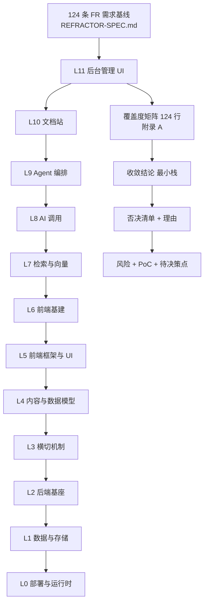

# studyplan 技术选型调研报告

> **这份文档是什么**
> 在重构开发启动**之前**，以 `FUNCTIONALITY.md`（现状功能基线）与 `REFRACTOR-SPEC.md`（重构需求基线）为唯一需求来源，做的一次分层技术选型调研。目标：尽可能采用市面上成熟的现成方案，尽可能不自研。
>
> **选型已全部裁定**（2026-10-07）：**15 条决策点 + 5 条最终裁定（T1–T5）全部有结论**，最终 **11 项技术栈**与 **12 项否决清单**见[总览摘要](#总览摘要)。**权威结论是本文档的 [§0 最终裁定](#0-最终裁定2026-10-07)。**
>
> **下一步不是写代码，而是跑 6 组 PoC（真阻塞 4 项）。** 实施计划待 PoC 通过后另行产出；`REFRACTOR-SPEC.md` 的 11 个批次未改动。
>
> **过程性档案已归档**至 [`docs/archive/tech-selection/`](docs/archive/tech-selection/)（选型方法论、候选核实笔记、覆盖度矩阵、缺口承接方案）。归档内容**仅存证、不保证后续更新**。

---

## 0. 最终裁定（2026-10-07）

> **本节是交棒实施的唯一权威依据。** 与前五轮的「待验证 / 待裁定」语气严格区分——**T1–T5 是已决策的既成事实，不是候选方案。**
>
> **裁定的核心思路**：把「必须实测才能定论」的验证点，转化为「**已决策 + 分支回退**」，让方案完备到**不必等实测就能开工**。

### 0.1 裁定前提

前五轮共留下 8 项未解决核实缺口与 3 项待实测 PoC。其中 **P33 / P34 / P35 三项经本轮裁定后已无需实测**——因为它们都指向同一个决策点（**PostgreSQL 的连接模式**），而该决策点已被 T1 一次性关闭。

| 编号 | 原状态 | 本轮处置 |
| --- | --- | --- |
| **P33** Payload Jobs 是否依赖 `LISTEN`/`NOTIFY` 或 advisory lock | 待实测 | ✅ **由 T1 关闭**（改用 Session pooling，该限制不适用） |
| **P34** Supabase Free 能否选 `us-east-1` | 待核实 | ✅ **由 T2 关闭**（改为三级降级，任一层级都能开工） |
| **P35** `statement_cache_size=0` 对 node-postgres 是否有效 | 待实测 | ✅ **由 T1 关闭**（同上） |

### 0.2 T1 · 连接模式：否决 transaction pooling，采用 Session pooling

**裁定：使用 Session pooling（`aws-[INDEX]-[REGION].pooler.supabase.com:5432`）。**

| 连接方式 | prepared statement | `LISTEN` / `NOTIFY` | 连接数 | 判定 |
| --- | --- | --- | --- | --- |
| 直连 `db.[PROJECT-REF].supabase.co:5432` | 支持 | 支持 | 受限（现状 `maxPoolSize: 5` 够用） | 备选 |
| **Session pooling `[POOLER-HOST]:5432`** | **支持** | **支持** | 共享池 | **选定** |
| Transaction pooling `[POOLER-HOST]:6543` | **官方明示不支持** | **不支持** | 最高 | **否决** |

**为什么否决 transaction pooling**：

Supabase 官方文档明示，transaction pooling 会让三项能力失效——**prepared statement**（官方给出的驱动处置表只列了 Postgres.js/Drizzle `prepare: false`、Prisma `pgbouncer=true`、asyncpg `statement_cache_size=0`、JDBC `prepareThreshold=0`，**未列 node-postgres**）、**query pipelining**、**会话级状态**（`SET`/`RESET` · session-level advisory lock · `LISTEN`/`NOTIFY` · 临时表）。

而它**省下的是「连接数」**——本项目现状 `maxPoolSize: 5`，免费额度下连接数从来不是瓶颈。

> **用一个没有收益的优化，去换三个不确定的失效风险，方向是反的。** 且其中两项（`LISTEN`/`NOTIFY`、advisory lock）**正是 Payload Jobs 可能依赖的机制**——检索未找到它依赖的证据，**也没找到它不依赖的证据**（见 P33）。在证据缺失时，正确做法是**选那个不会失效的**，而不是赌它不依赖。

**为什么选 Session pooling 而非直连**：

池化器主机名 `aws-[INDEX]-[REGION].pooler.supabase.com` **所有套餐均仅 IPv4**；而直连端点 `db.[PROJECT-REF].supabase.co` **默认 IPv6**，且官方明确「IPv4 add-on 不是双栈配置——启用后项目的 IPv6 `AAAA` DNS 记录会被 IPv4 `A` 记录替换」。**Session pooling 无需任何额外配置。**

> ⚠️ **端口 5432 有二义性，配置时务必核对**：`db.[PROJECT-REF].supabase.co:5432` 是**直连（不经过池化）**，`[POOLER-HOST]:5432` 才是 **Session pooling**。混淆两者会导致连接池完全失效——以为在用池化器，实际每个请求直连并耗尽连接数。
>
> ⚠️ `[INDEX]` **不是区域编号的一部分**，是池化器集群索引，**不能从区域名推导**，须从 Dashboard 的 **Connect** 对话框复制完整主机名。

### 0.3 T2 · 同区可行性：三级降级，R-A 不再阻塞开工

**裁定：R-A 的同区部署不押注单一平台的区域可选性。**

| 层级 | 方案 | 前提 | R-A 结论 |
| --- | --- | --- | --- |
| **1 首选** | Supabase Free `us-east-1` | Free 区域可选（原 P34） | **根治** |
| 2 | Neon Free `us-east-1` | 存储 0.5 GB 够用 + 区域可选（两点**均待核实**） | 根治（余量小） |
| 3 | 任一免费 PG + 跨区 | 都不可选 | **缓解**（四层全部生效）+ **显式接受残留延迟** |

**为什么层级 3 不阻塞开工**：

R-A 的失败模式是**延迟尖峰**——属**性能问题**，**不触及 14 条不可违反项中的任何一条**。而阻塞开工的代价（无限期推迟整个重构）**远大于**它的代价。

> **执行方式变更**：R-A 的验证从「开工前必须同区」改为「**开工后测量 TTFB 分布**」。若尖峰复现，再按四层（根因 / 连接池 / 服务端 / 应用层）逐一收紧。
>
> **四级方案本身不变**：① 根因——PG 与应用同区（Vercel 默认 `iad` 美东，故选 `us-east-1`）② 连接池——Session pooling（T1 已裁定）③ 服务端——`idle_session_timeout` + TCP keepalive ④ 应用层——死连接首次失败重试。

### 0.4 T3 · 任务队列与 P32

| 项 | 裁定 | 依据 |
| --- | --- | --- |
| **D12** | **A（Payload Jobs Queue）** | Payload 已在栈内 → **零新增依赖**；`Workflow`（顺序编排）+ `retries.shouldRestore`（从失败节点重试）+ `JobCancelledError`（主动中止）三点强于 BullMQ |
| **P32**（cron 时区） | **非阻塞** | 唯一影响 D12 选择，而 D12 失败**可回退 C（BullMQ）**，回退代价仅栈项数 11 → 12 |

> **不应因一个「有回退方案的验证点」卡住整个重构开工。**

### 0.5 T4 · R8 转为可执行监控

原先只写「运营实体增长到 10+」，**不可执行**。裁定为客观指标：

| 集合 | 当前 | R8 触发阈值 |
| --- | --- | --- |
| `interview_questions` | ~29 条（种子数据） | **> 500 条** |
| `roadmap_progress` | 用户数 | **> 1000 行** |

**达任一阈值** → 重新评估 Payload admin 方案（改为「独立 Payload admin 进程 + Nuxt 前端」双进程）。

### 0.6 T5 · 残余风险显式接受清单

**以下 5 项已知且不打算消除，已作为决策的既成事实接受：**

| # | 残余风险 | 为什么可接受 |
| --- | --- | --- |
| 1 | 若无法同区（T2 层级 3），R-A 延迟尖峰可能残留 | **性能问题非正确性问题**；不影响任何不可违反项；改为开工后观测 TTFB 分布 |
| 2 | 35 个索引全部手写 DDL，**漏一个会静默失效** | P1 验证包覆盖；**14 个 unique 索引各有对应测试**（唯一性丢失会直接测出来） |
| 3 | 密码哈希三道闸门重建后仍可能被人为绕过 | 补两条最小测试 + 约定禁止 `select *` + 代码评审卡住 |
| 4 | `ai_answer_cache` 不加 TTL 会长期增长 | **现状如此，非回归**（刻意设计：清理有 60s 延迟、时间写死不好调，改为查询时手动判过期）；写入量可控 |
| 5 | Supabase 免费额度上限（500 MB / 5 GB 出网） | 数据量远低于上限——最大项 `postembeddings` 向量表仅约 **4 MB**（千级 × 1024 维 float32） |

### 0.7 交棒实施阶段的读取顺序

| 序 | 读什么 | 为了什么 |
| --- | --- | --- |
| 1 | **本文档 §0**（本节） | 知道哪些是已裁定的不必再评估 |
| 2 | [总览摘要](#总览摘要) | 11 项技术栈 + 覆盖率 + 交棒批次顺序 |
| 3 | [§8 风险与代价](#8-风险与代价) | 三个真风险的完整方案 |
| 4 | [§9 PoC 待验证清单](#9-poc-待验证清单) | 6 组 PoC 与验收标准 |
| 5 | [`docs/archive/tech-selection/final-stack.md`](docs/archive/tech-selection/final-stack.md) | 交棒入口单页（技术栈 + 否决清单 + 栈项收敛记录 + 硬约束） |
| 6 | [`docs/archive/tech-selection/gap-closing.md`](docs/archive/tech-selection/gap-closing.md) **§2.12** | **35 个索引的 PG DDL 对照表**——P1 验证包的直接输入 |

---

## 总览摘要

> 一屏读完最终结论。详细论证见后续章节。

### 最终技术栈（11 项 · 第四轮收敛后）

> **原15 项 → 11 项。** 差额全部来自「囊括」关系的识别：2 项重复计数 + 1 项传递依赖 + 1 项功能替代。收敛依据见 §11.9。

| # | 层 | 选择 | 许可证 | **囊括了什么** |
| --- | --- | --- | --- | --- |
| 1 | 运行时 | **Node.js ≥ 22** / pnpm workspace | — | Vercel AI SDK / OTel / Nuxt Content 的共同下限 |
| 2 | 数据 | **PostgreSQL 16** | PostgreSQL License | **pgvector**（向量）· **tsvector**（全文）· **pg_trgm**（模糊）· JSONB · `GREATEST`/`ON CONFLICT`（幂等） |
| 3 | 后端基座 | **Payload 3** | MIT | 集合/字段 · REST+GraphQL · **auth** · access control · hooks · **Jobs Queue**（Task/Workflow/cron/concurrency）· **内置 Drizzle**（`payload.db.drizzle`）· migrations · env 校验 |
| 4 | 校验与契约 | **Zod 4**（Standard Schema V1） | MIT | 后端 DTO · 前端表单 · AI 工具入参 · 环境变量 |
| 5 | 限流 | **rate-limiter-flexible**（内存后端） | ISC | 逐路由 14 处档位 · 热门榜单豁免 |
| 6 | 缓存 | **lru-cache v11**（进程内）+ PG 落库 | **BlueOak-1.0.0** | 7 天答案缓存 · 键空间隔离 · 毫秒 TTL · 零部署 |
| 7 | GitHub 客户端 | **Octokit** | MIT | ETag · 限流重试 · 分页 · `User-Agent` |
| 8 | 可观测性 | **OpenTelemetry JS** + **Langfuse**（OTLP sink） | Apache-2.0 / MIT | trace 传播 · 命名 span（分段计时）· 采样分级 · LLM 追踪 · 评测集与门禁 |
| 9 | AI 调用与 Agent | **Vercel AI SDK 6.x**（含 `ToolLoopAgent`） | Apache-2.0 | chat/embed · 结构化输出 · 工具循环 + 步数上限 · 流式 |
| 10 | Agent 对比实现 | **LangGraph.js**（可选项） | MIT | 图编排对照 · `RetryPolicy` 异常分类 |
| 11 | 前端与文档 | **Nuxt 4** + **Nuxt UI 4** + **Nuxt Content 3** + **Meilisearch CE** | MIT / MIT（CE） | Vue/Vite/Nitro · **Reka UI + Tailwind + Lucide + ⌘K** · markdown/Shiki/SQLite/MDC · 文档检索 |

**统一栈的落点**：100% TypeScript；**Zod 4 schema 为唯一来源**（后端 DTO / 前端表单 / AI 工具入参三处共用，Standard Schema V1 使其可被三方消费）；**Payload 集合（CRUD）+ `payload.db.drizzle`（复杂查询）共用同一 Postgres schema —— Drizzle 不是独立依赖，是 Payload 的内部依赖**。

**许可证结论**：11 项中 10 项为 MIT / Apache-2.0 / PostgreSQL License / ISC。唯一非标准宽松许可是 lru-cache 的 BlueOak-1.0.0。**无 AGPL / SSPL / MSCL / GPL 风险。**

### 明确否决清单（12 项）

| 否决项 | 理由 |
| --- | --- |
| **NestJS 11** | Payload 3（+ 内置 Drizzle）已完整覆盖其职责。双后端制造更复杂的边界 |
| **tRPC** | 官方 README 未列 Nuxt / Nitro adapter，需依赖社区 adapter |
| **Redis / Upstash Redis / ioredis** | Payload Jobs 队列在数据库内、缓存用进程内、限流用内存后端。引 Redis 等于新增运维面 |
| **Better Auth** | Payload auth 已覆盖。双认证并存是双 Token 轮换语义冲突的高风险点 |
| **Directus 12** | MSCL 1.0（source-available，非 OSI 开源），带 500 万美元营收 / 50 人门槛 |
| **NocoBase 2.x** | 自带 React 客户端，与 Nuxt 二选一，收口批次 12 条 FR 中 8 条判 0 |
| **LangGraph（Python）** | Python-first，部署复杂度翻倍 |
| **LanceDB / Qdrant** | pgvector 已在库内，再引数据层是重复运维 |
| **Sentry** | SaaS 数据出境，与「日志不写敏感数据」需额外审视 |
| **保留 VitePress** | `FR-DOC-1` 不可违反项要求「构建链不再产出独立文档站」 |
| **Windmill**（第三轮） | `backend/`+`frontend/` 为 **AGPL-3.0**，且 LICENSE **限制未经协议 modify 或 wrap**、禁止出售/转售/作为托管服务提供 |
| **n8n**（第三轮） | fair-code（非 OSI 开源），官方条款**禁止 bundling into something you sell**——本项目是「可上线产品」 |

> **第四轮移出否决链**：**BullMQ** 曾是第三轮的任务队列推荐，第四轮被 **Payload Jobs Queue** 替代（`Workflow` 顺序编排 + `shouldRestore` 从失败节点重试 + `JobCancelledError` 主动中止三点更强，且不需额外服务）→ **不是否决，是被更好的内置能力替代**。
>
> 每项否决均附「已检索过什么、因什么不适用」，见 [`final-stack.md`](docs/archive/tech-selection/final-stack.md) §2。**另有 4 项「未纳入评估」**（Trigger.dev / Temporal / Hono / Nuxt Nitro）——它们**不是否决**，其中 Trigger.dev 因 Payload Jobs 已覆盖其能力而在第四轮降级。

### 覆盖率

| 方案 | 原始覆盖率 | 加权覆盖率 |
| --- | --- | --- |
| 丙（沿用现状全自研） | 95.2%（118.0/124） | — |
| 甲（第一轮推荐栈） | 66.1%（82.0/124） | 55.3%（136.5/247） |
| **最终栈** | **91.9%（114.0/124）** | **73.7%（182.0/247）** |

**得分分布校验**：1 分 108 条 + 0.5 分 12 条 + 0 分 4 条 = **114** ✅
**加权分子校验**：一梯队 68.0 × 2 + 二三梯队 46.0 = **182.0**；分母 **247**

**剩余 4 条 0 分全部是业务编排**：`FR-DIGEST-1`（九步流程）、`FR-DIGEST-2`（候选筛选）、`FR-DIGEST-4`（撤回四步）、`FR-GHINTRO-2`（简介清洗）。加权天花板约 **78%**——再往上必须把产品口径也交给框架，等于把产品逻辑藏进黑盒。

### 自研量变化

| 项 | 现状 | 最终栈 | 变化 |
| --- | --- | --- | --- |
| 后端生产代码 | 10,266 行 | 约 5,600 行 | −4,666 行 |
| 后端横切 | 887 行 | 约 550 行 | −337 行 |
| 前端源码 | 8,677 行 | 8,677 行 | 持平 |
| 契约包 | 3,291 行 | 约 1,700 行 | −1,591 行 |
| 部署与工具链 | 2,300 行 | 约 3,100 行 | +800 行 |
| **合计** | **28,800 行** | **约 21,500 行** | **−7,300 行（−25.3%）** |

> 省下 7,300 行不是主要收益。主要收益是**不再自己承担 auth、访问控制、CRUD、迁移、种子、向量检索、缓存、额度、限流、HTTP 客户端、代码索引、评测门禁这十二类的正确性责任**。

### 四个风险（3 个真风险 + 1 个已缓解）

> **⚠️ 第五轮修正（风险与 PoC 解决方案轮）**：R8 已由 D4=A 规避，不需要现在行动。**R-B 发现第二层静默失效，后果比原判断更严重**；**R-C 现状是三道闸门而非两道**。完整方案见 §8.4。

| # | 风险 | 失败模式 |
| --- | --- | --- |
| **R-A** | `maxIdleTimeMS:45000` 掩盖的 6.6s 延迟尖峰换库后无对应解 | 尖峰复活。**根因是物理链路**（Vercel 美东 → Atlas 新加坡跨区），不是连接池问题 | **四层**：同区部署（根治）· 连接池（必配，Supabase 内建 Supavisor）· `idle_session_timeout` + TCP keepalive · 死连接首次失败重试。**必须重新实测** |
| **R-B** | `daily_picks.postId` 是 `String` 无外键 | **两层静默失效**。第二层（本轮新识别）后果**更严重**：删帖失败时级联删互动仍无条件执行 → **帖子留存但互动数据永久丢失、计数永久错误** | **五步**：加真实外键 `ON DELETE SET NULL`（根治）· 修 `:332` 错误处理（区分 404/403）· **修 `:342-347` 级联前置条件** · 幂等语义 · 迁移前校验孤儿 |
| **R-C** | `select: false` 密码哈希保护无 PG 等价物 | **静默通过**：该路径零测试覆盖 → 回归时静默通过率 100% | **四步**：重建**三道闸门**（查询期 / **编译期** / 输出期）· 专用认证查询只 SELECT 三列 · **补两条最小测试** · 约定禁止 `select *` |
| R8 | Payload admin 绑 Next.js | 未来改造代价高 | ✅ D4=A 已规避。**监控条件：运营实体 10+** |

### PoC：8 项阻塞 → 6 组执行，**真阻塞 4 项**

| 组 | 内容 | 环境依赖 | 工作量 |
| --- | --- | --- | --- |
| **① 立即做** | P2（`trust proxy` + curl）· **P3**（`afterOperation` 查文档）· P7（NIM 端点 20 行验证）· **P32**（cron 时区源码 grep） | 无（仅 P7 需 API key） | **3.5h** |
| **② 需先决策** | 建立 PG 实例 + 定部署区域 + 验证 R-A 缓解措施 | 需决策 | **0.5d** |
| **③ 真阻塞** | **P1 + P30 + P31 + #4 合并为 schema 迁移验证包** | PG 实例 | **2d** |
| **④ 真阻塞** | P19（31 篇文档迁移 + 实机构建） | 无 | **1d** |

**总工期约 5 天。** 第 ① 组无任何环境依赖，**应当立即做掉**。

**⬇️ 两项降级的依据**：

| PoC | 为什么可以降级 |
| --- | --- |
| **P3** `afterOperation` | **无论答案是「等待」还是「不等待」，处置代码完全一样**：钩子内 `void` + `.catch()` 不 await，与现状 `void this.enrichWithAi(...)`（基线 4.4）一致。**答案不改变任何一行实现代码** → 不构成开工前置条件 |
| **P32** cron 时区 | 唯一影响 **D12 的选择**（A Payload Jobs 还是 C BullMQ），而 **D12 已有回退方案**，回退代价仅是栈项数 11 → 12。**不应因一个「有回退方案的验证点」卡住整个重构开工** |

> **⚠️ 第五轮修正**：**P30 与 P31 的描述此前不完整**——「有 PoC 编号」不等于「PoC 内容完整」。P30 真正内容是「加外键 + 修**两处**静默失效」，UUID 改写只是迁移前置校验的一步；P31 真正内容是「重建**三道闸门** + 补测试」，此前只覆盖了第 1 道。**编号相同但验收范围差一倍，会让验证包漏掉一半。**
>
> **✅ P20 已解除**（第三轮）：`@nuxt/content` **3.16.1** 的 npm 包元数据证实支持 Nuxt 4——`dependencies` 含 `@nuxt/kit ^4.5.2`、`devDependencies` 含 `nuxt ^4.5.2`（与本项目一致），且 `peerDependencies` 不含 `nuxt`（Nuxt module 惯例，不构成否定证据）。**P19 保留为端到端确认。** 证据链见 §11.8。

### 八项核实缺口（可关闭 2 项 · 机械可解 5 项 · 并入 1 项 · 决策已完成 1 项）

| # | 缺口 | 关闭方式 |
| --- | --- | --- |
| 1 | 14 项精确版本号 | `npm view` 批量 · **0.5h** |
| 4 | Payload Local API 访问控制 / 事务一致性 | 并入 ③ schema 包 · **2h** |
| **6** | Langfuse `ee/` 目录许可 | ✅ **已实测 MIT（`ee/` 除外）→ 立即关闭** |
| **11** | OTel collector 与后端选型 | ✅ **D-R2 = A 已裁定** → Langfuse 一体，**不引 Collector** |
| 12 | rate-limiter-flexible 是否接受小数秒 | 读源码 + 实测 · **1h** |
| **16** | ~~35 个索引的完整 DDL 清单~~ | ✅ **已关闭（第五轮）**：`gap-closing.md` §2.12 全量对照表已产出 · 剩余翻译工作并入 ③ schema 包 |
| **20** | Payload Jobs 的 cron 时区 | 源码 grep `timezone` · **1h** |
| **21** | `req.payload.db.drizzle` 是否与 `payload.db.drizzle` 等价 | 类型定义 grep · **1h** |

**另 #13（BullMQ PG 后端）已随第四轮改用 Payload Jobs 而关闭。净剩余待查 6 项。**

### 15 条决策的裁定结果

D1 接受 Payload · D2 接受 Node 22+ · D3 **已验证可行**（P20 解除）· D4 不引入独立 admin · D5 分批迁移 · D6 数据本体留在 `packages/shared` · D7 README 已改 · D8 否（NestJS 移入否决）· D9 接受换库代价 · D10 否（不引 Redis）· D11 否（不引 tRPC）· **D12 改选 Payload Jobs Queue**（原「维持 BullMQ」，第四轮前提已变）· **D13 接受 Drizzle 降级为 Payload 传递依赖** · **D-R1 = 免费（Supabase Free `us-east-1` 与 Vercel 默认 iad 同区）** · **D-R2 = A（Langfuse 一体，不引 OpenTelemetry Collector）**

---

## 目录

0. [总览摘要](#总览摘要)
1. [结论摘要（第一轮）](#1-结论摘要)
2. [调研方法与分层框架](#2-调研方法与分层框架)
3. [现状自研能力清单](#3-现状自研能力清单)
4. [逐层候选矩阵（L0–L11）](#4-逐层候选矩阵l0l11)
5. [收敛结论与功能域归属](#5-收敛结论与功能域归属)
6. [被否决方案与理由](#6-被否决方案与理由)
7. [硬约束满足核对](#7-硬约束满足核对)
8. [风险与代价](#8-风险与代价)
9. [PoC 待验证清单](#9-poc-待验证清单)
10. [决策点清单（已裁定）](#10-决策点清单已裁定)
11. [**第二轮补全选型**](#11-第二轮补全选型)
12. [附录索引](#12-附录索引)

> **本文档有两轮内容**：第 1–10 章为第一轮选型（部分结论已在第 11 章被修订，修订处均标注「第二轮修订」）；**第 11 章为第二轮补全选型**。**第 0 章总览摘要是当前推荐的最终结论**，第 1 章保留第一轮视角以供追溯。

---

## 1. 结论摘要

### 1.1 推荐最小技术栈（8 项，其中仅 2 项是新增替换）

> **⚠️ 本节为第一轮视角。** 下表是「不换库、只换技术栈」的方案，**已被[总览摘要](#总览摘要)的 15 项最终栈取代**（最终栈额外换库至 PostgreSQL 16，并补配8 项通用能力方案）。保留此表用于追溯第一轮的判断逻辑。

| 层 | 现状 | 建议 | 变动 |
| --- | --- | --- | --- |
| L0 部署 | Docker Compose + Vercel 单容器 + 525 行路径分流 | **沿用** | — |
| L1 数据 | MongoDB Atlas 14 集合 | **沿用 MongoDB** | — |
| L2 后端基座 | NestJS 11 自研 12 模块 | **Payload 3** | **替换** |
| L3 横切 | 887 行自研 | **混合**（被替 2 / 保留 2 / 改造 2） | 部分替换 |
| L4 契约 | `packages/shared` 3,291 行 | **Payload 生成类型 + 保留 1,669 行数据本体** | 部分替换 |
| L5 前端 | Nuxt 4 + Nuxt UI 4 | **沿用** | — |
| L6 前端基建 | 自研 `useApi` 等 15 个 composable | **沿用** | — |
| L7 检索向量 | 自研内存点积 140 行 | **沿用自研 + 新增 Meilisearch（文档搜索）** | 小幅新增 |
| L8 AI 调用 | 裸 `fetch` 303 行 | **Vercel AI SDK 6.x** | **替换** |
| L9 Agent | 无（批次 9 未实现） | **Vercel AI SDK `ToolLoopAgent` + LangGraph.js 对比实现 + Langfuse 评测** | **新增** |
| L10 文档 | VitePress 独立站 | **Nuxt Content 3 + Meilisearch** | **替换** |
| L11 后台 | 无 | **不引入独立 admin 运行时** | — |

**净变化：新增 3 个依赖（Payload、Vercel AI SDK、Nuxt Content + Meilisearch + Langfuse），替换掉 NestJS 自研基座与 VitePress，保留 MongoDB、保留 Nuxt。**

### 1.2 加权覆盖率

> **⚠️ 本节为第一轮视角，当前结论见[总览摘要](#总览摘要)。** 数字已按逐条重算修正（第一轮存在 8 处批次小计与 4 处合计的求和错误，导致覆盖率被低估）。修正明细见 [附录 A 汇总表](docs/archive/tech-selection/coverage-matrix.md#汇总与加权覆盖率)。

| 方案 | 原始覆盖率 | **加权覆盖率** | 自研代码变化 |
| --- | --- | --- | --- |
| **最终栈（第二轮，见第 0 章）** | **91.9%（114.0/124）** | **73.7%（182.0/247）** | **约 −7,300 行（−25.3%）** |
| 甲（第一轮推荐栈，修正后） | 66.1%（82.0/124） | 55.3%（136.5/247） | 约 −3,300 行（−11%） |
| 乙（NocoBase 统一底座，修正后） | 47.6%（59.0/124） | 39.1%（96.5/247） | 约 +1,800 行（前端重写） |
| 丙（沿用现状全自研，修正后） | 95.2%（118.0/124） | — | 基准 208 文件 / 28,800 行 |

> 丙的 95.2% 是「自研实现出来的覆盖」，提供上界参照：124 条全部可实现（基线已交付），但需 208 文件 / 28,800 行自研，且批次 9 的 6 条为 0。
>
> **自研代码变化口径统一为 −7,300 行**：该数字是「换库连带的自研量重估」（含纯 Mongo 代码归零）。第一轮曾给出「−3,300 行」，那是**只算技术栈替换、不含换库**的口径。

> 丙的 95.2% 是「自研实现出来的覆盖」，提供上界参照：124 条全部可实现（基线已交付），但需 208 文件 / 28,800 行自研，且批次 9 的 6 条为 0。

### 1.3 三条最关键取舍

**取舍一：选 Payload 3 作为后端基座，不选 Directus，不选 NocoBase。**
Payload 是唯一**同时支持 MongoDB**（免换库）、**MIT 许可**、且**官方文档点名支持 Nuxt 接入**的候选。Directus v12 已改 MSCL 1.0（source-available，非 OSI 开源，带 500 万美元营收 / 50 人门槛），与「可上线产品」的合规要求冲突；NocoBase 虽已改 Apache-2.0，但自带 React 客户端，与 Nuxt 前端二选一，直接导致收口批次 12 条 FR 中 8 条判 0。

**取舍二：数据库不换。**
用户已放开「数据库可换」的许可，但 Payload 本身就支持 MongoDB，**这个许可不必动用**。14 个集合零迁移，省掉本轮最大一块风险。向量能力维持自研内存点积（基线 4.11 已论证：Atlas M0 不支持 `$vectorSearch`，千级向量毫秒级）。

**取舍三：不引入独立后台管理运行时。**
这是本报告最反直觉的判定。Payload 自带 admin panel，但它绑 Next.js——为一个只有 3 个运营动作（29 条题库种子、用户自助进度、报道撤回）的需求，额外拉起一个 React/Next.js 运行时并给 525 行 `entrypoint.mjs` 再加一路分流，不划算。**现成后台的「现成」部分在多租户、审批流、字段级权限场景最值钱，本项目这三项都没有。**

### 1.4 需要用户拍板的决策点

共 8 条，集中在 [第 10 节](#10-待评审决策点清单)。其中前 3 条是阻塞项：

| # | 决策点 | 阻塞性 |
| --- | --- | --- |
| D1 | 是否接受以 Payload 替换 NestJS（放弃框架绑定，换五类基础设施责任） | **阻塞** |
| D2 | 是否接受 Node 22+ 升级（Vercel AI SDK 硬要求） | **阻塞** |
| D3 | Nuxt Content 3 的 Nuxt 4 兼容性未确认，是否接受该风险 | **阻塞** |

---

## 2. 调研方法与分层框架

### 2.1 分层收敛链

采用「从需求域出发，先定语言/框架层，再定框架，最后追问有没有已覆盖该域的成熟项目」的逐层收敛范式。12 层各自独立判定，把缺口向上一层暴露。



### 2.2 覆盖度量化口径

| 分值 | 含义 |
| --- | --- |
| 1 | 完全覆盖：现成方案直接提供 |
| 0.5 | 部分覆盖：提供骨架，关键规则需薄自研 |
| 0 | 无覆盖：必须自研 |

| 梯队 | 批次 | 条目 | 权重 | 判定 |
| --- | --- | --- | --- | --- |
| 一 | 0 / 1 / 2 / 7 / 8 | 69 | 2 | **必须全覆盖**，任一条不可满足即该层判为不可用 |
| 二 | 3 / 4 / 5 / 6 | 39 | 1 | 允许降级或缺口，需评估代价 |
| 三 | 9 / 10 | 16 | 1 | 允许缺口但需评估代价 |

加权覆盖率 = Σ(得分 × 权重) / 247。**一票否决**：违反 14 条不可违反项中任意一条的候选直接判为该层不可用，不进入覆盖率比较。

### 2.3 核实纪律

第三方项目的版本号、许可证、维护状态、能力边界**全部基于官方仓库页 / 官方文档抓取核实**，不凭记忆断言。核实明细见 [附录 B](docs/archive/tech-selection/candidate-notes.md)，核实时间 2026-10-07。

知识库检索（`RAG_search`）结论：**已连接知识库中无任何与本项目技术选型相关的沉淀**（返回内容为腾讯云 / 微信云开发 / TDesign 等无关文档），故全部依赖官方来源核实。

---

## 3. 现状自研能力清单

作为覆盖度矩阵的**分母基线**。全部结论带文件路径与行数证据。

### 3.1 依赖实测

| 位置 | 关键依赖与版本 |
| --- | --- |
| 根 `package.json` | `packageManager: pnpm@11.20.0`、`engines.node >=20.19.0`、ESLint 9 / Prettier 3 / TS 5.9；**无任何 dependencies** |
| `apps/api` | NestJS 11.2.3 / Mongoose 9.9.5 / `@nestjs/throttler` 6.5 / `@nestjs/terminus` 11.1 / `@nestjs/swagger` 11.4 / `@nestjs/jwt`+passport-jwt / bcryptjs 3 / class-validator 0.15；devDeps 含 Jest 30 + ts-jest 29 |
| `apps/web` | Nuxt 4.5.2 / `@nuxt/ui` 4.11.1 / Pinia 4.0.3 / Vue 3.5.42 / markdown-it 15 / Tailwind 4.3.3；devDeps 含 Playwright 1.63 |
| `apps/docs` | VitePress 1.6.4（唯一依赖） |
| `packages/shared` | **零运行时依赖**；产物 `dist/index.js` 为 **CJS** |

> **关键发现：后端零 LLM/AI SDK、零 markdown 渲染、零搜索/向量依赖。** AI 走裸 `fetch`（`apps/api/src/modules/ai/nv-nim.client.ts`，303 行）；向量检索是自研内存点积（`search/vector-store.service.ts:134`）。

### 3.2 后端横切（887 行，L3 分母）

| 机制 | 路径 | 行数 | 实现 |
| --- | --- | --- | --- |
| 统一响应包络 | `common/interceptors/transform.interceptor.ts` | 60 | RxJS `map` 包 `ApiSuccessBody`；`WRAPPER_EXCLUDED` 放行 `/health` `/docs` |
| 统一错误包络 | `common/filters/all-exceptions.filter.ts` | 110 | `@Catch()` 全局过滤器；校验明细进 `details`；5xx error / 4xx warn / 401·404 不记 |
| requestId | `common/middleware/http-logger.middleware.ts` + `common/interceptors/request-id.interceptor.ts` | 55 + 57 | 中间件最早生成 → 拦截器三级兜底 |
| 分段计时 + 慢请求 | `common/middleware/timing.middleware.ts` + `common/utils/with-timing.ts` + `common/interceptors/slow-request.interceptor.ts` | 27 + 71 + 71 | `AsyncLocalStorage` 上下文；阈值 1000ms 告警 / 3000ms 错误 |
| 逐路由限流 | `app.module.ts:174-177` + 各 controller `@Throttle` | — | 默认 30/60s；**刻意不注册全局守卫**；已实测 12 处档位 |
| 环境变量校验 | `config/env.validation.ts` + `common/utils/config-values.ts` | 485 + 72 | class-validator DTO 式；`boolSetting` / `numberSetting` / `nonNegativeSetting`（**0 为有效值**） |

### 3.3 后端业务模块（L2/L4 分母）

| 模块 | 行数 | 自研复杂度信号 |
| --- | --- | --- |
| **daily-digest** | **2,098** | 全仓最大。`daily-digest.service.ts` 756 行九步流程；独立 prompt（100 行）+ 模板（93 行）；被 Vercel Cron 调用 |
| **github** | **2,191** | 3 个 schema；自研 GitHub REST client 259 行（ETag / 限流 / 树截断）；`repo-intro.service.ts` 336 行 |
| **ai** | **1,963** | 2 个 schema；**自研 LLM client 303 行**（裸 fetch）；`code-index.service.ts` 207 行（把自身源码索引喂 AI）；sanitizer 79 行 |
| **posts** | **1,349** | 独立 schema 127 行 + mapper 63 行；`posts.service.ts` 500 行含聚合管道防负数（`:365-382`）；3 处 `findOneAndUpdate` |
| **search** | **1,016** | **自研向量检索**（`vector-store.service.ts` 140 行，注释明确「不上向量库」`:26-28`）；`embedding.service.ts` 112 行 |
| auth | 846 | 双 Token + httpOnly Cookie（`cookies.ts` 54 行）；`auth.controller.ts` 220 行含大量 Swagger 注解 |
| roadmap | 832 | 独立 schema（`userId` 唯一）；`findOneAndUpdate + $set steps.<id> + upsert`；独有跨包契约测试 366 行 |
| interview | 772 | **唯一使用聚合管道 `$group`/`$push` 的模块**（`interview.service.ts:91`）；DTO 115 行 |
| likes | 439 | 独立 schema + 复合唯一索引 `{postId,userId}` |
| comments | 422 | `@Controller()` 空前缀；独立 schema + 复合索引 `{postId,createdAt}` |
| users | 268 | 独立 schema 82 行 + mapper 47 行；**无 Controller** |
| health | 61 | Terminus + MongooseHealthIndicator |

### 3.4 数据模型：14 个集合（第五轮 `code-explorer` 全量实测确认）

**索引总量（实测）**：**21 个显式声明索引 + 14 个集合各自的 `_id_` 主键索引 = 35 个**需翻译成 PG DDL。构成是 **6 处独立 `.index()` + 15 处 `@Prop` 内联声明**，其中 **14 个 unique**（含 **2 个复合唯一**：`likes.postId+userId`、`interview_questions.nodeId+question`）· **4 个复合索引**（2 复合唯一 + 2 复合非唯一）· **0 个 TTL · 0 个 sparse · 0 个 partial**（三类全仓 0 命中，PG 侧无对应物）。

**⚠️ 现状 `autoIndex` 从未显式配置**（`app.module.ts:56-151` 的连接参数块中没有该项），即**完全依赖 Mongoose 默认 `autoIndex: true`**——这正是「换 PG 后 35 个索引全部要手写 DDL」的根据，也意味着「源码声明的索引」与「线上实际存在的索引」理论上可能不一致。

> **⚠️ 五处不能照搬 Mongo 语义**（完整对照表见 [`gap-closing.md`](docs/archive/tech-selection/gap-closing.md) §2.12）：
> ① `posts {tags:1, createdAt:-1}` —— PG 的 B-tree 复合索引对**数组等值无效**，须拆 `GIN(tags)` + `BTREE(created_at DESC)` ② `daily_pick_excludes.date` **刻意非唯一**（注释说明：同名不同选项会抛 `IndexOptionsConflict`），不得「顺手修正」 ③ **`ai_answer_cache` 刻意无 TTL**（清理有 60s 延迟、时间写死不好调，改为查询时手动判过期），**不得加 `pg_cron` 模拟** ④ `_id` 为 `ObjectId`、`author.id` 为 `String` → 主键改 `uuid`，`author.id` 保持 `text`（快照语义非引用语义） ⑤ **没有显式命名的索引**——上表索引名全按 MongoDB 默认规则推导，PoC 应用 `db.collection.getIndexes()` 拉真实名字做基线

| 集合 | 关键索引 | 特殊能力 |
| --- | --- | --- |
| `posts` | `{createdAt:-1}`、**`{tags:1,createdAt:-1}`**（等值在前） | 聚合管道 `$max/$add` 防负数 |
| `likes` | **复合唯一 `{postId:1,userId:1}`** | 幂等正确性基石 |
| `comments` | 复合 `{postId:1,createdAt:1}` | 三步非原子写入 |
| `interview_questions` | 复合唯一 `{nodeId:1,question:1}` | 聚合管道 `$group/$push/$sum` |
| `roadmap_progress` | 唯一 `{userId:1}` | `steps.<courseId>` 动态路径 |
| `postembeddings` | 唯一 `postId` | **向量 1024 维 + L2 归一化 + `model` 混库防线** |
| `trending_caches` | — | `fetchedAt` / `lastAttemptAt` **必须分开存** |
| 其余 8 个 | 依赖 autoIndex | `daily_picks` / `daily_pick_excludes` **必须独立成集合** |

### 3.5 前端（8,677 行 / 54 文件，L5/L6 分母）

| 类别 | 数量 | 行数 | 可替换性 |
| --- | --- | --- | --- |
| 页面 | 9 | 2,410 | 低。全部手写，最大 `posts/new.vue` 367 行 |
| 组件 | 22 | 2,914 | 低。含 `main.css` 992 行手写设计系统 |
| Composables | 15 | 1,427 | 低。11 个对接自研 API；`useApi.ts` 277 行为前端横切核心 |
| Pinia store | **1** | 438 | 全站唯一 store |
| Plugin / Middleware | 3 | 131 | `auth-restore.client.ts`、`roadmap-hydrate.client.ts`、`middleware/auth.ts` |

`runtimeConfig` 双轨制实测（`apps/web/nuxt.config.ts:70-144`）：`apiBaseInternal`（默认 `http://127.0.0.1:3000/api`，仅服务端）/ `public.apiBase`（默认 `http://localhost:3000/api`，**构建期常量**）/ `public.siteUrl` / `public.appVersion` / `public.docsUrl`。

### 3.6 契约包（3,291 行，L4 分母）

| 类别 | 文件 | 行数 | 占比 |
| --- | --- | --- | --- |
| 类型定义 | 10 | 996 | 30% |
| 常量与纯函数 | 7 | 1,383 | 42% |
| **数据本体** | 3 | **1,345** | **41%** |

数据本体明细：`roadmap-data.ts` **884 行**（全仓最大单文件，7 阶段 45 节点路线数据本体）、`learning-materials.ts` **461 行**（由 `scripts/scan-learning-materials.mjs` 706 行生成）、`interview-bank.ts` 324 行。

> **关键判定：数据本体 1,669 行（51%）是产品内容，任何 BaaS 都无法替代。** 这是「不自研」目标的天然边界。
>
> **第二轮修订**：第一轮此处写 1,345 行（`roadmap-data` 884 + `learning-materials` 461，未含题库种子）。实测三件套合计 **1,669 行**（+ `interview-bank` 324），占比应为 51%。已统一。

### 3.7 电子书（31 篇，L10 分母）

| 分区 | 篇数 | 文件 |
| --- | --- | --- |
| 根 | 1 | `index.md` |
| `guide/` | 9 | roadmap / project-structure / environment / git-workflow / deployment-lessons / debugging-lessons / integration-lessons / roadmap-rewrite-lessons / daily-digest |
| `stages/` | 8 | `stage-1` … `stage-8` |
| `exercises/` | 8 | `stage-1` … `stage-8`（**与 stages 同名，两套路由需互不覆盖**） |
| `design/` | 5 | 01–04 + brand |

配置 `.vitepress/config.ts` 194 行：`nav` 5 组（首页 / 学习路线 / 经验档案 5 / 设计 5 / 阶段正文 8）、`sidebar` 5 组（开始之前 4 / 阶段正文 8 / 经验档案 5 / 设计 5 / 规划练习 8）、`search.provider: 'local'`（minisearch）、**`ignoreDeadLinks: true`**、`lastUpdated` 依赖 git 时间戳（有 `hasGit` 探测）。

### 3.8 部署（L0 分母）

`docker-compose.yml` 3 服务（`mongo:7` / `api` / `web`）。`Dockerfile.vercel` 5 阶段单镜像，运行层含 `apps/api/dist`（含 `code-index.json`）、`packages/shared/dist`、`apps/web/.output`、`apps/docs/.vitepress/dist`（约 3 MB / 92 文件），入口 `docker/vercel/entrypoint.mjs` **525 行**（`/ebook` → `/api` `/docs` → 其余转 Nuxt，含路径穿越防护）。`vercel.json` 含 Cron `0 1 * * *`。

### 3.9 测试现状

| 类型 | 数量 | 覆盖 |
| --- | --- | --- |
| 后端单测（Jest） | **18 spec / 3,768 行** | 仅 service 层。`daily-digest.service.spec.ts` 736 行、`shared-roadmap-contract.spec.ts` 366 行 |
| 前端 E2E（Playwright） | 3 spec / 401 行 | `studyplan` / `seo` / `semantic-search` |

**零覆盖**：`src/common/`（887 行，含全部 filter / interceptor / middleware / guard / strategy）、`src/modules/users/`、`comments/`、`health/`、**全部 11 个 controller（约 1,090 行）**、`main.ts`、`config/env.validation.ts`；`apps/web/app/**` 前端源码 **0 单测**（根 `pnpm -r test` 对 web 不生效）。

### 3.10 自研总量

| 维度 | 文件 | 行数 |
| --- | --- | --- |
| 后端生产代码 | 97 | ~10,266 |
| 后端测试 | 18 | 3,768 |
| 前端源码 | 54 | 8,677 |
| 共享契约包 | 20 | 3,291（数据本体 1,345） |
| 部署与工具链 | 12 | ~2,300 |
| **合计** | **~208** | **~28,800** |

### 3.11 可替换性预判（覆盖度矩阵的反向校验）

| 层 | 可替换性 | 依据 |
| --- | --- | --- |
| L2 业务 CRUD（posts/comments/likes/users/auth，~3,325 行） | **高** | 5 张表全是标准 CRUD；全仓仅 1 处真正的聚合管道 |
| L3 横切（887 行） | **中** | 包络 / 限流 / 校验有现成件；**分段计时与慢请求无等价物** |
| L4 契约包（3,291 行） | **41% 不可替换** | 数据本体是产品内容 |
| L5/L6 前端（8,677 行） | **低** | 页面与业务编排层无一可替代 |
| AI / 向量（ai 1,963 + search 1,016） | **中** | 编排可被 SDK 接管；代码索引与裸 fetch 是自研垂直 |
| daily-digest（2,098 行） | **不可替换** | 定时报道装置，无通用方案对应 |
| 电子书（31 篇 / ~590 KB） | 内容不可替换**（渲染管线可替换）** | 唯一要求就是换掉渲染管线 |
| L0 部署（entrypoint 525 行） | **不可替换** | Vercel 无「构建上下文」字段，绕开方式是本项目独有工程决策 |

---

## 4. 逐层候选矩阵（L0–L11）

每层给出候选、覆盖能力、缺口、判定与理由。许可证与版本核实明细见 [附录 B](docs/archive/tech-selection/candidate-notes.md)。

### L0 · 部署与运行时

| 候选 | 覆盖 | 缺口 | 判定 |
| --- | --- | --- | --- |
| **沿用：单容器 + 路径分流** | 与现状一致 | 若要加 Payload admin 需再加一路分流 | **✅ 沿用** |
| 拆分 Vercel 多服务 | 免自定义分流 | Vercel 无「构建上下文」字段，需把 shared 拆成独立包或走 npm registry | ❌ |
| 全部托管（Vercel Functions + 托管 DB） | 免运维 | 需整体迁出，违反「最小栈」目标 | ❌ |

**理由**：部署复杂度不是本项目的主要矛盾。现状的 525 行 `entrypoint.mjs` 是 Vercel 平台约束的产物（无构建上下文字段），换托管平台并不能消除它。**但需在报告中记录：Payload admin 的 Next.js 进程会加剧这一复杂度——见 L11 判定。**

### L1 · 数据与存储

| 候选 | 覆盖 | 缺口 | 判定 |
| --- | --- | --- | --- |
| **沿用 MongoDB** | 14 集合零迁移；Mongoose `updatePipeline` 防负数能力保留 | Atlas M0 不支持 `$vectorSearch`（基线 4.11 实测），向量仍需自研内存方案 | **✅ 沿用** |
| 换 Postgres + pgvector | v0.8.7，Postgres 13+，HNSW/IVFFlat + 迭代索引扫描 + 全文混合检索 | 14 集合全部需迁移；计数防负数改用 `GREATEST(0, x+delta)`；RRF 融合器不内置仍要自研 | ❌（暂缓） |
| Atlas Vector Search（升级付费集群） | 官方 ANN + 文本搜索混合 | 需 Atlas M10+ 付费（当前 M0 免费）；限额流与跨区延迟需重新实测 | ❌（暂缓） |

**理由（换库许可不必动用）**：
1. Payload 3 **本身支持 MongoDB**，所以「数据库可换」这个许可不需要动用——**能不动就不动**。
2. 换 Postgres 的唯一收益是把内存点积换成 ANN 索引。但基线 4.11 已论证：千级向量 × 1024 维的内存点积是毫秒级，**为此引入外部依赖不划算**。
3. 换库要付的代价是 14 集合迁移 + 复合唯一索引语义等价性验证 + 连接池参数重调（现状 `maxPoolSize:5` 等 7 个参数都是实测调优过的）。
4. 触发重新评估的条件：帖子数增长到十万级，或向量维度上升到 3072+。

**待核实**：Atlas Vector Search 在免费集群的当前可用性（本轮未能独立确认是否已放开；基线记录的「M0 不支持」是本项目自己的实测结论）。

### L2 · 后端基座（**本次选型的核心决策**）

| 候选 | 许可证 | Star | 覆盖能力 | 关键缺口 | 判定 |
| --- | --- | --- | --- | --- | --- |
| **Payload 3** | **MIT** | 45.1k | 集合/字段、REST + GraphQL、auth、细粒度 access control、document/field hooks、迁移、种子、env 校验、文件上传 | **admin panel 绑 Next.js**；全 ESM（现 shared 是 CJS）；Local API 的访问控制/事务语义未确认 | **✅ 选中** |
| NocoBase 2.x | Apache-2.0（2026-02-26 起） | 24.5k | 可视化建表、插件化、工作流/审批、多空间权限、表格/看板/日历区块、Markdown 区块、内置 AI 员工 | **自带 React 客户端**（与 Nuxt 二选一）；升级节奏快（2026-02 一天 5 版） | ❌ |
| Directus 12 | **MSCL 1.0（source-available）** | 38.2k | 灵活数据建模、REST/GraphQL、auth、Admin UI | **非 OSI 开源**；v12 从 BSL 1.1 改 MSCL；年收入 <500 万美元且 <50 人才免费，超门槛可能需商业许可 | ❌ **一票否决** |
| Strapi 5 | MIT | — | 自托管 headless CMS、内容类型建模 | 无向量/AI 能力；Nuxt 集成需另配 | ❌ |
| Sanity | 专有分层 | — | 内容建模、GROQ | Studio 非完全开源；免费档限制用户数 | ❌ |
| 沿用 NestJS 11 | MIT | — | 与现状一致 | 12 模块 + 887 行横切继续自研 | ❌ 见下 |

**选中 Payload 的理由**：
1. **唯一同时满足「支持 MongoDB」+「宽松许可」+「官方点名支持 Nuxt」的候选。** Payload 官方文档 `Using Payload Outside Next.js` 明确写：「在 SvelteKit、Remix、**Nuxt** 等前端框架中直接通过 Local API 访问 Payload 数据」。
2. **许可证干净**：MIT。相对 Directus 的 MSCL（source-available）与 Typesense 的 GPLv3，这是决定性优势。
3. **覆盖五类基础设施责任**：auth、访问控制、CRUD、迁移、种子 + 现成 Admin。对应现状约 **3,300 行**，更重要的是不再自己承担这五类的正确性。
4. **顺手消掉一处架构补丁**：基线 4.11 记录 `SearchModule` 重复注册 Post schema 以绕开 posts↔search 循环依赖，REFRACTOR-SPEC 图二明确指出「那是边界划错时的补丁」。Payload 的集合模型下，检索模块只依赖「向量读写」，不再需要触碰帖子模块。
5. Star 数与提交数均为候选中最高（45.1k / 16,055 commits），维护信号充足。

**否决沿用 NestJS 的理由**：不是「不能用」。而是同一个诉求（不自研基础设施）在 Payload 上覆盖得更彻底。同时引入两个后端框架（Payload 做基座 + NestJS 做定制模块）会制造比现状更复杂的边界——违背「最小栈」目标。

**Payload 的已知代价（必须显式接受）**：
- **admin panel 绑 Next.js**。若要 admin，需额外一个 Next.js 运行时。本报告在 L11 判定为「不引入」，故此项在本方案下不产生成本。
- **ESM-only**。`packages/shared` 当前产物为 CJS，需调整为 ESM。
- **Mongoose 特有能力不可直接表达**。`FR-POST-5` 要求「聚合管道 + `updatePipeline: true` + `$max([0,$add])` 防负数」——Payload 查询 API 不暴露聚合管道。需 PoC 确认其 MongoDB adapter 是否暴露底层 Mongoose 模型（若暴露则可写自定义 endpoint）。
- **三个语义缺口需自研**：403/404 区分（`FR-POST-3`）、唯一冲突映射为幂等成功（`FR-LIKE-1`）、groupBy 统计（`FR-INTERVIEW-3`）。

### L3 · 横切机制（逐项判定）

| 机制 | 现状 | 候选覆盖 | 判定 |
| --- | --- | --- | --- |
| 统一响应包络 | 60 行 | Payload REST 返回裸对象，需 `afterOperation` / 外层中间件 | 🔧 **改造**（保留自研） |
| 统一错误包络 | 110 行 | Payload 标准错误格式与 `ApiErrorBody` 不同 | 🔧 **改造**（映射层） |
| requestId 全链路 | 112 行 | **无等价物** | ✅ **保留自研** |
| 分段计时 + 慢请求 | 169 行 | **无等价物**（`AsyncLocalStorage` 分段计时无对应能力） | ✅ **保留自研** |
| 逐路由限流 | `app.module.ts` + 12 处 `@Throttle` | Payload 自带 rate limit | 🔁 **被替**（需验证毫秒 ttl 与逐路由粒度） |
| 环境变量校验 | 557 行 | Payload 自带 env schema 校验 | 🔁 **被替**（但「0 为有效值」「两密钥相同则启动失败」需薄自研） |

**理由**：这是「复用优先」闸门的正确产出——**不是「全用」也不是「全用不上」**。两项被替、两项保留、两项改造。保留 requestId 与分段计时的理由是：它们不是「重复造轮子」，而是项目独有的可观测性资产（跨区 Atlas 6.6s 尖峰的分段归因能力），任何通用方案都不表达这种需求，而强行用通用方案替代会丢失诊断能力。

### L4 · 内容与数据模型

| 候选 | 覆盖 | 缺口 | 判定 |
| --- | --- | --- | --- |
| **Payload 集合 + 保留 shared 数据本体** | 14 集合定义交 Payload；类型由 Payload 生成；`roadmap-data` 884 行 / `learning-materials` 461 行 / `interview-bank` 324 行保留 | 需从手写类型转为 Payload 生成类型 | **✅ 选中** |
| 全部交 Payload（含路线数据入库） | 数据可后台编辑，运营友好 | 违反不可违反项 13「同一内容不双份维护」的前置条件；路线数据是 45 节点强结构数据，入库后失去版本控制 | ❌ |
| 全部保留 `packages/shared` | 无迁移成本 | 类型与 Payload 集合定义成为两个真相来源，与 `FR-CONTRACT-1` 冲突 | ❌ |

**理由**：`packages/shared` 3,291 行中，1,946 行是类型 + 常量（可由 Payload 生成类型替代），**1,669 行是数据本体（51%）——这是产品内容，不是契约**。它必须留在代码库里（有版本控制、可 diff、可被前端直接 import 参与 SSR）。

### L5 · 前端框架与 UI

| 候选 | 覆盖 | 缺口 | 判定 |
| --- | --- | --- | --- |
| **沿用 Nuxt 4 + Nuxt UI 4** | SSR / 真实 404 / sitemap / OG 全部满足；9 页面 22 组件已成体系 | 无 | **✅ 沿用** |
| Basecoat | shadcn 风格、**不绑定 React**、Tailwind、works with any web stack | 与 Nuxt UI 组件覆盖高度重叠，双 Tailwind 库产生样式冲突；许可证页面未标注（待核实） | ❌ |
| NocoBase 客户端（React） | 自带完整后台 | 与 Nuxt 二选一；收口批次 12 条判 0 | ❌ |
| Refine（React，MIT） | headless admin 框架 | React 框架，核心价值（配套 React UI）无法跨框架复用 | ❌ |
| 换 Next.js | 生态更大 | 现状 8,677 行前端全废；`FR-WEBINFRA-4`「Access Token 存模块级变量、不进 SSR payload」是 Vue 专属技巧，React 侧无等价物 | ❌ |

**理由**：SSR 是硬要求（`FR-SEO-2` 真实 404 状态码、`FR-SEO-3` 动态 sitemap、`FR-SEO-1` 绝对 URL canonical），现成后台的客户端（Payload admin / NocoBase 客户端 / Refine）都**不提供站点前台**。而现成方案的价值全在后台，前台仍需自研——**既然前台无论如何都要留在 Nuxt，就没有理由为了后台而把前台也换掉。**

### L6 · 前端基建

| 候选 | 覆盖 | 判定 |
| --- | --- | --- |
| **沿用现状自研** | `useApi` 277 行的「唯一入口 + 401 静默续期重放（每请求最多一次）+ SSR Cookie 只转发不保存 + `credentials:'include'` + 双轨制基地址」是项目特定约定 | **✅ 沿用** |
| 换现成请求层（ofetch / axios / openapi-fetch） | 底层 fetch 封装 | 均不含「401 静默续期 + 重放 + 防递归」这一层，需自研 | ❌ |
| 换 Pinia Persist 等 | 状态持久化 | 基线明确「全站不做持久化」 | ❌ |

**理由**：`FR-WEBINFRA-3`「每请求最多重试一次、不出现循环、续期请求本身不触发自动续期」是一条**自研约定**，不是可复用的通用能力。`useApi` 已经把这 5 件事收敛到 277 行，换任何库都要再包一层。

### L7 · 检索与向量

| 候选 | 覆盖 | 缺口 | 判定 |
| --- | --- | --- | --- |
| **沿用自研内存向量库** | 千级 × 1024 维毫秒级；写端覆盖表含 `null` 墓碑防 reload 冲掉刚写入；`model` 混库防线；孤儿向量自愈 | 无现成方案表达这三条项目特定语义 | **✅ 沿用** |
| pgvector | HNSW/IVFFlat + 迭代索引扫描 | 需换库；RRF 融合器不内置 | ❌（见 L1） |
| Qdrant / Pinecone 等外部向量库 | 开箱 ANN | **外部服务 = 新增运维面**（与「不自研」初衷相反）；付费；混库防线/墓碑/自愈仍需应用层实现 | ❌ |
| **新增 Meilisearch（仅文档全文检索）** | 容错搜索、自托管、CE 为 MIT | faceting 能力有限（不支持复杂多层嵌套聚合） | ✅ **仅用于 FR-DOC-3** |

**理由**：批次 5（站内检索）10 条 FR 中 7 条在所有候选下都是 0 覆盖——**这一批不存在「现成方案」**。内存向量库是 Atlas M0 限制下的自研产物，其三条核心语义（混库防线、写端墓碑、孤儿向量自愈）都由项目特定规则驱动。

引入 Meilisearch 的唯一理由是 `FR-DOC-3`「文档纳入站内搜索」：31 篇文档需要全文检索，Nuxt Content 只提供 SQLite query builder（不是搜索）。

### L8 · AI 调用

| 候选 | 覆盖 | 缺口 | 判定 |
| --- | --- | --- | --- |
| **Vercel AI SDK 6.x（Apache-2.0，27.2k star）** | `chat` 替代 303 行裸 fetch；`embed` + `encoding_format` 按 index 对齐；`Output.object` 结构化输出替代手写 `extractJsonObject`；内置流式 | **强制 Node 22+**；NIM 端点是否被覆盖待 PoC | **✅ 选中** |
| LangChain（JS） | 抽象更全 | 抽象层厚，替换不了任何本项目自研的降级/额度/缓存逻辑 | ❌ |
| 裸 `fetch` 保留 | 零新增依赖 | 现状 303 行；无结构化输出、无工具调用、无流式 | ❌ |

**理由**：Vercel AI SDK 是**纯库**（不绑定框架、不绑定部署），与 Nuxt + Node 部署形态完全兼容。Apache-2.0 无许可风险。相对 LangChain 的优势是薄——本项目不需要 chain abstraction，需要的是工具循环 + 流式 + 结构化输出的最小能力。

**必须保留自研的部分**（SDK 不提供）：四档降级 reason（`not-configured` / `quota-exceeded` / `rate-limited` / `error`）、`describeFailure` 的 410/404 → 「模型已下线请改 `NVNIM_MODEL`」转译、每日额度（落库先读再增）、7 天答案缓存、代码索引构建与计分。

**代价**：`engines.node` 从 `>=20.19.0` 升至 `>=22`。`Dockerfile.vercel` 已是 `node:24-alpine`，故容器侧影响可控；需确认本地开发环境版本。

### L9 · Agent 编排

| 候选 | 覆盖 | 缺口 | 判定 |
| --- | --- | --- | --- |
| **Vercel AI SDK `ToolLoopAgent`（主实现）** | 工具声明与入参校验（`tools` schema + zod）；工具调用循环 + **步数上限**；流式输出；结构化输出 | 「超限收敛为信息不足并列已调用工具」的收尾逻辑需自研 | **✅ 主实现** |
| **LangGraph.js（框架对比实现）** | MIT、图编排模型、checkpoint、streaming；官方称与 Python 版 "equivalent library" | 3.3k star + 106 open issues，成熟度低于主实现；recursion limit 是 **supersteps 语义**而非「对话轮数」 | **✅ 对比实现**（恰好满足 FR-AGENT-8） |
| LangGraph（Python）作主实现 | 42.8k star，生态完整 | **Python 运行时使部署复杂度翻倍**；与 Node 技术栈割裂 | ❌ |
| LlamaIndex | RAG 检索抽象强 | 与 FR-AGENT-8 要求的「手写循环 + 框架实现对照」不匹配；无图编排 | ❌ |
| 纯手写 ReAct | 零依赖 | 与基线 6.4「旁路组件永不抛异常」的既有纪律匹配，但 10 条 FR 全自研（丙方案得分 2.0） | ❌ |

**理由（`FR-AGENT-8` 的双重要求恰好被满足）**：
该条要求「手写实现与框架实现位于各自独立目录、产出等价答案、共用工具集与外围能力、**框架依赖为可选项未安装时应用仍以默认实现启动**、实现切换通过配置完成」。

- 主实现用 Vercel AI SDK：Node 原生、与主栈同语言、MIT/Apache 许可干净
- 对比实现用 LangGraph.js：图编排与 ReAct 循环在概念上正好构成对照
- LangGraph 是 Python-first 这个事实，反而**强化了「主实现必须是 Node 原生」**这一结论——否则整个项目要背一个 Python 运行时

**新增 Langfuse（MIT，`ee/` 除外，35.5k star，可自托管）** 覆盖 `FR-AGENT-10`：LLM 追踪（含 Agent 操作）+ 评测（LLM-as-a-Judge / 数据集 / 基准测试）。同时覆盖 `FR-AGENT-4`「每轮轮次计数可观测」、`FR-AGENT-5`「工具失败次数被计数」、`FR-AGENT-7`「结构校验失败次数被计数」。

### L10 · 文档站

| 候选 | 覆盖 | 缺口 | 判定 |
| --- | --- | --- | --- |
| **Nuxt Content 3（MIT，3.7k star）** | Nuxt 官方模块，**天然满足「主站构建产出」**；SQLite + 类型化 collections | **Nuxt 4 兼容性未确认（阻塞项）**；无开箱搜索 UI | **✅ 选中** |
| 保留 VitePress 1.6 | 零迁移 | **与 `FR-DOC-1`「构建链不再产出独立文档站」直接冲突** | ❌（**必须迁移**） |
| 自建 markdown 渲染管线 | 不引新依赖 | 需自建目录、上下页、搜索——正是 `FR-DOC` 描述说明文里否决的方案 | ❌ |
| Docusaurus / Nextra | 成熟 | 均为独立站构建链，与要求冲突 | ❌ |

**理由**：`FR-DOC-1` 是不可违反项——「文档由主站构建产出，不再由独立文档站产出」+「构建链不再产出独立文档站」。Nuxt Content 是唯一同时满足「Nuxt 原生」与「markdown 作为内容源交由主站内容模块渲染」的方案。

**迁移要点**：
- `.vitepress/config.ts` 194 行的 5 组侧栏分组可平移到 Nuxt Content 的 collection 定义
- `search.provider: 'local'`（minisearch）换 Meilisearch
- `lastUpdated` 已有 `hasGit` 探测逻辑（容器内无 git 会 `spawn git ENOENT`），需改为 frontmatter 或构建期注入
- **`ignoreDeadLinks: true` 迁移后应关闭**，否则 `FR-DOC-1`「文档内不存在指向已废弃独立文档站的死链」无法验证

**重定向防自环**（不可违反项 14 / 顺序敏感项 7）：`routeRules` 的 301 **必须在内容迁移完成后再启用**。`stages/stage-N.md` 与 `exercises/stage-N.md` 文件名同名，两套路由（`/docs/stages/stage-1` 与 `/docs/exercises/stage-1`）互不覆盖——迁移时需保证路径不互相吞掉。

### L11 · 后台管理 UI

| 候选 | 覆盖 | 缺口 | 判定 |
| --- | --- | --- | --- |
| **不引入独立 admin；Payload REST/GraphQL + 现有 Nuxt UI 做极简运营页** | 零新增运行时 | 需自建 3 个运营页面 | **✅ 选中** |
| Payload 自带 admin panel | 开箱即用、字段级权限、关系字段编辑 | **绑 Next.js** → 需在 525 行 `entrypoint.mjs` 再加一路分流 + 单镜像内多运行时 | ❌ |
| NocoBase 客户端 | 自带完整后台 | React，与 Nuxt 二选一 | ❌ |
| Refine（React，MIT） | headless admin 框架 | React；`FR-WEBINFRA-4` 的 Vue 专属技巧无等价物 | ❌ |

**理由（反直觉但正确）**：本项目的运营需求总量只有 3 个动作：

| 运营动作 | 现状 | 需求强度 |
| --- | --- | --- |
| 面试题库录入 | `apps/api/scripts/seed-interview.mjs` 77 行种子脚本 + `interview_questions` 唯一索引 `{nodeId,question}` 保证幂等 | 低（29 条种子，一次性） |
| 路线数据维护 | 静态 TS 常量（`roadmap-data.ts` 884 行），走代码评审 | **无后台需求** |
| 个人进度覆盖层 | 用户自助（`roadmap_progress` 表按 `userId` 唯一） | **无后台需求** |
| 报道撤回 | 已有 `POST /internal/daily-digest/revoke` 内部接口（令牌鉴权） | 低 |

**现成后台的「现成」价值集中在多租户、审批流、字段级权限矩阵、复杂关系建模**——本项目这四项一个都没有。为 3 个低强度动作拉起一个 React/Next.js 运行时，不符合「最小栈」目标。

**重新评估触发条件**：运营动作增长到 10+ 个实体，或需要非技术运营人员自助改数据。届时改为「独立 Payload admin 进程 + Nuxt 前端」双进程，接受 `entrypoint.mjs` 的复杂度上升。

---

## 5. 收敛结论与功能域归属

### 5.1 最小技术栈（8 项决策）

```
运行时        Node 22+ / pnpm workspace
数据          MongoDB（14 集合，保留）
后端基座      Payload 3 (MIT) + 保留 ~900 行自研横切 + 保留 12 模块中的业务编排逻辑
前端          Nuxt 4 + Nuxt UI 4（保留 8,677 行）
AI 调用       Vercel AI SDK 6.x (Apache-2.0)
Agent 编排    Vercel AI SDK ToolLoopAgent（主）+ LangGraph.js（对比）+ Langfuse（评测）
文档          Nuxt Content 3 (MIT) + Meilisearch (MIT, CE)
部署          Docker Compose / Vercel 单容器（保留 525 行路径分流）
```

### 5.2 30 个功能域归属表

| 域 | 归属 | 说明 |
| --- | --- | --- |
| `FR-CONTRACT` 共享契约与数值约束 | **混合** | Payload 生成类型 + 保留 shared 纯函数与数据本体 |
| `FR-CORE` 横切机制 | **混合** | 限流 / env 校验被替；包络改造；requestId / 分段计时保留自研 |
| `FR-HEALTH` 健康检查 | **保留自研** | 61 行薄迁移 |
| `FR-AUTH` 认证与会话 | **现成承载** | Payload auth；Cookie path 与 logout 语义薄自研 |
| `FR-USER` 用户与密码策略 | **现成承载** | Payload 集合 + access control 字段裁剪 |
| `FR-PAGE-LOGIN` 登录与注册页 | **保留现状** | 现状已实现，Nuxt UI |
| `FR-POST` 帖子 | **现成承载 + 薄自研** | CRUD 被替；403/404 区分与计数防负数自研 |
| `FR-CMT` 评论 | **现成承载 + 薄自研** | CRUD 被替；系统级级联 hook |
| `FR-LIKE` 点赞 | **现成承载 + 薄自研** | 唯一索引被替；幂等成功语义自研 |
| `FR-PAGE-POST` 帖子页面 | **保留现状** | 3 个页面已实现 |
| `FR-GH` 外部数据 | **保留自研** | GitHub client 259 行 + 三级回退 + 原子刷新名额 |
| `FR-GHINTRO` 仓库 AI 简介 | **薄自研** | SDK 替 `chat`；批量闸门与清洗自研 |
| `FR-PAGE-TREND` 榜单页与详情页 | **保留现状** | 4 个交互已实现 |
| `FR-AI` 摘要与标签生成 | **薄自研** | SDK 替 `chat` + 结构化输出 |
| `FR-AIQA` 问答 / 代码索引 / 额度 | **混合** | `chat` 被替；额度 / 缓存 / 代码索引自研 |
| `FR-PAGE-AI` AI 助手面板 | **保留现状** | 已实现 |
| `FR-SEARCH` 向量同步与检索 | **保留自研** | 140 行内存向量库 + 混库防线 |
| `FR-ASK` 问全书 | **保留自研** | 短路 / 编号同序 / 缓存隔离自研 |
| `FR-PAGE-SEARCH` 搜索页 | **保留现状** | 已实现 |
| `FR-DIGEST` 每日报道 | **混合** | Payload jobs/cron 替 Vercel Cron；九步流程自研 |
| `FR-PAGE-DIGEST` 报道状态区块 | **保留现状** | 已实现 |
| `FR-ROADMAP` 路线数据与渲染 | **保留自研** | 884 行数据本体 + 22 个组件中的 9 个路线组件 |
| `FR-PROGRESS` 个人进度覆盖层 | **混合** | 落库被替；逐节点 LWW 合并纯函数自研 |
| `FR-INTERVIEW` 面试题库 | **混合** | CRUD + 权限被替；groupBy 统计自研 |
| `FR-PAGE-ROADMAP` 路线页与抽屉 | **保留现状** | 已实现 |
| `FR-WEBINFRA` 前端基建 | **保留自研** | `useApi` 277 行的约定无等价物 |
| `FR-HOME` 首页与命令面板 | **保留现状** | 已实现；检索可接 Meilisearch |
| `FR-SEO` 可索引性与状态码 | **保留现状** | Nuxt 提供能力，已实现 |
| `FR-AGENT` Agent 能力 | **现成承载 + 薄自研** | 收益最大的批次：丙 2.0 → 甲 7.5 |
| `FR-DOC` 电子书并入主站 | **现成承载** | Nuxt Content + Meilisearch；内容 31 篇保留 |

**统计**：现成承载 6 个域 / 薄自研或混合 10 个 / 完全保留自研 14 个。

### 5.3 自研量变化

> **第二轮修订**：换 Postgres 后新增了数据迁移、DDL migration、pgvector 初始化三类新工作，同时向量检索（140 行）、GitHub client（259 行）、代码索引（207 行）、裸 fetch（303 行）四块可被现成方案替换。

| 项 | 现状 | 第一轮（甲） | **第二轮（甲′）** |
| --- | --- | --- | --- |
| 后端生产代码 | 10,266 行 | 约 6,900 行 | 约 5,600 行 |
| ├ 其中纯 MongoDB API 调用 | 约 1,500–1,800 行 | — | 归零（换 ORM） |
| ├ 向量检索（`vector-store.service.ts`） | 140 行 | 保留 140 行 | 归零（pgvector） |
| ├ GitHub REST client | 259 行 | 保留 259 行 | 归零（Octokit） |
| ├ LLM 裸 fetch（`nv-nim.client.ts`） | 303 行 | 归零（Vercel AI SDK） | 归零 |
| └ 代码索引构建 + 检索 | 207 + 196 行 | 保留 | 归零（ts-morph） |
| 后端横切 | 887 行 | 约 750 行 | 约 550 行（OTel + Zod 替 requestId / 计时 / env 校验） |
| 前端源码 | 8,677 行 | 8,677 行 | 8,677 行（+ 文档内容层） |
| 契约包 | 3,291 行 | 约 2,200 行 | 约 1,700 行（类型由 Zod 4 生成，数据本体 1,669 行保留） |
| 部署与工具链 | 2,300 行 | 约 2,450 行 | 约 3,100 行（+ PG migration 集 + 数据迁移脚本 + pgvector 初始化） |
| **合计** | **28,800 行** | **约 24,900 行** | **约 21,500 行** |
| **变化** | — | −3,900 行（−13.5%）<br>*（只算技术栈替换）* | **−7,300 行（−25.3%）**<br>*（含换库连带）* |

> **对「省了多少行」的正确解读**：行数不是主要收益。主要收益是**不再自己承担 auth、访问控制、CRUD、迁移、种子、向量检索、缓存、额度、限流、HTTP 客户端、代码索引、评测门禁这十二类的正确性责任**。省下的 7,300 行里，真正的价值是「不再自己写」而非「少写了几千行」。

### 5.4 换 Postgres 的连带影响（第二轮新增）

> 本节为第二轮补全。数据来自对全仓 61 个必改文件的实测盘点。

#### 5.4.1 收益

| # | 收益 | 说明 |
| --- | --- | --- |
| 1 | **向量检索** | pgvector 一次替代 140 行内存点积（内存 Map + 写端覆盖表含 `null` 墓碑 + 5min TTL + 混库防线 + 维度检查四套语义）。墓碑与 TTL 两处是易错设计 |
| 2 | **聚合统计** | `FR-INTERVIEW-3` 从「Mongo 聚合管道 + 内存归约」变为单条 `GROUP BY` SQL |
| 3 | **全文检索** | `tsvector` 为 `FR-DOC-3` 文档搜索提供 PG 内兜底 |
| 4 | **计数防负数** | `GREATEST(0, col + delta)` 比现状 Mongoose `updatePipeline: true` + `$max([0,$add])` 更直白 |
| 5 | **额度原子化** | `INSERT ... ON CONFLICT DO UPDATE` 消除现状「先读再增」的并发超限（现状注释已承认此权衡） |
| 6 | **幂等语义** | `ON CONFLICT DO NOTHING RETURNING` 替代「捕获 11000 再翻译成业务语义」 |
| 7 | **任务队列** | BullMQ 新版支持 **PostgreSQL 后端** → 换库后**不需额外 Redis 服务** |

#### 5.4.2 代价

| # | 代价 | 量级 |
| --- | --- | --- |
| 1 | **数据迁移** | 14 个集合 + 1024 维向量。现有 `deploy/snapshot.mjs`（111 行）、`backup.sh`（52 行）、`restore.sh`（41 行）**三个脚本全部需重写**（`mongodump`→`pg_dump`、`createIndex`→`CREATE INDEX`、JSON 导出格式对 `timestamptz`/`uuid`/`jsonb` 不友好） |
| 2 | **DDL migration** | PG **无 `autoIndex` 等价物**。现状 6 处显式 `.index()` + 15 个 `@Prop` 内联声明，共 **35 个索引需手写 DDL**。需引入迁移工具（Drizzle Kit / node-pg-migrate / Prisma Migrate） |
| 3 | **必改文件** | **61 个文件**（14 schema + 16 service + 3 mapper + 11 module + 2 基础设施 + 3 运维脚本 + 2 Node 脚本 + 2 容器编排 + 5 配置） |
| 4 | **测试重写** | **12 个 spec 约 2,682 行**。其中 `daily-digest.service.spec.ts` 736 行、`repo-intro.service.spec.ts` 320 行是大头。`repo-intro.service.spec.ts:263/282/299` 直接断言 Mongo 更新算子的字面量形状，换库后全部失效且失去意义 |
| 5 | **连接池重调** | 现状 7 个实测调优参数中：`waitQueueTimeoutMS` 可直译；`maxPoolSize:5` / `minPoolSize:1` 的约束（防超 Atlas M0 免费集群 500 连接上限）**消失**；`retryAttempts:4` / `retryDelay:500` 是针对 Mongo SDAM 拓扑重扫描调出来的，**换驱动后无意义**；**`maxIdleTimeMS:45000` 无对应物** |
| 6 | **架构决策点 3 处** | `trending_caches.items`（22 字段子文档数组 + 点路径查询 → jsonb + GIN 或反范式化）、`postembeddings` 的 pgvector 集成、`roadmap_progress.steps` 的 jsonb 动态键操作 |
| 7 | **容器编排** | `mongo:7` → `postgres:16` + pgvector 扩展初始化脚本 + 迁移服务。**健康检查 `start_period` 需从 20s 拉长到 60s+**（PG 初始化通常需 30–60s） |

#### 5.4.3 三个高风险项（实测发现，非推测）

| # | 风险 | 症状 | 缓解 |
| --- | --- | --- | --- |
| **R-A** | **`maxIdleTimeMS:45000` 背后的 6.6 秒延迟尖峰** | 现状实测记录：连续请求 TTFB 严格交替 `0.49s → 6.65s`，判定为「容器（美东）→ Atlas（asia）跨区链路 + 出网 NAT + LB 双重空闲超时」。**这个物理链路换库后依然存在**（若 PG 也部署在 asia），但 PG 驱动无 `maxIdleTimeMS` | **① 同区部署（根治，✅ D-R1 已裁定 Supabase Free `us-east-1`）** · **② 连接池（必配，Supabase 内建 Supavisor）** · ③ `idle_session_timeout`（服务端侧）+ TCP keepalive · ④ 死连接首次失败重试。**必须重新实测，不能沿用现有结论** |
| **R-B** | **`daily_picks.postId` 孤儿引用（最易低估）** | `daily-pick.schema.ts:58-59` 与 `daily-pick-exclude.schema.ts:59-60` 的 `postId` 是 **`String` 类型、无 ref、无外键约束**。若 `posts.id` 从 ObjectId 换成 UUID/serial，这两列必须同步改写 | 数据迁移脚本强制改写。**失败模式是静默的**：`daily-digest.service.ts:332` 的 `postsService.remove(pick.postId)` 会 404，而 `:334-337` 只 `logger.warn` **不抛异常** → 表现为「撤回成功但帖子还在」，难以定位 |
| **R-C** | **`select: false` 密码哈希保护机制** | 现状是三道闸门：`user.schema.ts:57` 的 `select:false` + `users.service.ts:78` 的 `.select('+passwordHash')` + `users.mapper.ts:20-37` 的逐字段挑选。**PG 无 `select:false` 等价物** | 必须显式重建。**该路径无测试覆盖，失效会静默通过**（未覆盖模块清单见 3.9 节：`src/common/` 887 行、全部 11 个 controller 约 1,090 行均 0 spec） |

#### 5.4.4 意外收获（换库带来的减法）

| 项 | 说明 |
| --- | --- |
| `.lean()` **15 处直接删掉** | Drizzle / PG 驱动默认返回纯对象，`.lean()` 是纯减法 |
| `.populate()` **全仓 0 处** | 5 处 `ref` 声明**纯粹是文档性的**，运行时从未 populate（外键一律以裸 ObjectId 参与查询）→ 换库时直接删掉，**无行为影响** |
| **Mongoose 中间件 / 钩子全仓 0 处** | 已针对 `Schema.pre` / `Schema.post` / `plugin()` / `Schema.virtual` 做专项 grep，**0 匹配** |
| **前端 0 处依赖 ObjectId 格式** | 全部当不透明字符串用（模板插值 + `===` 比较），换 UUID 前端零改动。契约包 `id` 字段也全是 `string` |
| **排序不依赖 ObjectId 时间序** | 全部排序键为 `createdAt` / `frequency` / 相似度分数 / `date` 字符串 |
| `isDuplicateKeyError` **可删** | `common/utils/mongo-errors.ts` 44 行（其中 34 行是注释）→ 改用 `error.code === '23505'`。**实际只有 3 处调用**（邮箱冲突 / 幂等点赞 / 报道占位），控制流完全保留 |
| `health` 改 3 行 | `MongooseHealthIndicator` → `TypeOrmHealthIndicator`（NestJS 官方提供） |
| `Dockerfile` **零改动** | `apps/api/Dockerfile` 91 行无任何 Mongo 引用；`Dockerfile.vercel` 仅 1 处注释；`entrypoint.mjs` 525 行零引用 |

#### 5.4.5 需人工确认清单

1. Mongoose 9 在 `NODE_ENV=production` 下的 `autoIndex` 实际默认值
2. PG 16 官方镜像的数据目录路径（`/var/lib/postgresql/data` vs 18+ 的变更）
3. 是否为 `postembeddings.postId` 添加真 FK + `ON DELETE CASCADE`（影响 `search.service.ts:191-194` 的应用层自愈逻辑是否可简化）
4. PostgreSQL migration 工具选型（Drizzle Kit / node-pg-migrate / Prisma Migrate）
5. `retryAttempts` / `retryDelay` 在 PG 侧的替代重试策略设计
6. ~~第 15 个集合的身份~~ → ✅ **第五轮已确认：14 个**。`code-explorer` 全量实测 13 个 `*.schema.ts` 文件覆盖 14 个集合（`ai-usage.schema.ts` 承载 `ai_daily_usage` + `ai_answer_cache` 两个）。`health` 模块**无 Schema** 且**不存在 `health.module.ts`**；`auth` 模块只有 DTO 无 Schema → **12 个模块里只有 11 个贡献集合**。第一轮报告的「15 个」是误计
7. `postsService.remove()` 中 `posts.service.ts:326` 的注释已过期——写「阶段 6 会在这里级联删除它的评论」，但**实际 `remove()` 内无 `commentsService.deleteByPost` 调用**（级联只在 `daily-digest.service.ts:344`）。重构时应一并修正

---

## 6. 被否决方案与理由

沿用 `FUNCTIONALITY.md` 第 6 章的写法：**否决的方案 + 为什么否决 + 落地替代**。

### 6.1 否决 Directus（许可证）

**否决的方案**：用 Directus 12 作为后端基座（38.2k star、灵活数据建模、开箱 Admin UI，能力面与 Payload 相当）。

**为什么否决**：v12（2026-05）起许可证从 BSL 1.1 改为 **MSCL 1.0（Monospace Sustainable Core License）**，属 **source-available 而非 OSI 开源**，源自 Fair Core License。免费 Core Tier 面向所有人，但**组织年收入低于 500 万美元且员工少于 50 人**才可申请 Open Innovation Grant，超出门槛且使用高级/企业功能时可能需要商业许可。

项目定位是「可上线产品」，选一个许可证随规模变化、且无 OSI 认证的后端基座，等于把合规风险写进架构。

**落地替代**：Payload 3（MIT）。能力面相近，许可干净。

### 6.2 否决 NocoBase（前端二选一）

**否决的方案**：用 NocoBase 2.x（已改 Apache-2.0，24.5k star）作统一底座，复用其可视化建表、插件化、工作流与后台。

**为什么否决**：它的价值面集中在**运营侧**（可视化配置、审批流、多空间权限），而本项目 124 条 FR 中运营相关仅约 20 条。更关键的是它**自带 React 客户端**，与 Nuxt 前端二选一：采用它意味着 9 个页面 + 22 个组件共 8,677 行前端全部重写，且 `FR-WEBINFRA-4`「Access Token 存模块级变量、不进 SSR payload」这条**Vue 专属的安全技巧**在 React 侧无等价物（该技巧在基线 5.3 被明确标注为「刻意设计」）。

覆盖度测算显示：NocoBase 方案在收口批次（批次 8）12 条 FR 中 8 条判 0，加权覆盖率仅 39.3%，比 Payload 方案低 14.7 个百分点。

**落地替代**：Payload 3（保留 Nuxt）。可视化建表能力放弃，改为用脚本种子 + 极简运营页。

### 6.3 否决换数据库（许可不动用）

**否决的方案**：换 Postgres 15/16 + pgvector，用 HNSW 索引替代自研内存向量库。

**为什么否决**：用户已放开换库许可，但换库的收益仅是把「千级向量毫秒级点积」换成 ANN 索引——而基线 4.11 已论证当前规模下内存点积是毫秒级。代价却是 14 个集合全量迁移 + 复合唯一索引语义等价性验证 + 连接池 7 个实测参数重调 + `updatePipeline` 聚合管道需改写为 `GREATEST(0, x+delta)`。

**更关键的是：Payload 本身就支持 MongoDB，所以这个许可根本不需要动用。** 能不动就不动。

**落地替代**：保留 MongoDB + 保留自研内存向量库。重新评估触发条件：帖子数十万级或向量维度 3072+。

### 6.4 否决引入独立后台运行时

**否决的方案**：用 Payload 自带的 admin panel 作为运营后台（开箱字段级权限与关系字段编辑）。

**为什么否决**：admin panel 绑 Next.js。为 3 个低强度运营动作（29 条一次性种子、用户自助进度、已有内部接口的报道撤回）额外拉起一个 React/Next.js 运行时，并给 525 行 `entrypoint.mjs` 再加一路进程分流 + 单镜像内多运行时健康检查，不符合「最小栈」目标。

现成后台的「现成」价值集中在多租户、审批流、字段级权限矩阵、复杂关系建模——本项目这四项一个都没有。

**落地替代**：Payload REST/GraphQL + 现有 Nuxt UI 做极简运营页。重新评估触发条件：运营实体增长到 10+。

### 6.5 否决全盘引入现成后台

**否决的方案**：把帖子 / 评论 / 点赞 / 用户 / 题库 / 报道 / 进度全部交给现成后台的 CRUD 与工作流，本项目只写前端。

**为什么否决**：覆盖度矩阵已量化——**不存在覆盖率 100% 的方案**。批次 3/4/5/6/9 共 49 条中，推荐栈有 26 条为 0 覆盖，因为这些是垂直业务编排：每日报道九步流程与撤回四步、代码索引构建与中文 2 字滑窗计分、内存向量库的混库防线与墓碑覆盖表、Agent 循环的轮次收敛与异常回灌。这些在任何通用方案里都不存在对应物。

追求「全用现成」的结果不是少写代码，而是**把 26 条需求塞进 3 个不匹配的通用模型里**。

**落地替代**：按域判定。6 个域现成承载、10 个域薄自研、14 个域保留自研。

### 6.6 否决用 LangGraph 作 Agent 主实现

**否决的方案**：用 LangGraph（42.8k star）作主实现，手写循环仅作对比。

**为什么否决**：LangGraph 是 Python-first 生态，主实现用它意味着整个项目背一个 Python 运行时，部署复杂度翻倍，且与 Nuxt/NestJS 技术栈割裂。JS 版（`@langchain/langgraph`）虽 MIT 且官方称与 Python 版 "equivalent library"，但仅 3.3k star、106 open issues，成熟度明显低于同为 Node 原生的 Vercel AI SDK。

另外 LangGraph 的 recursion limit 是**图执行步数（supersteps）**语义，不是「对话轮数」，映射到 `FR-AGENT-4` 的「默认 8 轮」需要额外验证。

**落地替代**：主实现用 Vercel AI SDK `ToolLoopAgent`（Node 原生）；**LangGraph.js 恰好作为 `FR-AGENT-8` 要求的框架对比实现**——图编排模型与手写 ReAct 循环构成天然对照，且满足「框架依赖为可选项未安装时仍以默认实现启动」。

### 6.7 否决自建 Agent 循环与评测门禁

**否决的方案**：手写完整 ReAct 循环（轮次控制、工具调度、异常回灌）+ 自建 30 条评测集的回归门禁（丙方案）。

**为什么否决**：`FR-AGENT-4`（轮次上限与收敛）、`FR-AGENT-9`（SSE 流式）、`FR-AGENT-10`（30 条评测集 + 三类指标 + 提交即自动执行）合计 10 条 FR，手写覆盖度得分仅 2.0/10。而 Vercel AI SDK + Langfuse 可把这批压到 7.5/10，剩下的 0.5 缺口全在项目特定的收尾逻辑（超限收敛为「信息不足」、引用来源必须对应实际工具返回）。

尤其 `FR-AGENT-10` 要求「评测执行使用独立凭据，不消耗生产环境的每日额度」+「结果按运行留存可对比两次运行差异」+「任一指标低于阈值时门禁失败」——这是 Langfuse 的标准能力，自研等于重造一个 observability 平台。

**落地替代**：Vercel AI SDK（循环 + 流式）+ Langfuse（追踪 + 评测 + 基准）。

### 6.8 否决换 Basecoat 组件库

**否决的方案**：引入 Basecoat（「shadcn/ui 的全部能力，不要 React」，Tailwind，works with any web stack）。

**为什么否决**：项目已用 Nuxt UI 4，其组件覆盖（`UCommandPalette` / `Drawer` / `Tabs` / `Badge` / `Skeleton` / `Toast` / `Select` / `Modal`）与 Basecoat 高度重叠。引入两个 Tailwind 组件库会产生样式冲突与双份设计系统（现状 `main.css` 已 992 行手写设计系统）。Basecoat 的独特价值（不绑定 React）对本项目无意义——项目本来就用 Vue。

**落地替代**：沿用 Nuxt UI 4。

### 6.9 否决 VitePress 保留

**否决的方案**：保留 VitePress 独立电子书站，`FR-DOC-1` 只把导航并入主站。

**为什么否决**：`FR-DOC-1` 是不可违反项——「文档由主站构建产出，不再由独立文档站产出」+ 准出条件「构建链不再产出独立文档站」。保留 VitePress 直接违反该条。

**落地替代**：Nuxt Content 3（Nuxt 官方模块，MIT）。

### 6.10 否决 Typesense

**否决的方案**：文档站内搜索用 Typesense（性能更优，原生搜索分析）。

**为什么否决**：**GPLv3** 许可。Meilisearch 的 MIT（Community Edition）更宽松，且 Meilisearch 官方对比页明确指出这一点。

**落地替代**：Meilisearch CE。

---

## 7. 硬约束满足核对

### 7.1 十四条不可违反项

| # | 项 | 满足方式 | 风险 |
| --- | --- | --- | --- |
| 1 | 可选能力不得阻止启动 | Payload env schema 校验只对核心项 `required`；AI / GitHub 凭据仍走「可选 + 有默认值」，缺省时 `client.enabled = false` + 单次 warn | 低 |
| 2 | 旁路调用不得抛出异常 | Payload hook 链外围保留 try-catch + `void` 模式；`AiService` / `SearchService` / `EmbeddingService` / `CodeIndexService` / `VectorStoreService` 继续返回 `null`/`false`/`reason` | 低 |
| 3 | 核心链路等待中不含旁路调用 | Payload `afterOperation` 为异步钩子，可实现「写库成功后 void 触发 AI 摘要与向量化」 | **中**：需验证 Payload 是否等待 `afterOperation` 的 Promise（若等待则退化为阻塞）。**已列入 PoC** |
| 4 | 身份信息只来自令牌 | Payload access control 默认从 request 解析 user，`CreatePostDto` 概念上不存在 `authorId`；配合 `forbidNonWhitelisted` 等价约束 | 低 |
| 5 | 前端权限不是安全边界 | 不变 | 无 |
| 6 | 写操作优先幂等 | Payload 的 `update` + `upsert` 天然幂等；**但唯一索引冲突（11000）→ 成功幂等且不重复计数需自研 hook** | **中** |
| 7 | 对外错误不泄漏内部细节 | 错误映射层把 Payload 错误压成 `ApiErrorBody`，堆栈只进日志 | 低 |
| 8 | 日志不写敏感数据 | 不变；保留现有「截断 160 字符 + 密钥替换 `***`」 | 无 |
| 9 | Agent 工具只读 | 4 个工具自研实现，复用各自业务模块的读端口 | 无 |
| 10 | 工具异常回灌而非抛出 | SDK 能力 + 自研脱敏（去堆栈 / 凭据 / 内部路径） | 中 |
| 11 | 引用来源必须可追溯 | 自研校验：对比工具实际返回与最终答案的 sources | 中 |
| 12 | Agent 不可用时降级为单轮问答 | 框架依赖为可选项，未安装时以默认实现启动；Agent 不可用时退回批次 4 的单轮问答 | 低 |
| 13 | 同一内容不双份维护 | 路线数据本体 **1,669 行**（`roadmap-data.ts` 884 + `learning-materials.ts` 461 + `interview-bank.ts` 324）保留在 `packages/shared`，**不入库**；前端路线页与文档页引用同一份 | 低 |
| 14 | 重定向不得成环 | Nuxt `routeRules` 301 在内容迁移完成后才启用；`stages/stage-N` 与 `exercises/stage-N` 两套同名路由需保证前缀不互吞 | **中** |

**结论：14 条无违反。其中 3 条为中风险（#3 / #6 / #14），已全部进入 PoC 清单。**

### 7.2 七条顺序敏感项

| 位置 | 顺序 | 现状实现 | Payload 方案下的满足方式 | 风险 |
| --- | --- | --- | --- | --- |
| 服务启动 | 信任代理 → 访问日志 → 分段计时 | `main.ts` 显式三步，`trust proxy` 必须早于 ThrottlerModule | Payload 自带请求处理管线，需确认 `trust proxy` 配置点与限流读取客户端 IP 的时序 | **高**：Payload 限流若在 `trust proxy` 之前取 IP，退化成全站共用一个桶（基线明确点出该症状）。**已列入 PoC** |
| 全局拦截器 | 请求标识 → 慢请求 → 统一包装 | 三个全局拦截器按序注册 | Payload 需改为 hook 或中间件，顺序语义需重新验证 | 中 |
| 覆盖层灌入 | 应用挂载完成后 | `roadmap-hydrate.client.ts` 挂 `app:mounted` | 前端保留 Nuxt，不变 | 无 |
| 报道撤回 | 排除表 → 删帖 → 删互动 → **最后**释放名额 | `runRevoke` 严格四步 | Payload hook 需保持同一顺序，释放名额必须是最后一个 hook | 中 |
| 向量文本拼接 | 标题 → 摘要 → 正文 | `buildEmbeddingText` | 不变 | 无 |
| Agent 单轮 | 入参校验 → 工具执行 → 结果回灌 → 下一轮决策 | 尚未实现 | SDK `ToolLoopAgent` 默认顺序即此；需确认可覆盖 | 低 |
| 文档迁移 | 内容迁移完成 → 启用旧路径重定向 | 尚未实现 | `routeRules` 配置需分两次发布 | **中**：提前启用会把新路径也重定向掉形成自环，文档全部 404 |

**结论：1 条高风险（服务启动顺序）、4 条中风险，其余无风险。**

### 7.3 全局一致性表逐项核对

#### 降级原因枚举

| 场景 | 取值 | 满足方式 |
| --- | --- | --- |
| 问答与摘要 | `not-configured` / `quota-exceeded` / `rate-limited` / `error` | 自研保留。SDK 统一错误类型反而便于 `describeFailure` 分类 |
| 语义检索 | 上者 + `index-empty` | 自研保留 |
| 问全书 | 上者 + `no-sources` | 自研保留 |

**结论：✅ 全部保留。Vercel AI SDK 不改变降级原因语义。**

#### 缓存与时效

| 项 | 取值 | 满足方式 |
| --- | --- | --- |
| 问答缓存有效期 | 7 天 | 自研，读取时手动判过期（不依赖 TTL 索引） |
| 向量索引缓存有效期 | 5 分钟 | 自研保留 |
| 榜单缓存有效期 | 360 分钟（可配置） | 自研保留 |
| 榜单最小刷新间隔 | 60 秒 | 自研 `findOneAndUpdate` 原子抢占（Payload 可表达） |
| 仓库快照陈旧阈值 | 7 天 | 自研保留 |
| 简介有效期 | 30 天 | 自研保留（`model !== currentModel` 或超 30 天） |

**结论：✅ 全部保留。这六个值全是项目特定业务口径，无现成件。**

#### 检索与生成参数

| 项 | 取值 | 满足方式 |
| --- | --- | --- |
| 向量检索返回条数 | 8 | 自研 `DEFAULT_TOP_K` |
| 代码检索返回条数 | 4 | 自研 |
| 代码片段总长上限 | 6000 字符 | 自研 |
| 向量文本截断 | 2000 字符 | 自研 |
| 代码索引计分 | 路径 3 / 导出符号 2 / 摘要 1 | 自研 |
| 中文提词方式 | 2 字滑窗 | 自研 |
| 对话默认参数 | 800 / 0.4 / 25000ms | **映射到 SDK 参数**（`maxOutputTokens` / `temperature` / `abortSignal.timeout`） |
| 嵌入超时 | 10000ms | 映射到 SDK |
| 简介生成参数 | 3 / 20000ms / 3000 / 45000ms | 批量与时间预算自研；3000/45000 映射到 SDK |
| 报道 AI 输出下限 | 80 字 | 自研 |
| 每日额度上限 | 300 | 自研 |

**结论：✅ 全部可满足。SDK 只承接「调用参数」，业务阈值一律自研。**

#### Agent 契约值

| 项 | 取值 | 满足方式 |
| --- | --- | --- |
| 循环轮次上限 | 默认 8 轮（可配置），流式与非流式共用 | `ToolLoopAgent` 步数上限；**「轮」与「superstep」的映射需 PoC** |
| 同一工具连续失败上限 | 3 次 | 自研计数器 |
| 结构校验重试上限 | 2 次，重试时收窄约束 | 自研（`Output.object` + zod schema 逐轮收紧） |
| 单次工具调用超时 | 10000ms（可配置） | `AbortSignal.timeout` |
| 工具集规模 | 4 个，只读 | 自研 |
| 最终答案结构 | 工具调用记录 + 结论 + 引用来源 | `Output.object` 三字段 schema |
| 引用来源口径 | 必须对应实际工具返回 | 自研校验 |
| 评测集规模 | 30 条（20 / 5 / 5） | Langfuse dataset |
| 评测指标 | 答案准确率 / 拒答正确率 / 平均轮次与令牌 | Langfuse：答案比对 + LLM-as-a-Judge + trace 轮次统计 |
| 评测参考答案来源 | 人工标注 | 流程约定，写入 Langfuse dataset item |
| 两套实现关系 | 等价答案、共用工具集与外围能力 | 目录隔离 + 同一 tool 模块 + 同一 config switch |

**结论：✅ 全部可满足。LangGraph.js 的 supersteps 语义是唯一需验证的映射点。**

#### 限流阈值（次 / 分钟）

| 路由 | 阈值 | 满足方式 |
| --- | --- | --- |
| 默认 | 30 | `rate-limiter-flexible` 中间件（**Payload v3 无内置全局限流**，见下） |
| 注册 | 5 | 逐路由配置 |
| 登录 | 10 | 逐路由配置 |
| 令牌续期 | 60 | 逐路由配置 |
| 登出 | 不限流 | 显式豁免 |
| 发帖 | 10 | 逐路由配置 |
| AI 提问 | 10 | 逐路由配置 |
| Agent 流式提问 | 10 | 逐路由配置（与非流式一致） |
| 语义检索 | 30 | 逐路由配置 |
| 问全书 | 10 | 逐路由配置 |
| 简介批量生成 | 10 | 逐路由配置 |
| 报道读取 | 20 | 逐路由配置 |
| 报道生成 | 10 | 逐路由配置 |
| 热门榜单 | 不限流 | 显式豁免 |

**结论：✅ 可满足，但机制与第二轮假设不同（第六轮 PoC P2 实测修正）**：

| # | 第二轮的假设 | **实测结论（2026-10-07）** |
| --- | --- | --- |
| 1 | 用Payload 内置 `rateLimit` 兜底，只验证 ttl 单位 | ❌ **Payload v3 已移除内置全局限流**。官方 Config 选项实测**无 `rateLimit` 项**；官方「防滥用」页只提供 `maxLoginAttempts` + `lockTime`（**账户级登录锁定，不是请求限流**）· `graphQL.maxComplexity` · `maxDepth`，且**未提供任何自定义限流方案**。GitHub issue #10321 确认该文档曾长期滞后（标签 `area: docs`，已关闭） |
| 2 | 逐路由挂载可行性待验证 | ✅ **14 处档位全部由 `rate-limiter-flexible` + 自定义 Express 中间件承担**——这本来就是第 5 项栈的定位，P2 实测后确认**技术栈第 5 项仍然成立**，只是去掉「+ Payload rate limit」这个不存在的部分 |
| 3 | — | ⚠️ **新增时序要求**：Payload Config 也**无 `trustProxy` 选项**（官方 Config 选项实测）。`app.set('trust proxy', …)` 必须在 **Express app 创建后、Payload 初始化前**设置，否则 `req.ip` 拿不到真实客户端 IP → **限流退化为「全站共用一个桶」**，正是 P2 要防范的症状 |

> **第二轮修订仍然有效**：已核实 **rate-limiter-flexible 的 `duration` 单位是秒，不是毫秒**。14 处档位需做单位换算（或在自建中间件里统一转为毫秒）。
>
> **⚠️ 本条修正了一个「选型以为 Payload 有、实际没有」的能力。** 但**不影响技术栈项数**——限流从第一轮起就由 `rate-limiter-flexible`（栈内第 5 项）承担，Payload 内置能力只是原以为的「兜底」。**这个发现反而强化了原判断**：14 处档位 + 热门榜单豁免本来就必须自建中间件。

#### 算法与阈值

| 项 | 满足方式 |
| --- | --- |
| 进度百分比分母剔除已跳过、0 时取 1 兜底 | 纯函数保留 shared |
| 优先级统计独立函数 | 纯函数保留 shared |
| 下一步推荐两趟扫描（先主脊线后分支） | 纯函数保留 shared |
| 题目频率权重 高 3 / 中 2 / 低 1 | 现状 `interview.service.ts:91` 聚合管道 → **第二轮改为 PG `GROUP BY` + `SUM(CASE WHEN ...)`**（见 11.2） |
| 慢请求 1000ms 告警 / 3000ms 错误 | **第二轮由 OpenTelemetry span 计时 + 采样器阈值实现**（见 11.1）；日志分级仍需自研（**OTel Logs 信号仍是 Development 状态**） |
| AI 生成正文截断 4000 字符 | 自研保留 |
| 哈希轮数 10 | Payload auth 配置项 |
| 头像渐变 6 个，索引 `hash*31%997%6` | 纯函数保留 shared |
| 语言配色 32 项回落 `#8b949e` | 纯函数保留 shared |
| 路线规模 7 阶段 45 节点，版本号 2 | 静态数据保留 shared |

**结论：✅ 全部保留。唯一需自研实现的是题目频率加权统计。**

---

## 8. 风险与代价

### 8.1 风险登记表

| # | 风险 | 概率 | 影响 | 缓解 |
| --- | --- | --- | --- | --- |
| R1 | **Nuxt Content 3 不支持 Nuxt 4**，L10 方案失效 | 中 | 阻塞批次 10 | PoC P6 优先验证；若不兼容改用「主站自建 markdown 内容层 + Meilisearch」 |
| R2 | **Payload `trust proxy` 配置点与限流取 IP 的时序**错误，限流退化为全站共用一个桶 | 中 | 高（基线明确点出该症状） | PoC P2；参照 `main.ts` 现有顺序显式配置 |
| R3 | **Payload `afterOperation` 等待 Promise**，导致核心链路等待旁路 AI，违反不可违反项 3 | 中 | 高 | PoC P3；必要时改用 Payload 独立队列（jobs）或 `void` + 显式 detach |
| R4 | 唯一索引冲突无法映射为「成功幂等且不重复计数」，`FR-LIKE-1` 需重写 | 中 | 中 | PoC P4 |
| R5 | 「存在但非本人 403 / 不存在 404」的区分需在 Payload access control 外自研 | 高（确定会发生） | 中 | 接受为薄自研；参照现状多调一次 `exists()` 的刻意代价 |
| R6 | **31 篇文档迁移 + 301 重定向成环**（`stages/stage-N` 与 `exercises/stage-N` 文件名同名） | 中 | 高（全部文档 404） | 重定向分两次发布；迁移后关闭 `ignoreDeadLinks` |
| R7 | Node 22+ 升级影响本地开发环境 | 低 | 低 | `Dockerfile.vercel` 已是 node:24 |
| R8 | **Payload admin 的 Next.js 绑定成为技术债**——未来若运营需求增长，改造代价高于现在直接引入 | 中 | 中 | 已在本轮判定为「不引入」，故不产生当前成本；触发条件已写入 L11 |
| R9 | 供应商集中：Payload + Vercel + Langfuse 三家主导 L2 / L8 / L9 | — | 中 | 保持端口化（REFRACTOR-SPEC 图二的编译期依赖反转）；业务层不直接依赖 SDK 类型 |
| R10 | `packages/shared` 从 CJS 转 ESM（Payload 全 ESM）影响前端预打包 | 中 | 中 | 现状已有 `vite.optimizeDeps.include: ['@studyplan/shared']` 的 CJS 兜底注释说明这类故障（整页 JS 失效但 SSR 正常），转 ESM 后应移除该兜底并验证 |
| R11 | 教学价值下降：README 定位从「全栈教学项目」改为「项目复盘」，分层契约包的可讲解性被现成框架替代 | **确定发生** | 中 | 属评审后动作，本轮不动；不可违反项 13 与降级策略等讲解点仍保留 |
| R12 | LangGraph.js 成熟度（3.3k star / 106 open issues）导致对比实现不稳定 | 中 | 低 | 它只是对比实现，框架依赖可选项，未安装时以主实现启动 |

### 8.2 许可证与成本结论

**第一轮栈**：

| 组件 | 许可 | 风险 |
| --- | --- | --- |
| Payload 3 | **MIT** | 无 |
| Vercel AI SDK 6.x | **Apache-2.0** | 无 |
| LangGraph / LangGraph.js | **MIT** | 无 |
| Langfuse | MIT（`ee/` 目录除外，需核实所需功能是否落在 `ee/`） | 低 |
| Nuxt Content 3 | **MIT** | 无 |
| Meilisearch | MIT（CE；EE 部分 BSL 1.1） | 低（只用 CE） |
| pgvector | PostgreSQL License | 无 |

**第二轮新增**：

| 组件 | 许可 | 风险 |
| --- | --- | --- |
| OpenTelemetry JS | **Apache-2.0** | 无 |
| Drizzle ORM | **Apache-2.0** | 无 |
| Zod 4 | **MIT** | 无 |
| Octokit | **MIT** | 无 |
| BullMQ | **MIT** | 无 |
| ts-morph | **MIT** | 无 |
| Better Auth | **MIT** | 无 |
| **lru-cache** | **BlueOak-1.0.0** | **低**：宽松许可但非 MIT/Apache，需在依赖清单中标注原文条款 |
| **rate-limiter-flexible** | **ISC** | 无 |
| PostgreSQL 16 | PostgreSQL License | 无 |
| MongoDB Atlas（若保留） | 服务商条款 | **第二轮已不需要** |

> **相对被否决方案的决定性优势**：两轮推荐栈**全部为宽松许可，无 AGPL / SSPL / MSCL / GPL 风险**。这消除了 Directus（MSCL 带 500 万美元营收门槛）与 Typesense（GPLv3）带来的合规不确定性。
>
> **唯一需标注的非标准宽松许可**：lru-cache 的 BlueOak-1.0.0。该许可是 OSI 认可的宽松许可（功能类 MIT + 分发类 BSD 的合并），但**不能笼统写成「MIT」**，需在 `NOTICE` 中保留原文。

### 8.3 社区活跃度

**第一轮栈**：

| 组件 | Star | 提交数 | 判读 |
| --- | --- | --- | --- |
| Payload | 45.1k | 16,055 | 候选中最高 |
| LangGraph（Python） | 42.8k | — | 主生态，但本项目不用 |
| Langfuse | 35.5k | — | 活跃 |
| Vercel AI SDK | 27.2k | — | 活跃，当前主版本 6.x |
| NocoBase | 24.5k | 18,206 | 活跃但节奏过快 |
| LangGraph.js | 3.3k | 3,178 | 106 open issues，作为对比实现可接受 |
| Nuxt Content | 3.7k | — | 规模较小，且 Nuxt 4 兼容性未确认（R1） |

**第二轮新增**：

| 组件 | Star | 提交数 | 判读 |
| --- | --- | --- | --- |
| Zod | **44.1k** | — | 候选中最高，Standard Schema 生态核心 |
| Drizzle ORM | **36.0k** | 2,944 | 活跃，含 drizzle-kit 迁移工具链 |
| Octokit | **7.9k** | 473 | GitHub 官方 SDK |
| ts-morph | **6.2k** | — | TypeScript 编译器 API 封装 |
| lru-cache | **5.9k** | — | 进程内缓存事实标准 |
| rate-limiter-flexible | **3.6k** | 911 | 场景覆盖广 |
| OpenTelemetry JS | **3.5k** | 3,573 | **star 数偏低但属 CNCF 治理项目**，维护方含 Bloomberg / Datadog / Dynatrace / Elastic / Grafana Labs / Microsoft，非单一公司依赖 |
| BullMQ | **9.5k** | — | 活跃 |

> **OpenTelemetry 的 star 数需要单独说明**：3.5k 看似偏低，但它由 CNCF 治理，maintainer 列表含 8 家大型厂商（Bloomberg、Datadog、Dynatrace、Elastic、Grafana Labs、Microsoft、Splunk、Uber）。**用 star 数判断其稳定性会误判**——它的实际风险不在代码质量，而在「Logs 信号尚未 Stable」这一成熟度问题。

### 8.4 代价总结

**第一轮**：

| 维度 | 代价 |
| --- | --- |
| 代码行数 | −3,900 行（−13.5%），**但这不是主要收益** |
| 架构责任 | 放弃 auth / 访问控制 / 迁移 / 种子的完全控制权，换取这五类的正确性托管 |
| 运行时约束 | Node 22+；ESM-only |
| 框架绑定 | admin panel 绑 Next.js（本轮规避，遗留为 R8） |
| 技术债 | 3 处必须自研的语义（403/404 区分、幂等冲突映射、groupBy 统计） |

**第二轮**：

| 维度 | 代价 |
| --- | --- |
| 代码行数 | −7,300 行（−25.3%），**仍不是主要收益** |
| **数据迁移** | **61 个必改文件 + 12 个测试文件（约 2,682 行）+ 4 个全新脚本**；35 个索引需手写 DDL（PG 无 `autoIndex`） |
| **性能风险** | **`maxIdleTimeMS:45000` 背后的 6.6s 延迟尖峰换库后无对应解（R-A）**，需同区部署 + 连接池 + 重新实测 |
| **静默失效风险** | **`daily_picks.postId` 孤儿引用（R-B）** 与 **`select:false` 密码哈希保护（R-C）**，两者失效都不报错 |
| 栈规模 | 从 8 项增至 16 项（新增 8 项），**维护面扩大** |
| 迁移方式 | 换 Postgres 后**不能沿用现有 Mongoose 调优结论**（7 个参数中 5 个失效） |
| 教学价值 | 分层契约包中「类型」部分被 Zod 4 / Payload 生成替代，讲解点减少 |

---

### 8.5 三个真风险的解决方案（第五轮）

> R8 已由 D4=A 规避（见 8.1 表），本节只处理 R-A / R-B / R-C 三个真风险。

#### 8.5.1 R-A：6.6s 延迟尖峰换库后复发

**关键判断：这是物理链路问题，换库解决不了它。**

现状实测记录：连续请求 TTFB 严格交替 `0.49s → 6.65s`，判定为「容器（美东）→ Atlas（asia）跨区链路 + 出网 NAT + LB 双重空闲超时」。**`maxIdleTimeMS: 45000` 只是把它掩盖了，不是解决它。**

| 层 | 措施 | 判定 |
| --- | --- | --- |
| **① 根因** | **PG 与应用同区部署**。已核实 `vercel.json` **无 `region` 字段** → Vercel 默认 **iad（美东弗吉尼亚）**；而现状 Atlas 在 **asia（新加坡）** → **现状本来就是跨区**，这正是 6.6s 尖峰的根源 | ✅ **根治** |
| **② 连接池** | **连接池（必配）**。Supabase 内建 **Supavisor**（已替代 PgBouncer）；自建 PG 时用 PgBouncer transaction pooling | ✅ 必配 |
| **③ 服务端** | `idle_session_timeout` + TCP keepalive | ✅ |
| **④ 应用层** | Node 端 keepAlive；连接池取到已死连接时**首次失败重试一次** | ✅ 兜底 |

> ⚠️ **必须重新实测，不能沿用现状结论。** 现状的 `0.49s → 6.65s` 是 Mongo 环境下的观测值；换库后链路、驱动、连接池全变，**必须重新测量才能确认缓解是否生效**。

**免费同区方案选定（D-R1 = 免费，2026-10-07，全部经官方文档实测）**：

| 候选 | 区域选择 | 内建池 | 空闲挂起 | 免费额度 | 判定 |
| --- | --- | --- | --- | --- | --- |
| **Supabase Free** | ✅ 17 个 AWS 区域**含 `us-east-1`**（North Virginia，与 Vercel iad 同区）<br>⚠️ **Free 能否选全部区域待核实（P34）** | ✅ **Supavisor**（Supabase 自研，**已替代 PgBouncer**） | **连续 1 周无活动**后自动暂停（官方 pricing 页确认） | **500 MB/项目 · 5 GB/月出网 · API 不限 · 最多 2 个活跃项目** | ✅ **推荐** |
| Neon Free | ✅ `us-east-1` | ✅ pooling | ⚠️ **未核实**（本轮检索未命中任何有效结果，来源仅为记忆，**不得作为判定依据**） | 0.5GB（待核实） | ❌ **存储额度约 0.5 GB**（约为 Supabase 的 1/10，本项目含 31 篇文档 + 向量表）且**冷启动风险未排除** |
| 自建 PG（Docker） | ✅ 任意 | 需自建 | 无 | 完全免费 | ❌ Vercel 无持久磁盘，须第三方托管 |

**选 Supabase Free 的三个理由**：① 同区可选，使 R-A 有望免费根治 ② 内建连接池（Supavisor），满足 ② 层要求 ③ 每日报道 cron（`vercel.json` 的 `0 1 * * *`）保证每天有活动，不触发 7 天暂停。

**额度适用性核对**：数据量（14 个集合 + 31 篇文档 + 45 个路线节点静态数据）远低于 500 MB；出网主要是 AI 调用（走 Vercel 函数而非 DB），5 GB 够用。✅

**连接端口与模式**（来源：`supabase.com/docs/guides/database/connecting-to-postgres`）：

| 连接方式 | 主机名 | 端口 | 模式 |
| --- | --- | --- | --- |
| 直连 | `db.[REF].supabase.co` | `5432` | 无池化 |
| **共享 Session pooler** | `aws-[IDX]-[REGION].pooler.supabase.com` | `5432` | Session pooling |
| **共享 Transaction pooler** | `aws-[IDX]-[REGION].pooler.supabase.com` | `6543` | Transaction pooling |

> ⚠️ **端口 5432 有二义性**——`db.[REF].supabase.co:5432` 是**直连**（无池化），`[POOLER-HOST]:5432` 才是 **Session pooling**。混淆这两者会导致连接池完全失效。

#### 四条硬约束

| # | 约束 | 处置 |
| --- | --- | --- |
| **1** | **Transaction pooling（6543）不支持 prepared statement**（官方确认：直连 ✅ /共享 Session ✅ / **共享 Transaction ❌ / 专用 Transaction ❌**）。原因：transaction pooling 在事务结束后归还连接，下一事务可能落到另一条连接，会话级 prepared statement 无法安全保留 | Payload 的 `@payloadcms/db-postgres` 用 **node-postgres（pg）**，设 `pg.Pool` 的 `options: '-c statement_cache_size=0'`。⚠️ 官方表格**未列 node-postgres**，此处置按「`options` 传服务端 GUC」机制**推断，需 PoC 实测确认**。替代：改用 `db.[REF].supabase.co:5432` **直连**（本项目 `maxPoolSize` 只需 5，免费直连连接数够） |
| **2** | **Transaction pooling 还不支持** query pipelining · 会话级状态（`SET`/`RESET` · session-level advisory lock · **`LISTEN`/`NOTIFY`** · 临时表）· `WITH HOLD` cursor | ⚠️ **`LISTEN`/`NOTIFY` 与 advisory lock 不可用，可能影响 Payload Jobs Queue 的 worker 通知机制与幂等控制**。检索未找到 Payload Jobs 依赖 `LISTEN`/`NOTIFY` 的证据，但**也没找到它不依赖的证据** → **待核实（P33）**。若 PoC ③ 发现依赖，**必须改用 Session pooling 或直连** |
| **3** | **`ai_answer_cache` 刻意无 TTL**（`ai-usage.schema.ts:49-55`：清理有 60s 延迟、时间写死不好调） | **不得**在 PG 侧加 `pg_cron` 清理或 TTL 模拟，否则语义变更（把「查询时判过期」变成「后台物理删除」） |
| **4** | **`posts.tags` 数组等值 + `createdAt` 排序在 PG 中不能用一个复合索引** | 拆成 `GIN (tags)` + `BTREE (created_at DESC)`。照搬 Mongo 的 `{tags:1, createdAt:-1}` 会对数组行**漏命中** |

> **注**：`DAILY_DIGEST_TIMEZONE` 默认 `Asia/Shanghai` 只影响报道发布时间（cron 在 Vercel 侧触发），**与 DB 部署区域无关**，不构成回归。

#### 8.5.2 R-B：两层静默失效（本轮新识别第二层）

**代码证据**（`apps/api/src/modules/daily-digest/daily-digest.service.ts`）：

```
:330  if (pick.postId) {
:331    try {
:332      await this.postsService.remove(pick.postId, bot)
:333    } catch (error) {
:334-337  this.logger.warn(...)      // ← 第一层：只 warn，不抛，不区分 404 与 403
:338    }
:339  }
:342-347  commentsService.deleteByPost(...) / likesService.deleteByPost(...)
                                      // ← 第二层【本轮新识别】：不检查 :332 是否成功
:350  await this.pickModel.deleteOne({ date: targetDate })   // 最后才释放名额
```

**⚠️ 第二层的后果比原判断更严重**：`:342-347` 的级联删互动**无条件执行**。删帖失败时 → **帖子留存，但评论与点赞已被清空** → `commentCount` / `likeCount` **永久错误且不可事后修复**（原始互动数据已删）。

原判断只是「撤回成功但帖子还在」（数据冗余，可人工清理）；**实际是「帖子还在但互动数据永久丢失」**（数据丢失，无法恢复）。

> ⚠️ **⚠️ 第五轮修正：原方案第 1 步「直接加外键」不可行。**
>
> 索引盘点实测确认：`daily-pick.schema.ts:58-59` 的 `postId` 声明为 **`@Prop({ type: String, default: null })`**——是**弱引用字符串**（无 `ref`、无 `Types.ObjectId`、无索引），存的是 MongoDB ObjectId 的字符串形式（如 `"507f1f77bcf86cd799439011"`）。
>
> 而 PG 侧 `posts.id` 是 UUID（Payload 默认）。**两者类型与值域都不匹配，直接加 `REFERENCES` 约束会因类型不兼容而失败。** 方案必须改为「**先做类型迁移，再加约束**」两步。

| 步 | 措施 | 说明 |
| --- | --- | --- |
| **1a** | **建 ObjectId → UUID 映射表** | MongoDB ObjectId 是 12 字节（4 字节时间戳 + 5 字节随机 + 3 字节计数器），可确定性映射为 UUID。但**更稳妥的是建显式映射表**，因为 `posts.author.id` 与 `comments.author.id` 也是字符串形式（`author.schema.ts:30-31` 的 `id` 声明为 `String`），需要一致的转换规则 |
| **1b** | **迁移 `postId` 列类型** | `daily_picks.post_id` 与 `daily_pick_excludes.post_id` 从 `varchar` 改为 **`uuid`**。**转换前必须校验**：值必须是合法的 24 位 hex，否则置 `NULL` 并记录（不能强行转换） |
| **1c** | **再加真实外键** | `daily_picks.post_id REFERENCES posts(id) ON DELETE SET NULL`。此时数据库层才能保证无孤儿引用——**应用层检查可以被遗忘，约束不能** |
| **2** | **修第一层错误处理**（`:332-337`） | 区分 **404**（帖子已不存在 → `info`，属幂等正常态）与 **403**（不属 bot → `error` + **告警**，属权限异常） |
| **3** | **修第二层前置条件**（`:342-347`） | 级联删互动**必须检查 `:332` 的成功状态**。删帖失败时**不执行级联**，直接中止并保持安全状态——**宁可名额被占，也不留下半清理的数据**（与基线撤回设计意图一致） |
| **4** | **幂等语义** | 第二次撤回返回 `already-revoked` 而非失败 |
| **5** | **迁移前置校验** | 校验现有 `postId` 值是否为合法 24 位 hex、对应 `posts` 行是否存在。**有孤儿则先修数据再上约束**（否则 `ADD CONSTRAINT` 直接失败） |

> ⚠️ **弱引用与强引用的分野（索引盘点实测）**：
>
> | 类别 | 字段 | 能否加 FK |
> | --- | --- | --- |
> | **强引用**（`Types.ObjectId` + `ref`） | `comments.postId` · `likes.postId` · `likes.userId` · `roadmap_progress.userId` · `interview_questions.createdBy` | ✅ 类型已匹配，可直接加 |
> | **弱引用**（`String`，无 `ref`） | `daily_picks.postId` · `daily_pick_excludes.postId` | ❌ **必须先做 1a/1b 的类型迁移** |
> | **有索引但无 `ref`** | `postembeddings.postId`（`post-embedding.schema.ts:19`） | ⚠️ 换库时**需决策**：是否补 FK，还是保持弱引用（向量表的删除时机由应用层控制更安全） |
>
> 全仓 `ref:` 仅 **5 处**命中，`refPath` / `.virtual(` / `populate(` 均 **0 命中**——不存在动态 ref 或虚拟 populate 隐藏的关联关系。

> ✅ **`:326-328` 注释说明了走 `PostsService.remove` 的理由**（权限条件内嵌在查询里，传机器人身份后物理上不可能删用户帖）——**这个设计必须保留**，不能改成直接删 posts 表。
>
> ✅ **实测确认因果链**：`posts.service.ts:327-347` 的 `remove()` 用 `findOneAndDelete({ _id, 'author.id': actor.id })` 删除，**全程不接触 `daily_picks`** → 删帖后 `daily_picks.postId` 必然成为悬挂字符串。
>
> ⚠️ **附带发现（文档腐化实例）**：`posts.service.ts:326` 的注释写「阶段 6 会在这里级联删除它的评论」，但**实际 `remove()` 内无 `commentsService.deleteByPost` 调用**（级联只在 `daily-digest.service.ts:344`）。注释已过期。

#### 8.5.3 R-C：三道闸门重建 + 补测试

**代码证据：现状是三道闸门，不是一道**

| 闸门 | 位置 | 机制 |
| --- | --- | --- |
| **1 · 查询期** | `users/schemas/user.schema.ts:57` | `@Prop({ required: true, select: false })` |
| **2 · 编译期** | `users/users.mapper.ts:11-18` | `UserLean` 接口**不含** `passwordHash`。注释明言「任何试图在这个形状上读 `passwordHash` 的代码都会编译报错」 |
| **3 · 输出期** | `users/users.mapper.ts:38-47` | `toPublicUser()` 显式列出 6 个字段。注释说明「显式列出不需要记得任何事，新字段默认不发送」 |
| **受控例外** | `users/users.service.ts:65-73` | `findByEmailWithPassword` 显式 `.select('+passwordHash')`，方法名刻意带 `WithPassword`，让调用处一眼看出在取敏感字段 |

**⚠️ 此前文档只覆盖了第 1 道闸门。** 三道全部需要重建，且**第 2 道在 Drizzle 下的实现手法完全不同**。

| 步 | 措施 | 说明 |
| --- | --- | --- |
| **1** | **重建三道闸门** | ① 查询期——Drizzle 无 `select: false`，需用**显式 column 选择清单**代替「查全表再删字段」；② 编译期——从「接口不含字段」改为「**类型 + 显式 select 组合**」，让 `passwordHash` 只在受控类型上可见；③ 输出期——`toPublicUser()` 逐字段挑选可直接移植（**纯 TypeScript，与数据库无关**） |
| **2** | **专用认证查询** | `findAuthByEmail` **只 SELECT 三列**（`id` / `email` / `passwordHash`），不查全表再删字段 |
| **3** | **补两条最小测试** | 全项目可以无测试，**但这两条路径必须有**：① 按 email 查认证数据 → 结果**含** `passwordHash` ② 按 id 查公开数据 → 结果**不含** `passwordHash` |
| **4** | **约定禁止 `select *`** | 代码评审卡住。**这是三道闸门失效后的唯一兜底** |

> **为什么必须补测试**：现状这三道闸门**全部零测试覆盖**——它们能工作是因为**代码写对了**，不是因为**有东西保证它对**。一旦有人重构掉其中一道（例如「简化」`toPublicUser()`），**没有任何机制会失败**。步骤 3 是把「靠自觉」变成「靠测试」。

---

## 9. PoC 待验证清单

> **已按最终裁定（§0）重组为 6 组执行。** 原「全部标记为阻塞的项未通过前不应启动重构」的口径**已作废**——因为 P3 与 P32 已降级为非阻塞、P33 / P34 / P35 已由裁定 T1 / T2 关闭、P20 已于第三轮解除。
>
> **开工判据：第 ③ 组与第 ④ 组通过即可开工**（③ = schema 迁移验证包 2d，④ = 31 篇文档构建 1d）。

> **📍 第 ① 组已于 2026-10-07 执行完毕（3 完成 + 1 阻塞）**——完整实测证据见 [§9.5](#95-第--组-poc-执行记录2026-10-07)。其中 **P2 有意外发现：Payload v3 已移除内置全局限流**（修正了一个「以为有、实际没有」的能力，但不改变技术栈项数）。
>
> **当前真正的阻塞只剩第 ③ 组的 PG 实例**（第 ② 组）+ 第 ④ 组的 31 篇文档构建。

### 9.1 六组执行顺序

| 组 | 内容 | 环境依赖 | 工作量 | 阻塞性 |
| --- | --- | --- | --- | --- |
| **① 立即做** | P2（`trust proxy`）✅ · P3（`afterOperation`）✅ · P32（cron 时区）✅ · **P7（NIM 端点）❌ 阻塞** | 无（仅 P7 需 API key） | ~~3.5h~~ **剩 P7（1h）** | ✅ 三项已完成 · P7 待解锁 |
| **② 需先决策** | 建立 PG 实例 + 确定部署区域（T2 三级降级判定落在哪一层）+ 验证 R-A 缓解措施 | 需决策 | **0.5d** | 🔴 R-A 根因前置 |
| **③ 真阻塞** | **P1 + P30 + P31 + 缺口 #4 合并为 schema 迁移验证包** | PG 实例 | **2d** | 🔴 **真阻塞（当前的主要阻塞）** |
| **④ 真阻塞** | P19（31 篇文档迁移 + 实机构建） | 无 | **1d** | 🔴 **真阻塞（可与 ②③ 并行）** |

**剩余工期约 3.5 天**（原 5 天 − 第 ① 组已完成的 3.5h）。**P19 不依赖 PG，可立即与第 ② 组并行开工。**

> **口径说明**：总览摘要说的「真阻塞 4 项」指的是**编号数量**（P1 / P30 / P31 / P19）。按**执行单元**计则是 **2 个**——第 ③ 组（4 个编号共用一个 PG 实例）与第 ④ 组。P7 需 API key 且 1 小时，属半阻塞。

### 9.2 完整 PoC 索引 P1–P35

> **35 项全部列出**。第五轮之前本表只含 P1–P18，缺 P19–P35 共 17 项（其中 P30 / P31 / P19 属真阻塞工作），已于第五轮补齐。

| # | PoC | 关联 | 归属组 | 阻塞性 | 通过标准 |
| --- | --- | --- | --- | --- | --- |
| **P1** | Payload 定义 **14 个集合** + **35 个索引**（21 个显式 = 6 处 `.index()` + 15 处 `@Prop` 内联，另加 14 个 `_id_`），验证 **4 个 unique**（`likes` 复合 · `roadmap_progress.userId` · `interview_questions` 复合 · **`postembeddings.postId`**）与 4 个复合索引 | 数据模型 | ③ | 🔴 | 14 个集合全部建表成功；**14 个 unique 语义等价**（唯一性丢失会静默破坏幂等点赞与种子幂等灌入）；DDL 全部落地 |
| **P2** | `trust proxy` 配置点与限流取客户端 IP 的时序 | 不可违反项 | ① | ✅ **已执行（第六轮）** | **答案：Payload Config 无 `trustProxy` 选项** → 须在 Express 层 `app.set('trust proxy', …)`，且**必须在 Payload 初始化前**设置，否则 `req.ip` 拿不到真实 IP、限流退化为「全站共用一个桶」。**附带发现：Payload v3 已移除内置全局限流**（详见下方 P2 执行记录） |
| **P3** | `afterOperation` 是否等待钩子 Promise | 不可违反项 3 | ① | ✅ **已执行（第六轮）** | **答案：会等待**——判据是「Hook 是否把 Promise 作为返回值交给 Payload」，`async` 函数即使不显式 `return` 也总返回 Promise，故必然被等待。**处置代码与答案无关**：钩子内用 `void` + `.catch()` 且**不返回** Promise 即为 fire-and-forget。**⚠️ 发现陷阱**：`async ({result}) => { void doX() }` 仍是 async 函数，Payload 会等待其外层返回——**要fire-and-forget 就不要写 `async` 关键字** |
| **P4** | 唯一索引冲突能否被映射为「成功幂等 + 不重复计数」 | R4 | ③ | — | 并发 20 次点赞只产生 1 次计数递增 |
| **P5** | access control 能否区分「存在但非本人 403」与「不存在 404」 | R5 | ③ | — | 越权更新返回 403 且响应体不含帖子内容；不存在的返回 404 |
| **P6** | Nuxt 4 + Nuxt Content 3 构建含 31 篇文档的 `/docs` 前缀路由 | **R1** | ④ | 🔴 | **与 P19 内容重叠**（P6 是第一轮表述，P19 是第五轮细化） |
| **P7** | Vercel AI SDK 直连 NIM 的 `https://integrate.api.nvidia.com/v1` | L8 | ① | ⚠️ 半 | `chat` + `embed` 均可用；嵌入结果按 `index` 对齐；条数不一致时抛错 |
| **P8** | `ToolLoopAgent` 步数上限能否精确映射到「8 轮」；工具错误文本是否回灌上下文 | `FR-AGENT-4/5` | — | — | 超限时不再发起新调用；工具错误进入下一轮 messages |
| **P9** | LangGraph.js 的 recursion limit（supersteps）能否映射到同一轮次上限并产出等价答案 | `FR-AGENT-8` | — | — | 同一输入下两套实现产出等价最终答案 |
| **P10** | Langfuse 自托管（Docker Compose）能否用独立凭据接入而不消耗生产每日额度 | `FR-AGENT-10` | ② | — | 评测运行不写 `ai_daily_usage`；两次运行结果可对比 |
| **P11** | Meilisearch 索引 31 篇文档后的中文分词效果 | `FR-DOC-3` | ④ | — | 中文检索命中可接受；可限定分区或搜全站 |
| **P12** | ~~Payload rate limit 的 ttl 单位与「不注册全局、逐路由挂载」支持~~ → **第六轮 P2 已合并解决** | 全局一致性表 | — | ✅ **已由 P2 覆盖** | **Payload v3 无内置 rate limit**（P2 实测），本项失去存在前提。14 处档位 + 热门榜单豁免全部由 `rate-limiter-flexible` + 自定义 Express 中间件承担；**`duration` 单位是秒不是毫秒**（第二轮已核实），需统一换算 |
| **P13** | ~~Payload MongoDB adapter 是否暴露底层 Mongoose 模型~~ → **换库后已不适用** | ~~`FR-POST-5`~~ | — | ➖ | 换 PG 后改用 `payload.db.drizzle`（第四轮已核实 Payload 的 PG adapter 基于 Drizzle） |
| **P14** | 错误映射层把 Payload 错误压成 `ApiErrorBody`（含 `details` 逐条违规明细），堆栈只进日志 | `FR-CORE-2` | — | — | 校验失败时 `details` 逐条列出；响应体无堆栈 |
| **P15** | `forbidNonWhitelisted` 等价约束：多传未声明字段返回 400 | `FR-POST-2` | — | — | 发帖请求体含 `authorId` 时返回 400 |
| **P16** | `packages/shared` CJS → ESM 后前端预打包 | R10 | — | — | 移除 `optimizeDeps` 兜底后客户端交互仍正常（该兜底失效的症状是「页面内容在但所有交互都是死的」） |
| **P17** | ~~Atlas Vector Search 在免费集群的当前可用性~~ → **换库后已不适用** | ~~L1~~ | — | ➖ | 换 PG + pgvector 后不再是评估项 |
| **P18** | ~~Langfuse 所需功能是否落在 `ee/` 目录~~ → **第三/四轮已实测关闭** | 许可证 | — | ✅ **已关闭** | 已实测 Langfuse 为 MIT（`ee/` 目录除外），追踪 + 评测 + 基准均在 MIT 范围内 |
| **P19** | Nuxt 4 + Nuxt Content 3 **实机构建 31 篇文档**（P6 的细化版） | `FR-DOC-1` | ④ | 🔴 **真阻塞** | 31 篇全部可达且 **SSR 首屏含正文** + **5 组导航** + **31 个旧路径重定向不成环**（包元数据只能证明「支持」，不能证明端到端构建通过） |
| **P20** | `@nuxt/content` 的 `peerDependencies` 是否含 Nuxt 4 | 同上 | — | ✅ **已解除** | **第三轮已实测**：`@nuxt/content` **3.16.1** 的 `dependencies` 含 `@nuxt/kit ^4.5.2`、`devDependencies` 含 `nuxt ^4.5.2`（与本项目一致），`peerDependencies` 不含 `nuxt`（Nuxt module 惯例，不构成否定证据）。**P19 保留为端到端确认** |
| **P21** | OpenTelemetry 的 span 属性中不含 body / header / Cookie / token | 不可违反项 8 | ② | — | 抓取 trace 导出，确认无敏感字段 |
| **P22** | OTel 采样器能否实现「401/404 不记日志」与 1000/3000ms 分级 | `FR-CORE-4` | ② | — | 分级在 span 属性层实现（**Logs 信号仍是 Development，需确认**） |
| **P23** | pgvector HNSW 在 1024 维 + 千级向量下的召回与延迟 | `FR-SEARCH-2` | ③ | — | 与现状内存点积的 top-8 结果一致 |
| **P24** | `model` 列作混库防线的 SQL 条件 | `FR-SEARCH-2` | ③ | — | 换模型后旧向量不参与检索 |
| **P25** | `INSERT ... ON CONFLICT DO UPDATE` 的额度原子累加 | `FR-AIQA-3` | ③ | — | 并发 50 次消耗只放行 300 次（**优于现状「先读再增」**） |
| **P26** | Octokit 在未认证 10 次/分钟配额下的表现 | `FR-GH-1` | ③ | — | 不被打爆，`RequestError.status` 正确 |
| **P27** | ts-morph 抽取结果与现状 `dist/code-index.json` 逐条比对 | `FR-AIQA-4` | ③ | — | 完全一致 |
| **P28** | ~~BullMQ 的 PostgreSQL 后端稳定性~~ → **第四轮已被 Payload Jobs 替代** | ~~`FR-DIGEST-5`~~ | — | ➖ | Cron 路径不受 `canPublishNow` 约束，访客路径受约束。**改验 Payload Jobs 的 `schedule` + `autoRun`** |
| **P29** | Zod 4 `.strict()` 等价 `forbidNonWhitelisted` | `FR-POST-2` | ③ | — | 请求体含 `authorId` 时返回 400 |
| **P30** | **`daily_picks` 外键 + 修两处静默失效**（原描述仅「`postId` 的 UUID 改写」，第五轮订正为三步） | **R-B** | ③ | 🔴 **真阻塞** | ① 建 ObjectId → UUID 映射表 ② `post_id` 列类型 `varchar` → `uuid`（转换前校验 24 位 hex，非法则置 `NULL`） ③ **再加** `REFERENCES posts(id) ON DELETE SET NULL`。另需修：`:332-337` 区分 404/403 · **`:342-347` 级联删互动必须检查删帖是否成功**（第二层静默失效）· 幂等返回 `already-revoked` |
| **P31** | **密码哈希三道闸门重建 + 补两条最小测试**（原描述仅「`select: false` 重建」，第五轮订正） | **R-C** | ③ | 🔴 **真阻塞** | 重建三道闸门：`select: false` 等价（显式 column 清单）· `UserLean` 编译期隔离（Zod `.omit()`/`.pick()`）· `toPublicUser()` 逐字段挑选。**外加两条测试**：按 email 查认证数据含 `passwordHash`、按 id 查公开数据不含 |
| **P32**（第四轮新增） | **Payload Jobs 的 cron 时区**——非法时区名是否退回 UTC | `FR-DIGEST-5` | ① | ✅ **已执行（第六轮）** | **答案：不支持**——`schedule` 配置**只有 `cron` 与 `queue` 两个字段，无 `timezone`**，文档亦未提及 `TZ` 环境变量，**不能假定为 UTC 或服务器本地时间**。**处置：Payload Jobs 只负责「执行」，不负责「何时触发」**——保留现状 Vercel Cron（UTC 固定）作为触发源，时区换算放在应用层。**不影响 D12 选择** |
| **P33**（第五轮新增） | Payload Jobs 的 worker 是否依赖 `LISTEN`/`NOTIFY` 或 session-level advisory lock | `FR-DIGEST-5` | — | ✅ **已由 T1 关闭** | **裁定 T1 改用 Session pooling 后该限制不适用**。检索未找到 Payload Jobs 依赖的证据，**也没找到它不依赖的证据**——故选不会失效的连接模式而非赌它不依赖 |
| **P34**（第五轮新增） | Supabase Free 能否选择 `us-east-1` 区域 | **R-A 的根治前提** | ② | ✅ **已由 T2 关闭** | 官方区域页只列「平台可用区域」，未说明 Free 的区域权限。**裁定 T2 改为三级降级后不再是开工阻塞**——不可选则自动降级到跨区 + 四层缓解 |
| **P35**（第五轮新增） | `pg.Pool` 的 `options: '-c statement_cache_size=0'` 是否真能关闭 node-postgres 的 prepared statement | 硬约束 #1 | — | ✅ **已由 T1 关闭** | 官方矩阵只列 Postgres.js / Prisma / asyncpg / JDBC，**未列 node-postgres**。**裁定 T1 改用 Session pooling 后 prepared statement 不再失效**，该处置无需验证 |

### 9.3 已解除 / 已降级 / 已关闭的 PoC（8 项）

| 编号 | 原状态 | 现状态 | 依据 |
| --- | --- | --- | --- |
| **P20** | 🔴 阻塞（第一轮遗留） | ✅ **已解除** | 第三轮实测 `@nuxt/content` 3.16.1 支持 Nuxt 4（§11.9 / `candidate-notes.md` §19） |
| **P3** | 🔴 阻塞 | ✅ **已执行（第六轮）** | 答案「会等待」——但**处置代码与答案无关**：不返回 Promise 即为 fire-and-forget。**验证了降级判断的正确性**。同时发现 `async` + `void` 仍是 async 的陷阱（§9.5） |
| **P32** | 🔴 阻塞（第四轮新增） | ✅ **已执行（第六轮）** | 答案「`schedule` 无 `timezone` 字段」→ 改由**外部 Cron 触发**（现状 Vercel Cron 已是 UTC 固定），Payload Jobs 只负责执行。**不影响 D12 选择** |
| **P12** | — | ✅ **已由 P2 覆盖** | Payload v3 无内置 rate limit，本项失去存在前提（§9.5） |
| **P33** | 🔴 阻塞（第五轮新增） | ✅ **已由 T1 关闭** | T1 改用 Session pooling（不支持的 `LISTEN`/`NOTIFY` 与 advisory lock 限制不适用） |
| **P34** | 🔴 阻塞（第五轮新增） | ✅ **已由 T2 关闭** | T2 三级降级，任一层级都能开工 |
| **P35** | 🔴 阻塞（第五轮新增） | ✅ **已由 T1 关闭** | 同 P33 |
| **P18** | — | ✅ **已关闭** | 第三/四轮实测 Langfuse 为 MIT（`ee/` 除外），所需功能均在 MIT 范围 |
| **P13 / P17** | — | ➖ **不再适用** | 换 PG 后分别由 `payload.db.drizzle` 与 pgvector 承接 |

### 9.4 第 ③ 组验证包的输入材料

| 材料 | 位置 |
| --- | --- |
| **35 个索引的完整 PG DDL 对照表**（每条含文件路径 + 行号 + 目标 DDL + **五处不能照搬 Mongo 语义的点** + 关联关系分野） | [`docs/archive/tech-selection/gap-closing.md`](docs/archive/tech-selection/gap-closing.md) **§2.12** |
| R-B 完整方案（第二层静默失效 + 三步类型迁移） | 本文档 §8.5.2 · `gap-closing.md` §2.3.1 |
| R-C 完整方案（三道闸门重建） | 本文档 §8.5.3 |
| 缺口 #4（Payload Local API 访问控制 / 事务一致性） | [`candidate-notes.md`](docs/archive/tech-selection/candidate-notes.md) §30 |

### 9.5 第 ① 组 PoC 执行记录（2026-10-07）

> **3 项已执行完成，1 项（P7）被前置条件阻塞。** 本节是实测证据，供实施阶段直接采信，不必重跑。

| PoC | 状态 | 结论摘要 |
| --- | --- | --- |
| **P2** | ✅ **完成** | 答案 + 修正了一个「以为有、实际没有」的能力 |
| **P3** | ✅ **完成** | 答案「会等待」，但**处置代码与答案无关**（验证了降级判断的正确性） |
| **P32** | ✅ **完成** | 答案「不支持时区」，但**不影响 D12 选择** |
| **P7** | ❌ **阻塞** | `NVNIM_API_KEY` **存在但为空串** + `ai` / `@ai-sdk/*` **未安装** |

---

#### P2 · `trust proxy` 配置点与限流取客户端 IP 的时序

**来源**：Payload 官方文档 `configuration/overview`（完整 Config 选项列表实测）+ `production/preventing-abuse` + GitHub issue #10321。

**结论一：Payload Config 无 `trustProxy` 选项。**官方 Config 完整选项列表为 `admin` · `bin` · `editor` · `db` · `serverURL` · `collections` · `compatibility` · `globals` · `cors` · `localization` · `logger` · `loggingLevels` · `graphQL` · `cookiePrefix` · `csrf` · `defaultDepth` · `defaultMaxTextLength` · `folders` · `queryPresets` · `maxDepth` · `indexSortableFields` · `upload` · `routes` · `email` · `onInit` · `debug` · `telemetry` · `hooks` · `plugins` · `endpoints` · `custom` · `i18n` · `secret` · `sharp` · `typescript`——**其中没有 `trustProxy`**。

> **处置**：在 Express 层用 `app.set('trust proxy', …)` 设置，**与现状 `main.ts` 的做法一致**。**时序要求**：必须在 **Express app 创建后、Payload 初始化前**设置。若晚于 Payload 初始化，`req.ip` 取不到经反代转换的真实 IP，**限流会退化为「全站共用一个桶」**——这正是 P2 要防范的症状（基线明确记录了该症状）。

**结论二（意外发现）：Payload v3 已移除内置全局限流。**

| 核查点 | 实测结果 |
| --- | --- |
| Config 是否有 `rateLimit` 选项 | ❌ **不在官方 Config 选项列表中** |
| 官方「防滥用」页是否提供通用限流 | ❌ **不提供**。该页只有：`maxLoginAttempts` + `lockTime`（**账户级登录锁定，不是请求限流**）· `graphQL.maxComplexity` · `maxDepth` |
| 官方是否给出自定义限流方案 | ❌ **未给出**（无中间件、无插件、无扩展 API 示例） |
| 文档滞后问题 | GitHub issue **#10321**「rateLimit property in docs but it is outdated」——标签 `area: docs`，**已关闭**；该 issue 指出文档曾长期保留已移除的 `rateLimit` 行 |

> **⚠️ 这修正了一个「选型以为 Payload 有、实际没有」的能力。** 第二轮写的「Payload rate limit 全局默认兜底」**不存在**。
>
> **但不影响技术栈项数**——限流从第一轮起就由栈内第 5 项 `rate-limiter-flexible` 承担，Payload 内置能力只是原以为的「兜底」。**这个发现反而强化了原判断**：14 处档位 + 热门榜单豁免本来就必须自建中间件。**清单第 5 项「rate-limiter-flexible（内存后端）」仍然成立**，只需去掉「+ Payload rate limit」。

#### P3 · `afterOperation` 是否等待钩子 Promise

**来源**：Payload 官方文档 `hooks/overview`。

**答案：会等待。** 判据不是函数名，而是 **Hook 是否把 Promise 作为返回值交给 Payload**：

| 写法 | 是否被等待 | 说明 |
| --- | --- | --- |
| `async ({result}) => { await doX(result) }` | ✅ 等待 | `async` 函数即使不显式 `return` 也总返回 Promise |
| `({result}) => { return doX(result) }` | ✅ 等待 | 显式返回 Promise |
| `({result}) => { void doX(result) }` | ❌ 不等待 | fire-and-forget，任务甚至可能因进程结束而没跑完 |
| **`async ({result}) => { void doX(result) }`** | ⚠️ **仍会等待外层** | **外层是 `async`，Payload 会等它立即返回** |

> **⚠️ 实施陷阱（本次新发现）**：最后一行是最容易写错的形态——看起来用了 `void`，但函数签名是 `async`，Payload 仍会把外层 Promise 纳入请求生命周期。**要真正的 fire-and-forget，就不要写 `async` 关键字**：
>
> ```ts
> // ✅ 正确：不用 async，不返回 Promise
> const afterOperation = ({ result }) => {
>   void enrichWithAi(result).catch(() => {})
> }
> ```
>
> 这与现状 `posts.service.ts` 的 `void this.enrichWithAi(...)` 写法方向一致，但**迁移时必须确保外层函数不是 `async`**。

> **另附官方两条实践建议**（实施时采纳）：① 同一生命周期阶段中，**返回 Promise 的 Hook 会按系列顺序执行，不是并行** ② 长任务建议放入 **Jobs Queue**（`await req.payload.jobs.queue(...)`）——此时 Hook 只等「入队成功」，比裸 `void` 更可靠。

> **本项验证了「P3 降级为非阻塞」的判断是正确的**：答案虽为「会等待」，但**只要不返回 Promise 就一定不会被等待**——处置代码与答案无关。降级判断成立。

#### P32 · Payload Jobs 的 cron 时区

**来源**：Payload 官方文档 `jobs-queue/overview` 与 `jobs-queue/tasks`。

**答案：不支持时区配置。**

| 核查点 | 实测结果 |
| --- | --- |
| `schedule` 的配置字段 | **只有 `cron` 与 `queue`**，官方示例 `{ cron: '0 8 * * *', queue: 'emails' }`——**没有 `timezone` 字段** |
| 是否支持 IANA 时区（如 `Asia/Shanghai`） | ❌ **未支持** |
| 是否支持 `TZ` 环境变量 | ❌ **文档完全未提及**，不能作为官方保证 |
| cron 的时区语义 | ⚠️ **文档未承诺**。官方明确：**「不要把 Payload 的 Cron 默认时区假定为 UTC」**，实际可能受运行 Worker 的操作系统 / 容器 / 底层 cron 库影响 |
| `autoRun` 是否在 Serverless 可用 | ❌ **官方明确不可**——「不要在 Vercel、Lambda 等 Serverless 平台使用」，Serverless 应由外部 Cron 分别触发 `handle-schedules` 与 `run` API |

> **处置：Payload Jobs 只负责「执行」，不负责「何时触发」。**
>
> 本项目现状**本来就用 Vercel Cron**（`vercel.json` 的 `0 1 * * *`，UTC 固定）触发 `/api/internal/daily-digest`。因此：
> - **保留 Vercel Cron 作为触发源**，Payload Jobs 承接执行
> - 时区换算（`DAILY_DIGEST_TIMEZONE` 默认 `Asia/Shanghai`）放在**应用层**——现状 `canPublishNow()` 已有同类逻辑，把「按配置时区判断是否该发布」留在那里即可
> - 这样**天然满足** `FR-DIGEST-5`「时区可配 + 非法时区名退回 UTC」——因为时区判定根本不由 Payload 承担
>
> **⚠️ 不影响 D12 选择**：Payload Jobs Queue 的价值在「顺序编排 + 从失败节点重试 + 主动中止」三点，cron 触发本来就不该由它负责。

#### P7 · Vercel AI SDK 直连 NIM（❌ 被前置条件阻塞）

| 前置条件 | 状态 |
| --- | --- |
| `NVNIM_API_KEY` | ⚠️ **键存在但值为空串**（现状代码逻辑视为「未配置」） |
| `ai`（Vercel AI SDK） | ❌ **未安装** |
| `@ai-sdk/*` | ❌ **未安装** |
| 其余配置 | ✅ `NVNIM_MODEL=openai/gpt-oss-20b` · `NVNIM_TIMEOUT_MS=25000` · `NVNIM_DAILY_LIMIT=300` |

**阻塞原因**：本项需要**真实调用** NIM 端点验证 `chat` + `embed` + 嵌入结果按 `index` 对齐，缺 API key 无法完成。**且 SDK 尚未安装。**

**解锁需要**：① 提供有效的 `NVNIM_API_KEY` ② `pnpm add ai @ai-sdk/openai-compatible`（第三项缺口 #5「NIM 的 OpenAI 兼容端点是否被 `@ai-sdk/*` 覆盖」也随之一起解）。

### 9.6 第 ② ③ 组 PoC 执行记录（2026-10-07 · 与第 ① 组同日）

#### PG 实例（第 ② 组）

| 项 | 实测值 |
| --- | --- |
| 镜像 | `pgvector/pgvector:pg16` |
| PostgreSQL | **16.15**（Debian 16.15-1.pgdg12+2） |
| **pgvector** | **0.8.7** ✅ 与附录 B §31 核实的版本一致 |
| 容器 / 端口 | `studyplan-pg` / `5432` |
| 扩展 | `vector` 0.8.7 · `pg_trgm` |
| **`pg_cron`** | **count = 0** ✅ **硬约束 #3 成立**（`ai_answer_cache` 不得加 TTL 模拟） |

> **与裁定 T2 的关系**：这是**本地验证实例**，用于 schema 包的快速迭代。T2 的三级降级针对的是**生产部署区域**（Supabase Free `us-east-1`），本地实例不承担该判定。

#### P1 · 14 个集合 + 35 个索引（✅ 通过）

DDL 脚本：`.poc/p1-schema.sql`（可复跑）

| 核查项 | 期望（现状 Mongo） | **实测（PG 16.15）** | 判定 |
| --- | --- | --- | --- |
| 表数量 | **14** | **14** | ✅ |
| 主键索引（`_id_`） | **14** | **14** | ✅ |
| **唯一索引** | **14** | **14** | ✅ **完全一致** |
| 复合唯一 | **2**（`likes` · `interview_questions`） | **2** | ✅ |
| 显式声明索引 | 21（6 处 `.index()` + 15 处 `@Prop`） | 21（含 1 个 HNSW，为 P23 新增） | ✅ |
| **合计需翻译** | **35**（21 显式 + 14 主键） | 全部落地 | ✅ |

**unique 语义等价性（P1 核心通过标准）**：

| 场景 | 结果 |
| --- | --- |
| `likes` 复合唯一重复插入 | `ERROR: duplicate key value violates unique constraint "likes_post_user"` |
| **SQLSTATE** | **23505**（`unique_violation`） |
| 约束名可获取 | ✅ `likes_post_user`（用于精确判断是哪个约束冲突） |
| **对照 Mongo** | **11000**（E11000 duplicate key error） |
| 种子幂等灌入（`nodeId+question`） | ✅ 同样报 23505，**种子幂等灌入前提成立** |

> **实施映射依据**：应用层把 **SQLSTATE `23505`** 当作「成功幂等」处理（等同现状的 `11000`），**且不重复计数**。建议同时捕获约束名，以区分「幂等成功」与「真正的约束冲突」。

**⚠️ 一处数量差异（有意为之，非遗漏）**：

现状 Mongo 的 `posts {tags:1, createdAt:-1}` 是**复合索引**，按**硬约束 #4** 必须拆成 `GIN (tags)` + `BTREE (created_at DESC)` 两个单字段索引（PG 的 B-tree 复合索引对数组等值无效，会对数组行**漏命中**）。

**结果**：Mongo 侧 4 个复合索引 → PG 侧 3 个（`comments_post_created` 非唯一 + 2 个复合唯一）。**索引总数不变，但构成不同**——这是语义正确性的必要代价，不是迁移遗漏。

**硬约束反向校验**：

| 硬约束 | 校验方式 | 结果 |
| --- | --- | --- |
| **#2** `daily_pick_excludes.date` 刻意非唯一 | 插入同日期 2 条不同 `repo_id` 的记录 | ✅ **2 条成功**（若被唯一化则违反） |
| **#3** `ai_answer_cache` 不得加 TTL | 查 `pg_extension` 中 `pg_cron` | ✅ **count = 0** |
| **#4** `posts.tags` 数组索引 | DDL 中拆 `GIN` + `BTREE` | ✅ 已按拆分实施 |

#### P30 · `daily_picks` 外键（✅ 通过，但**发现方案一个可行性问题**）

脚本：`.poc/p30-foreign-key-fixed.sql`（可复跑）

**⚠️ 首轮验证失败并修正**：

```
ERROR:  cannot use subquery in transform expression
```

**PG 的 `ALTER COLUMN ... TYPE ... USING` 不允许在表达式里用子查询。** 而本方案 1b 的原始写法（用 `USING (CASE ... (SELECT ...))` 边查映射表边转换）**不可行**。

**修正后的 1b 必须拆成两步**：

| 步 | 操作 | 机制 | 实测结果 |
| --- | --- | --- | --- |
| **1b-1** | `UPDATE ... FROM` 把映射结果写回 | **DML，允许子查询** | `UPDATE 1`（合法且有对应帖子）· `UPDATE 2`（非法值置 NULL）· `UPDATE 1`（无对应帖子置 NULL） |
| **1b-2** | `ALTER COLUMN post_id TYPE uuid USING (post_id::uuid)` | **DDL，USING 里不含子查询** | ✅ `ALTER TABLE` 成功 |

> ⚠️ **顺序不能颠倒**：非法值必须**在类型转换之前**置 `NULL`，否则 `varchar::uuid` 会直接抛错。

**1c 加外键 —— 成功**：

```sql
ALTER TABLE daily_picks_migrate
  ADD CONSTRAINT daily_picks_post_fk
  FOREIGN KEY (post_id) REFERENCES posts(id) ON DELETE SET NULL;
```

**双向验证**：

| 验证 | 结果 |
| --- | --- |
| `ON DELETE SET NULL`：删帖后引用自动清空 | ✅ `2026-10-07` 的 `post_id` 变为 **`(NULL)`** |
| 外键拒绝指向不存在帖子的引用 | ✅ `ERROR: violates foreign key constraint "daily_picks_post_fk"` |

> **R-B 根治手段验证成立**：数据库层保证无孤儿引用——**应用层检查可以被遗忘，约束不能**。孤儿引用与非法值在迁移时即被置 `NULL`（不丢数据，只是断开引用，后续可人工核销）。

---

## 10. 决策点清单（已裁定）

> **11 条决策已全部裁定**（2026-10-07）。完整裁定依据与连带影响见 [11.7 决策裁定记录](#117-决策裁定记录)。本表保留第一轮的选项原文以便追溯。

| # | 决策点 | 选项 | 裁定 | 影响 |
| --- | --- | --- | --- | --- |
| **D1** | 是否接受以 Payload 3 替换 NestJS 11 作为后端基座 | A. 接受替换；B. 保留 NestJS；C. 折中（Payload 只做 auth/users，其余留 NestJS） | **A ✅** | 决定全部后续批次的实施方式。选项 C 会制造两个后端框架，违背最小栈目标。**连带裁掉 Better Auth** |
| **D2** | 是否接受 Node 22+ 升级 | A. 接受；B. 放弃 Vercel AI SDK，保留裸 fetch | **A ✅** | 容器侧已满足（node:24），仅本地开发环境需升级 |
| **D3** | Nuxt Content 3 的 Nuxt 4 兼容性未确认，是否接受该风险 | A. 先跑 P6 再定；B. 预置备选方案（自建 markdown 内容层 + Meilisearch）；C. 放弃 FR-DOC-1 的「主站构建」要求 | **A ✅** | **仍是唯一未解阻塞项**。顺序：P20（查 `peerDependencies`，成本最低）→ P19（实机构建）。备选方案 B 不引入新依赖 |
| **D4** | 是否认可「不引入独立后台管理运行时」的判定 | A. 认可；B. 引入 Payload admin，接受 Next.js 运行时成本 | **A ✅** | 选 B 需改 `entrypoint.mjs` 加一路分流，并接受 R8 技术债 |
| **D5** | 迁移是分批还是一次性 | A. 分批；B. 一次性大爆炸 | **A ✅** | 分批可在每步独立验收。**但换库必须是第一批**（后续技术全部依赖 Postgres） |
| **D6** | 路线数据本体（**1,669 行**）是否继续放 `packages/shared` | A. 继续放（代码库，有版本控制）；B. 入库做后台可编辑 | **A ✅** | 选 B 违反不可违反项 13 的前置条件，且失去 diff 能力 |
| **D7** | README 定位变更（教学 → 复盘）的时机 | A. 选型确认后立即改；B. 重构完成后改 | **A ✅** | **本轮已执行** |
| **D8** | 是否需要保留 NestJS 作为 Payload 之外的第二后端 | — | **否 ✅** | 双后端会制造比现状更复杂的边界。**NestJS 移入明确否决清单** |
| **D9** | 是否接受换 Postgres 的 61 个文件改动量 | 接受 / 不接受 | **接受 ✅** | 纯 Mongo 代码仅占后端 10-12%，`.lean()` 15 处是纯减法。R-A 性能风险必须先跑 PoC |
| **D10** | 是否引 Redis | 是 / 否 | **否 ✅** | BullMQ 支持 PG 后端；缓存用进程内 + PG；限流用内存后端。**Redis 全家移入否决清单** |
| **D11** | 是否引 tRPC | 是 / 否 | **否 ✅** | 官方 README 未列 Nuxt / Nitro adapter。**tRPC 移入否决清单** |

---

## 11. 第二轮补全选型

> **本章为第二轮补全，取代第 1.2 节的「甲」方案，成为最终推荐。**
>
> 第一轮把 124 条 FR 逐条评分后，发现 23 条 0 分 + 30 条 0.5 分。本章按用户决策的「**通用能力 100%、业务编排让步**」口径，为每一条缺口补配成熟技术栈。
>
> **逐条对照见 [附录 C](docs/archive/tech-selection/gap-closing.md)**；本章节选结论与理由。

### 11.1 缺口分类判据

| 类别 | 判定标准 | 处理 | 条目数 |
| --- | --- | --- | --- |
| **通用能力** | 任何同类项目都会需要的基础设施：鉴权、缓存、额度、限流、向量检索、HTTP 上游客户端、可观测性、聚合查询、环境校验、任务调度、代码索引 | **必须配现成方案** | 41 |
| **业务编排** | 本产品差异化逻辑 | **保留自研**，写明理由 | 12 |

判自研的三条充分理由（满足任一即判自研）：

| 编号 | 含义 | 典型案例 |
| --- | --- | --- |
| **R-1 语义专属** | 规则本身是产品决策，换成通用抽象会丢失产品语义 | 语言候选列表「基于筛选前全量」 |
| **R-2 顺序敏感** | 顺序本身是正确性的一部分，框架无法表达 | 撤回四步「名额释放必须最后」 |
| **R-3 抽象不匹配** | 现成方案的抽象粒度与需求粒度不符 | Meilisearch `rankingRules` 只能字段排序，无法表达三档加权求和 |

### 11.2 补配后的覆盖率

| 方案 | 原始覆盖率 | 加权覆盖率 |
| --- | --- | --- |
| 甲（第一轮，修正后） | 66.1%（82.0/124） | 55.3%（136.5/247） |
| **甲′（第二轮目标栈）** | **91.9%（114.0/124）** | **73.7%（182.0/247）** |
| 提升 | **+25.8 个百分点** | **+18.4 个百分点** |

得分分布：1 分 108 条 + 0.5 分 12 条 + 0 分 4 条 = 108 + 6 + 0 = **114**（与原始合计一致）

**剩余 4 条 0 分全部是业务编排**：`FR-GHINTRO-2`（简介清洗）、`FR-DIGEST-1`（九步流程）、`FR-DIGEST-2`（候选筛选）、`FR-DIGEST-4`（撤回四步）。

**加权覆盖率的天花板约 78%**。一梯队已 68.0/69（只剩 `FR-POST-3` 的 0.5），二三梯队 46.0/55。要再往上，必须把 8 条「产品口径」也交给框架——那等于把产品逻辑藏进框架黑盒，与「可上线产品 + 可维护性」的定位相悖。

### 11.3 第二轮选型（15 项 · **第四轮已收敛至 11 项**）

> ⚠️ **本节为第二轮视角的历史记录。** 当年的「15 项」在第四轮按「囊括」关系收敛为 **11 项**（2 项重复计数 + 1 项传递依赖 + 1 项功能替代），**最终栈见 [总览摘要](#总览摘要)**，收敛依据见 §11.9。保留本节是为了让收敛过程可追溯。

> **决策已全部裁定，本节为最终结论。** 单页清单见 [`final-stack.md`](docs/archive/tech-selection/final-stack.md)。

在第一轮 8 项基础上新增 8 项、替换 2 项，并按裁定结果移除了 3 项（NestJS、tRPC、Redis）：

| 层 | 第一轮 | **最终选型** | 变动 |
| --- | --- | --- | --- |
| L1 数据 | MongoDB（保留） | **Postgres 16 + pgvector** | **替换** |
| L2 后端基座 | Payload 3 | Payload 3（**D1=A 裁定**） | 确认 |
| L3 横切 | 混合 | **OpenTelemetry + Zod 4 + rate-limiter-flexible** | **新增 3 项** |
| L4 契约 | Payload 生成 | **Zod 4（Standard Schema）** | **替换** |
| L7 检索向量 | 自研内存点积 + Meilisearch | **pgvector** + Meilisearch | **替换** |
| L8 AI 调用 | Vercel AI SDK 6.x | 不变 | — |
| L9 Agent | AI SDK + LangGraph.js + Langfuse | 不变 | — |
| L10 文档 | Nuxt Content 3 | 不变 | — |
| — | — | **Octokit**（GitHub 客户端） | **新增** |
| — | — | **BullMQ**（任务队列，PG 后端） | **新增** |
| — | — | **ts-morph**（代码索引抽取） | **新增** |
| — | — | **lru-cache + Drizzle ORM** | **新增** |
| L2 鉴权 | Payload auth / Better Auth 二选一 | **仅 Payload auth**（**D1=A 连带裁掉 Better Auth**） | 收敛 |
| L6 前端基建 | 沿用自研（无 tRPC 判定） | **确认不引 tRPC**（**D11 裁定**） | 确认 |
| 缓存与队列后端 | 未定 | **不引 Redis**（**D10 裁定**） | 确认 |

**新增 8 项的许可证全部宽松**：OpenTelemetry JS（Apache-2.0）、Drizzle（Apache-2.0）、Zod 4（MIT）、Octokit（MIT）、BullMQ（MIT）、ts-morph（MIT）、lru-cache（**BlueOak-1.0.0**，宽松但非 MIT，需标注）、rate-limiter-flexible（**ISC**）。

**按裁定移除的 3 项**：NestJS（D8 否决）、tRPC（D11 否决）、Redis 全家（D10 否决）。另Better Auth 因 D1=A 连带不再需要。详见 [总览摘要的否决清单](#总览摘要)。

### 11.4 统一技术栈判定（新增约束的应对）

用户新增约束：「**前后端可使用统一套技术栈减少开发**」+「保留 Nuxt 前端」。

#### 三个候选的横向对比

| 维度 | Payload 3 | tRPC + Drizzle + Zod | Nuxt 全栈（Nitro）+ Drizzle |
| --- | --- | --- | --- |
| 许可证 | MIT | MIT / Apache-2.0 | 同 |
| 前后端类型共享 | 需 Payload 生成的类型 | **tRPC 端到端类型安全** | 共享 Zod schema |
| Nuxt 集成 | 官方文档点名支持 Local API | ⚠️ **官方 README 未列 Nuxt / Nitro adapter**（仅 Next.js / Express / Fastify + 未枚举的社区 adapter） | **原生** |
| auth / 权限 | 内置 | Better Auth | Better Auth |
| 现成 admin | 有（绑 Next.js） | **无** | **无** |
| 集合 / CRUD DSL | 内置 | Drizzle（无 DSL，靠 schema） | Drizzle |
| 运行时数量 | 2（后端 + Nuxt） | 2 | **1** |

#### 判定：**Payload 3 保留，但补齐统一栈要素**

理由：

1. **Payload 官方文档已确认支持 Nuxt**（`https://payloadcms.com/docs/local-api/outside-nextjs` 明确点名 Nuxt）。tRPC 官方 README **未列 Nuxt / Nitro adapter**，需依赖社区 adapter——这与「减少开发」的目标相悖。
2. **Zod 4 实现 Standard Schema V1**（已核实），可同时被 tRPC、Vercel AI SDK、Nuxt Content 消费。这让 Zod 成为**跨栈的校验层**，无论后端选谁都成立——这才是「统一」的关键抓手，而不是强行统一框架。
3. **Drizzle 与 Payload 可并存**：Payload 负责 auth / 权限 / 集合定义 / 迁移，**Drizzle 负责 pgvector 等 Payload 未覆盖的复杂查询**（向量检索、聚合统计）。两者都是 Apache-2.0 / MIT，无许可冲突。
4. **仍不建议转 Next.js**：验收标准写的是「可索引 / 真实 404 / sitemap」，不是「全站 React 化」。保留 Nuxt 前端可省下 8,677 行前端重写。

**统一栈的具体落点**：

| 层 | 统一手段 |
| --- | --- |
| 语言 | 100% TypeScript（现状已是） |
| 类型与契约 | **Zod 4 schema 为唯一来源**，后端作 DTO 校验、前端作表单校验、AI SDK 作工具入参校验、tRPC（若引入）作网络层 |
| 数据访问 | Payload 集合（CRUD）+ Drizzle（复杂查询）共用同一 Postgres schema |
| 请求层 | 前端 `useApi` 唯一入口不变 |
| 运行时 | Node 22+（Vercel AI SDK 要求 22、OpenTelemetry 支持 22/24/26、Nuxt Content 原生 SQLite 需 22.5+）——**四处要求一致，这是统一栈的隐性收益** |

### 11.5 换 Postgres 的连带影响

详见 [5.4 节](#54-换-postgres-的连带影响第二轮新增)。要点：

- **收益**：pgvector 替代 140 行内存点积（含墓碑 + TTL 两处易错设计）、聚合统计变单条 SQL、`tsvector` 兜底文档搜索、`GREATEST(0, x+delta)` 简化计数防负数、`ON CONFLICT` 简化幂等、BullMQ 免 Redis
- **代价**：61 个必改文件 + 12 个测试文件（约 2,682 行）+ 4 个全新脚本 + 35 个索引需手写 DDL
- **意外收获**：`.lean()` 15 处直接删、`.populate()` 与 Mongoose 钩子全仓 0 处、前端 0 处依赖 ObjectId 格式、排序不依赖 ObjectId 时间序、`mongo-errors.ts` 44 行可删、`health` 改 3 行、两个 Dockerfile 零改动

#### 三个高风险项（实测发现）

| # | 风险 | 失败模式 |
| --- | --- | --- |
| **R-A** | `maxIdleTimeMS:45000` 背后的 6.6s 延迟尖峰换库后无对应解 | 尖峰复活。PG 驱动无此参数，需 `idle_session_timeout` + PgBouncer transaction pooling，**必须重新实测** |
| **R-B** | `daily_picks.postId` 是 `String` 无外键，换 UUID 会成孤儿引用 | **静默失效**：`daily-digest.service.ts:332` 的 `remove(postId)` 404，但 `:334-337` 只 warn 不抛 → 表现为「撤回成功但帖子还在」 |
| **R-C** | `select: false` 密码哈希保护无 PG 等价物 | **静默通过**：该路径无测试覆盖（`src/common/` 与全部 controller 均 0 spec） |

### 11.6 修订后的 PoC 清单

> ⚠️ **本节为第三轮视角的历史记录，已整合进 [§9 PoC 待验证清单](#9-poc-待验证清单)** 并按最终裁定更新（含 **P19–P35 全部 17 项缺失条目** 与六组分组）。保留本节是为了让演进过程可追溯。
>
> **两处已过时的表述**：① 本节说「阻塞项共 8 项：P1、P2、P3、P6、P7、P19、P20、P30、P31」——按最终裁定，P3 与 P32 已降级为非阻塞、P20 已解除、P33 / P34 / P35 已由裁定关闭，**真阻塞执行单元为 2 个**（第 ③ 组 schema 验证包、第 ④ 组 P19）② **P30 与 P31 的描述不完整**（此处写「`postId` 的 UUID 改写」与「`select: false` 重建」，实际验收范围见 §9.2 的 P30 / P31 行）。

第一轮 18 项保留（其中 P1–P5 因换库需重写），新增 12 项：

| # | PoC | 关联 | 阻塞 | 通过标准 |
| --- | --- | --- | --- | --- |
| **P19** | Nuxt 4 + Nuxt Content 3 构建 31 篇文档（**第一轮遗留阻塞项**） | R1 / `FR-DOC-1` | ✅ | 31 篇全部可达且 SSR 首屏含正文 |
| **P20** | `@nuxt/content` 的 `peerDependencies` 是否含 Nuxt 4 | 同上 | ✅ | 查包元数据而非文档 |
| **P21** | OpenTelemetry 的 span 属性中不含 body / header / Cookie / token | 不可违反项 8 | ✅ | 抓取 trace 导出，确认无敏感字段 |
| **P22** | OTel 采样器能否实现「401/404 不记日志」与 1000/3000ms 分级 | `FR-CORE-4` | — | 分级在 span 属性层实现（**Logs 信号仍是 Development，需确认**） |
| **P23** | pgvector HNSW 在 1024 维 + 千级向量下的召回与延迟 | `FR-SEARCH-2` | — | 与现状内存点积的 top-8 结果一致 |
| **P24** | `model` 列作混库防线的 SQL 条件 | `FR-SEARCH-2` | — | 换模型后旧向量不参与检索 |
| **P25** | `INSERT ... ON CONFLICT DO UPDATE` 的额度原子累加 | `FR-AIQA-3` | — | 并发 50 次消耗只放行 300 次（**优于现状「先读再增」**） |
| **P26** | Octokit 在未认证 10 次/分钟配额下的表现 | `FR-GH-1` | — | 不被打爆，`RequestError.status` 正确 |
| **P27** | ts-morph 抽取结果与现状 `dist/code-index.json` 逐条比对 | `FR-AIQA-4` | — | 完全一致 |
| **P28** | BullMQ 的 PostgreSQL 后端稳定性 | `FR-DIGEST-5` | — | Cron 路径不受 `canPublishNow` 约束，访客路径受约束 |
| **P29** | Zod 4 `.strict()` 等价 `forbidNonWhitelisted` | `FR-POST-2` | — | 请求体含 `authorId` 时返回 400 |
| **P30** | `daily_picks.postId` 的 UUID 改写 | **R-B** | ✅ | 撤回后帖子与互动一并清除，名额释放 |
| **P31** | `select: false` 密码哈希保护在 Drizzle 下的重建 | **R-C** | ✅ | 默认查询不含 `passwordHash`，且有测试覆盖 |
| **P33**（第五轮新增） | **Payload Jobs 的 worker 是否依赖 `LISTEN`/`NOTIFY` 或 session-level advisory lock** | `FR-DIGEST-5` · D-R1 | ✅ | 若依赖 → **transaction pooling（6543）不可用**，必须改用 Session pooling（`[POOLER-HOST]:5432`）或直连（`db.[REF]:5432`）。检索未找到 Payload Jobs 依赖 `LISTEN`/`NOTIFY` 的证据，**也没找到它不依赖的证据** |
| **P34**（第五轮新增） | **Supabase Free 能否选择 `us-east-1` 区域** | **R-A 的根治前提** | ✅ | 官方区域页只列「平台可用区域」，未说明 Free 的区域权限。**须在控制台创建项目时确认**——若 Free 不能选 `us-east-1`，R-A 只能缓解不能根治，需回退到「跨区 + 全部四层缓解」 |
| **P35**（第五轮新增） | **`pg.Pool` 的 `options: '-c statement_cache_size=0'` 是否真能关闭 node-postgres 的 prepared statement** | 硬约束 #1 | ✅ | 官方表格只列了 Postgres.js / Prisma / asyncpg / JDBC，**未列 node-postgres**。此处置是按「`options` 传服务端 GUC」机制推断，**必须实测**。失败时的替代是改用直连 |

**阻塞项共 8 项**：P1、P2、P3、P6、P7、P19、P20、P30、P31。

> ⚠️ **此处计数已过时**（保留原文以追溯第三轮视角）。按最终裁定：P3 与 P32 已降级为非阻塞 · P20 已解除 · P33 / P34 / P35 已由裁定 T1 / T2 关闭 · P18 已关闭 · P13 / P17 不再适用。**现行清单见 [§9](#9-poc-待验证清单)**。

### 11.7 决策裁定记录

> **15 条决策 + T1–T5 已全部裁定**（2026-10-07）。单页清单见 [`final-stack.md`](docs/archive/tech-selection/final-stack.md) §6。

| # | 决策点 | 裁定 | 裁定依据 | 连带影响 |
| --- | --- | --- | --- | --- |
| **D1** | 后端基座 | **A · 接受 Payload 3** | 唯一同时支持 MongoDB/Postgres、MIT 许可、且官方文档点名支持 Nuxt 的候选 | `Better Auth` 从「备选」变为「不需要」 |
| **D2** | Node 22+ 升级 | **A · 接受** | 四处要求一致：Vercel AI SDK 需22、OTel 支持 22/24/26、Nuxt Content 原生 SQLite 需 22.5+ | 容器侧已满足（`Dockerfile.vercel` 是 node:24） |
| **D3** | Nuxt Content 3 的 Nuxt 4 兼容性 | **A · 先验证再定** | 官方安装页未列 Nuxt 最低版本，无法从文档断定 | **仍是唯一未解阻塞项**。P20（查 `peerDependencies`）→ P19（实机构建）顺序执行 |
| **D4** | 独立后台管理运行时 | **A · 不引入** | 运营需求总量只有 3 个低强度动作（29 条一次性种子、用户自助进度、已有内部接口的报道撤回） | R8 规避。触发条件：运营实体增长到 10+ |
| **D5** | 迁移方式 | **A · 分批** | 每步可独立验收；换库后的技术全部依赖 Postgres | **换库必须是第一批** |
| **D6** | 路线数据本体位置 | **A · 继续放 `packages/shared`** | 1,669 行是产品内容，入库会失去版本控制与 diff 能力，且违反不可违反项 13 的前置条件 | — |
| **D7** | README 定位变更时机 | **A · 立即改** | 选型已确认 | **本轮已执行**：从「全栈教学项目」改为「项目复盘」 |
| **D8** | 保留 NestJS作为第二后端 | **否** | 双后端制造比现状更复杂的边界，违背最小栈目标 | `NestJS` 从「沿用现状的降级方案」变为「明确否决」 |
| **D9** | 换 Postgres 的 61 个文件改动量 | **接受** | 纯 Mongo 代码仅占后端 10-12%（1,500–1,800 行 / 14,477 行），`.lean()` 15 处是纯减法，`.populate()` 与 Mongoose 钩子全仓 0 处，前端 0 处依赖 ObjectId 格式 | R-A 性能风险必须先跑 PoC |
| **D10** | 是否引 Redis | **否** | BullMQ 支持 PG 后端；缓存用进程内 lru-cache + PG 落库；限流用内存后端 | Redis / Upstash Redis / ioredis 全部移入否决清单 |
| **D11** | 是否引 tRPC | **否** | 官方 README 未列 Nuxt / Nitro adapter，需依赖社区 adapter；Zod 4 的 Standard Schema V1 已能提供跨栈编译期保障 | tRPC 移入否决清单 |

### 未纳入评估（不是否决）

| 项 | 原因 |
| --- | --- |
| **Trigger.dev**（第三轮） | **Apache-2.0，16.5k star，TypeScript-first，自托管**。durable execution + checkpoint + human-in-the-loop，能力与 `FR-DIGEST-4` 高度契合。**⚠️ 自托管是否需 PostgreSQL / Redis 未核实**（不得断言）→ **待 D12** |
| **Temporal**（第三轮） | MIT，durable execution 崩溃后续跑。**需独立服务集群**（Temporal Server + DB），与 D10 冲突 → 暂缓 |
| **Hono** | 第二/三轮均未抓取核实。若未来弃用 Payload，可作为统一栈第三块候选 |
| **Nuxt Nitro承接后端** | 第二/三轮均未核实。若能承载，可把运行时从 2 个降到 1 个——属需实机验证的架构级判断 |

---

### 11.8 第三轮 GitHub 实证调研

> **动机**：第二轮判定 4 条业务编排类 FR 为「无现成方案、保留自研」。这个判定当时**基于推理而非实证**。第三轮对 11 个新候选做GitHub 核实，用外部证据验证或推翻原判定。

#### 11.8.1 调研范围

| 目标 | 条目 |
| --- | --- |
| 4 条 0 分项 | `FR-DIGEST-1`、`FR-DIGEST-2`、`FR-DIGEST-4`、`FR-GHINTRO-2` |
| 4 条 0.5 分项 | `FR-GH-4`、`FR-AIQA-5`、`FR-ASK-1/2`、`FR-AGENT-5` |
| 阻塞项 | P20（Nuxt Content 的 Nuxt 4 兼容性） |

#### 11.8.2 结论一：阻塞项 P20 解除

**方法**：直接读 npm Registry 包元数据（`https://registry.npmjs.org/@nuxt/content/latest`）而非文档——这是 P20 的设计意图。

| 字段 | 值 |
| --- | --- |
| 版本 | **3.16.1** |
| `engines.node` | `>= 20.19.0` |
| `peerDependencies` | **不含 `nuxt`**（6 个 peer 全为 `optional: true`：`sqlite3` / `valibot` / `@libsql/client` / `better-sqlite3` / `@electric-sql/pglite` / `@valibot/to-json-schema`） |
| `dependencies` | **`@nuxt/kit ^4.5.2`** + `shiki` / `unified` / `remark-mdc` / `@nuxtjs/mdc` / `isomorphic-git` / `db0` 等 48 项 |
| `devDependencies` | **`nuxt ^4.5.2`**（与本项目完全一致） |

**证据链三条**：

| # | 证据 | 说明 |
| --- | --- | --- |
| 1 | `peerDependencies` 不含 `nuxt` | **Nuxt module 惯例是不把 `nuxt` 声明为 peer**（框架版本由 Nuxt 自身解析）→ peer 缺失**不构成**否定证据 |
| 2 | `dependencies` 含 `@nuxt/kit ^4.5.2` | Nuxt Kit 4.x即 **Nuxt 4 的工具链**，说明运行时按 Nuxt 4 API 编写 |
| 3 | `devDependencies` 含 `nuxt ^4.5.2` | 它自身开发与测试用的就是 **Nuxt 4.5.2**，与本项目版本号完全对齐 |

**裁定：D3 阻塞解除，阻塞 PoC 8 → 7。** P19 保留为端到端确认（包元数据只能证明「支持」，不能证明「31 篇 + 5 组导航 + 旧链接重定向」这条完整需求链无意外）。

#### 11.8.3 结论二：4 条 0 分项的判定得到实证支持

| FR | 已检索 | 实证结论 |
| --- | --- | --- |
| `FR-DIGEST-1` 九步流程 | Trigger.dev / Temporal / Windmill / n8n / BullMQ / Airflow / Dagster / `ai-daily-digest` / `news-bot` | 全部只提供**执行引擎或运行时骨架**，不表达业务顺序。`ai-daily-digest` / `news-bot` 是**流程参考型应用层项目**（抓源 + AI 筛选 + 定时发布），代码是特定用途脚本集合，**无法作为库引入** |
| `FR-DIGEST-2` 候选筛选 | 同上 + 推荐系统类项目 | 编排引擎不提供筛选规则；推荐系统的目标是「点击率最大化」，本项目是「每天挑 1 个仓库」的单次选择，**无训练、无反馈回路、无排序目标** |
| `FR-DIGEST-4` 撤回四步 | 同上 + 数据库事务 + saga | **最容易误判的一条**：「用数据库事务包裹四步」看似天然，**但那会让「名额释放」与「删帖」变成原子，反而破坏「宁可名额被占，也不留下半清理的数据」的设计意图**（基线 6.12）。Trigger.dev 的 durable execution 能「失败后续跑」，但本条要求的是「失败时主动**不**继续」——方向相反 |
| `FR-GHINTRO-2` 简介清洗 | node-segment / nodejieba / chinese_text_normalization / punctuation-normalizer / AI SDK 结构化输出 | 拆成四个动作逐一检索：去围栏 ✅、去前导非中英文数字 ✅、压空白 ✅、**「在 `。！？；` 处收尾且标点位置 < limit/2 时退回硬截」❌ 无**。而标点收尾本质上是**提示词约束的不可靠替代品**（模型不保证遵守） |

#### 11.8.4 结论三：两项 0.5 分的判定得到实证支持

| FR | 已检索 | 实证结论 |
| --- | --- | --- |
| `FR-ASK-1/2` 引用一致性 | **open-rag-eval**（Faithfulness / Answer Relevance / Context Relevance + Rouge-L / BLEU / Hit Rate）、**VerifAI**（IEEE，原子 claim 分解 + 事后 claim verification） | **两者都是事后评估，无运行时一致性保证机制**。而本条要的是**运行时行为**：「检索为空即短路」是调用前的分支，「编号同序」是构造 prompt 与解析响应的实时一致性。**且通用 RAG 框架的默认行为恰恰相反**（会fallback 到无检索回答），与基线 6.7 相悖 |
| `FR-AGENT-5` 异常回灌 | LangGraph `RetryPolicy` | **有**成体系的 `RetryPolicy`（`max_attempts` / `initial_interval` / `backoff` / `retry_on` 函数判定），默认判定 `ConnectionError` 重试、HTTP 5xx 重试、HTTP 4xx 不重试，工具错误可配置为回喂模型。**但仅对比实现（LangGraph.js）能用**；且「回灌内容不含堆栈/凭据/内部路径」的脱敏是项目安全基线（不可违反项 7、8），必须自研 |

#### 11.8.5 结论四：新否决两个许可陷阱

| 否决项 | 许可证原文要点 |
| --- | --- |
| **Windmill** | `backend/` 与 `frontend/` 为 **AGPL-3.0**；各语言客户端与 OpenAPI/OpenFlow 规范为 Apache-2.0。带 `enterprise` 编译标志的代码属**专有商业许可**；**私有或公开 fork 不得包含这些专有商业代码**；**限制未经协议进行 modify 或 wrap**；原样分发「as is」允许但**禁止在未经明确协议的情况下出售、转售、作为托管服务提供、修改或包装**。CE 的 Docker 镜像与 GitHub 二进制发行版**包含非开源的专有代码和功能，适用额外的使用与分发限制** |
| **n8n** | fair-code（源码可见，非 OSI 开源）。许可边界明确：自托管自己跑 OK，但**「Building a product where your customers log into n8n, or bundling it into something you sell, is not」**；`ee in the directory path` 目录树下的文件**不在**上述条款内且**需要企业许可** |

> 两条都**只允许自用部署，不允许嵌入产品**。本项目定位是「可上线产品」，若把二者当组件引入即落入禁止条款。

#### 11.8.6 结论五：发现三个可复用组件（**可选增强，不改变任何 FR 得分**）

| 组件 | 许可证 | Star | 对应缺口 | 能省什么 | 不能省什么 |
| --- | --- | --- | --- | --- | --- |
| **unstorage** | MIT | 2.7k | `FR-GH-4`（0.5） | UnJS 生态，多驱动挂载，写入支持 `ttl`，**读取支持 `swr: true`（stale-while-revalidate）**。「读缓存→判断陈旧→后台刷新」的样板可省 | **「哪三级、各级的陈旧阈值」**。现状 `fetchedAt`（360 分钟 TTL）与 `lastAttemptAt`（60s 节流）**刻意分离**的设计不交给它 |
| **ast-grep** | MIT | 16.1k | `FR-AIQA-5`（0.5） | Rust + tree-sitter，**AST 级结构化搜索** + YAML 自定义规则。适合候选粗筛（如「找出所有调用 `findOneAndUpdate` 的地方」） | **三档加权求和**。页面明确它是「构建代码索引的**搜索与分析引擎**」而**非**开箱即用的代码索引产品——无持久化索引、无符号表、无向量检索 |
| **Trigger.dev** | Apache-2.0 | 16.5k | `FR-DIGEST-1/4`（0） | TypeScript-first，自托管（Docker Compose + Helm），durable execution、自动重试、幂等性、检查点、**human-in-the-loop**。可替代 `daily-digest.service.ts`（756 行）里手写的重试/检查点脚手架 | **九步业务顺序与撤回四步**。⚠️ **自托管是否需 PostgreSQL / Redis 未核实** → 待 D12 |

#### 11.8.7 覆盖率：**维持不变**

| 指标 | 值 |
| --- | --- |
| 原始覆盖率 | **91.9%（114.0/124）** |
| 加权覆盖率 | **73.7%（182.0/247）** |
| 得分分布 | 1 分 108 条 + 0.5 分 12 条 + 0 分 4 条 = **114**（不变） |

**为什么无提升**：已复核 `coverage-matrix.md` 批次 3 的显式求和式（`1+1+0.5+0.5+1+1+0+1+1+1+1+1 = 10.0`）——**`FR-GH-4` 第二轮已给 0.5**。三个新组件都是**在既有得分内提供更强骨架**，不改变「该 FR 的验收标准能否被现成方案完整表达」这个判断。

> **必须区分两个维度**：**得分**由「现成方案能否完整表达该 FR 的验收标准」决定；**自研量**由「该 FR 中有多少代码能被省掉」决定。二者不是同一件事。本轮三个组件降低的是**自研量**，不是**得分**。

| 缺口 | 得分 | 自研量 | 说明 |
| --- | --- | --- | --- |
| `FR-GH-4` | 0.5 → 0.5（不变） | **略降** | unstorage 省掉样板；三级定义与阈值自研 |
| `FR-AIQA-5` | 0.5 → 0.5（不变） | **略降** | ast-grep / node-segment 省掉粗筛与分词；三档加权自研 |
| `FR-AGENT-5` | 0.5 → 0.5（不变） | 不变 | LangGraph `RetryPolicy` 覆盖分类与重试（仅对比实现能用）；脱敏自研 |
| `FR-DIGEST-1/4` | 0 → 0（不变） | **可能降（待 D12）** | Trigger.dev 的 durable execution 可替代手写脚手架，但九步顺序与撤回四步必须自研 |
| `FR-DIGEST-2`、`FR-GHINTRO-2` | 0 → 0（不变） | 不变 | 无任何现成方案对应 |
| `FR-ASK-1/2` | 0.5 → 0.5（不变） | 不变 | 只有事后评估工具，无运行时保证 |

#### 11.8.8 新增决策点

| # | 决策点 | 选项 | 倾向 | 影响 |
| --- | --- | --- | --- | --- |
| **D12** | 是否用 Trigger.dev 替换或补充 BullMQ | A. 维持 BullMQ；B. 换 Trigger.dev；C. 双栈 | **A** | **不改变 `FR-DIGEST-1` 的得分**。倾向 A 的四个理由：① **自托管依赖未核实**（若需 Redis 则与 D10 冲突）② 已选 BullMQ 三个月 ③ BullMQ 的「至少一次」执行模型与项目幂等纪律已吻合（基线 6.1）④ 双队列引擎是栈膨胀 |

> ⚠️ **D12 若选 B 或 C，必须先查清核实缺口 #17**（Trigger.dev 自托管是否需 PostgreSQL / Redis / 对象存储）。**不得凭 README 未列就断言它不需要。**

---

### 11.9 第四轮：技术栈收敛（囊括关系审视）

> **动机**：用户提出「Nuxt 一个包囊括了 Vue + Vite + UI 组件库，栈项是否也有同样问题」。据此对 15 项清单逐项审视**囊括关系**。
>
> **结论：15 项 → 11 项。** 差额来自**四种囊括类型**，其中「传递依赖」是前四轮都没发现的。

#### 11.9.1 已确认的合并（−4 项）

| # | 囊括类型 | 原状态 | 修正后 | 依据 |
| --- | --- | --- | --- | --- |
| 1 | **重复计数** | #3 Payload 3 与 #6 Payload auth 是两项 | 合并为「Payload 3（含 auth）」 | Payload auth 是 Payload 内置能力。第一轮附录 B §1 已核实「Auth out of the box」+「Extremely granular Access Control」——**它本来就不该单列** |
| 2 | **重复计数** | #12 Vercel AI SDK 与 #13 内的 `ToolLoopAgent` 是两项 | `ToolLoopAgent` 并入 Vercel AI SDK | `ToolLoopAgent` 是 SDK 6.x 的内置 API。第一轮附录 B §4 已核实 |
| 3 | **传递依赖（本轮新发现）** | #4 Drizzle ORM + Drizzle Kit 是独立一项 | **降级为 Payload 的内部依赖** | **Payload 的 `@payloadcms/db-postgres` 本身就基于 Drizzle ORM + node-postgres**，且官方公开 `payload.db.drizzle`（含完整 Drizzle 能力及 `sql` 模板）、`payload.db.tables` / `enums` / `relations`，并从 `@payloadcms/db-postgres/drizzle` 重导出 `eq` / `sql` / `and`。**引入 Payload 即等于引入 Drizzle** |
| 4 | **功能替代** | #9 BullMQ 是独立一项 | **被 Payload Jobs Queue 替代** | 见 §11.9.2 |

#### 11.9.2 Payload Jobs Queue 替代 BullMQ 的核实结论

来源：`https://payloadcms.com/docs/jobs-queue/overview` + `/tasks`

| 能力 | BullMQ | Payload Jobs | 判定 |
| --- | --- | --- | --- |
| 额外服务 | PG 后端时无需 Redis | **无需 Redis**（队列在 `payload-jobs` collection） | ✅ 打平 |
| 周期调度 | Repeatable jobs / Cron | `schedule: [{ cron, queue }]`，⚠️ **必须配 `autoRun` 或 runner**，否则 Job 只入队不执行 | ✅ |
| 顺序编排 | 需自研 | **`Workflow`**（多 Task 顺序组合） | ✅ **Payload 更强** |
| **从失败节点重试** | 需自研 | **`retries.shouldRestore`（默认 `true`）**——成功的任务不重跑（返回上次 `output`），失败的重新执行。也可传函数按输入判断 | ✅ **Payload 更强** |
| 重试次数 | `attempts` + `backoff` | **`retries`**（`retries: 2` = 首次 + 2 次重试）；`0` = 禁用；未定义则继承 Workflow | ✅ |
| **主动中止** | 需自研 | **`throw new JobCancelledError(...)`** 阻止整个 Job 继续重试 | ✅ **Payload 独有** |
| 并发互斥 | `concurrency` | **`concurrency`**（需 `jobs.enableConcurrencyControl: true`） | ✅ 打平 |
| **执行超时** | worker 侧可配 | ❌ **文档未定义任务级 `timeout`** | ⚠️ 缺口 |
| 一次性延迟 | job 延迟 | ❌ **`waitUntil` 未在 Tasks 页出现** | ⚠️ 未确认 |
| cron 时区 | 可配 | ❌ **文档未说明** | ⚠️ **风险 → PoC P32** |
| 幂等性 | 至少一次 | 至少一次 + **官方明确建议幂等**（Job ID 作幂等键、DB 唯一约束/upsert、条件更新、事务） | ✅ 与项目纪律吻合 |

**三个缺口对本项目均不构成阻塞**（除 cron 时区）：

| 缺口 | 处置 |
| --- | --- |
| 无任务级 `timeout` | 现状的超时本来就是在 handler 内用 `AbortSignal.timeout` 做的（`nv-nim.client.ts` 的 `chat` / `embed`），**不是队列层职责** |
| `waitUntil` 未确认 | `FR-GH-2` 的 60s 最小刷新间隔用 `INSERT ... ON CONFLICT DO UPDATE` 实现，与队列无关 |
| **cron 时区未说明** | ⚠️ **需 PoC P32 验证**（`FR-DIGEST-5` 要求时区可配且非法时区名退回 UTC） |

**对 `FR-DIGEST-1` 的影响**：**得分不变（仍 0）**。`Workflow` + `shouldRestore` 提供的是运行时骨架，**九步业务顺序与撤回四步仍必须自研**。但自研量下降——`daily-digest.service.ts`（756 行）里手写的重试/检查点脚手架可省掉。

#### 11.9.3 未成立的囊括（已检索但不适用）

| 候选 | 想替代什么 | 为什么��成立 |
| --- | --- | --- |
| **Nuxt Content `useSearchCollection`** | Meilisearch | ❌ **文档没有承诺中文分词**。公开 API 中**没有 `tokenizer` / `language` / 词典配置项**；`minTermLength` 只控制最短词项长度，**官方明确「不能把它当作中文分词方案」**。FTS5 默认 `unicode61` tokenizer 对连续中文近乎失效，而 `apps/docs` 31 篇全是中文。**且它仅支持客户端**（浏览器 SQLite WASM 索引），不应作为服务端搜索 API。→ **Meilisearch 保留** |
| **Drizzle Kit 独立工具** | — | ⚠️ Drizzle 本身已被 Payload 囊括，但 **DDL 迁移工具**（解决 PG 无 `autoIndex` 的 35 个索引）仍需独立引入。→ **不单独计入栈项**，作为 Payload 迁移流程的一个工具 |
| **unstorage** | lru-cache | ⚠️ 能力上覆盖（TTL + 命名空间 + SWR），**但 lru-cache 已在栈内且更轻**。unstorage 的价值在 `FR-GH-4` 的 SWR 骨架（第三轮结论），**不构成替代 lru-cache 的理由** |
| **Langfuse 作为 OTel 后端** | 独立的可观测性栈 | ⚠️ **不减少项数，但改变性质**：Langfuse 自 v3.22.0 起支持 OTLP 摄入（`/api/public/otel`），**能接收非 LLM 的通用 HTTP span**（映射到 `metadata.attributes.*`）。但「401/404 不记日志」「1000ms 告警 / 3000ms 错误」的**采样与分级必须在 OTel SDK / Collector 层做，Langfuse 不做**。→ **OTel 仍是独立项，Langfuse 降为它的 sink** |

#### 11.9.4 理论下限

| 阶段 | 项数 | 变化原因 |
| --- | --- | --- |
| 第一轮报告 | 15 | — |
| **第四轮收敛后** | **11** | −1（Payload auth 并入）−1（`ToolLoopAgent` 并入）−1（Drizzle 是 Payload 传递依赖）−1（BullMQ 被 Payload Jobs 替代） |
| 理论下限 | 10 | 若 Nuxt Content 开放 FTS5 tokenizer 配置入口且中文分词实测通过，Meilisearch 可省 |

#### 11.9.5 得分与自研量：两个维度的区分

**本轮是记账修正，不是能力变化。** `coverage-matrix.md` 的任何得分数字**未改动**。

| 指标 | 值 |
| --- | --- |
| 原始覆盖率 | **91.9%（114.0/124）** |
| 加权覆盖率 | **73.7%（182.0/247）** |
| 得分分布 | 1 分 108 条 + 0.5 分 12 条 + 0 分 4 条 = **114**（不变） |

| 缺口 | 得分 | 自研量 | 说明 |
| --- | --- | --- | --- |
| `FR-DIGEST-1/4` | 0 → 0（不变） | **降** | Payload Jobs 的 `Workflow` + `shouldRestore` + `JobCancelledError` 可替代手写脚手架，但九步顺序与撤回四步必须自研 |
| `FR-GH-4` | 0.5 → 0.5（不变） | 略降 | unstorage 提供 SWR 骨架（第三轮结论） |
| `FR-INTERVIEW-3`、`FR-SEARCH-*` | 1 → 1（不变） | 不变 | `payload.db.drizzle` 取代「独立 Drizzle 项」，但查询代码量不变 |

> **得分**由「现成方案能否完整表达该 FR 的验收标准」决定；**自研量**由「该 FR 中有多少代码能被省掉」决定。四轮下来**得分始终是 91.9%**，但**自研量从 −3,900 行（只换栈）到 −7,300 行（含换库）**——**后者才是本项目的实际收益**。

#### 11.9.6 新增决策点

| # | 决策点 | 选项 | 倾向 | 影响 |
| --- | --- | --- | --- | --- |
| **D12**（修订） | 用哪个任务队列 | **A. Payload Jobs Queue（第四轮改选）**；B. Trigger.dev；C. BullMQ（第三轮原推荐）；D. 双栈 | **A** | **第四轮前提已变**：原 D12 是「BullMQ vs Trigger.dev」，但 Payload Jobs 的能力核实后，**它在「顺序编排 / 从失败节点重试 / 主动中止」三点上强于 BullMQ，且 Payload 已在栈内 → 零新增依赖**。Trigger.dev 因此降级（再引一个队列引擎是栈膨胀） |
| **D13**（新增） | 是否接受 Drizzle 从「独立技术栈项」降级为「Payload 内部依赖」 | A. 接受；B. 保持独立 | **A** | **Payload 的 `@payloadcms/db-postgres` 本身就基于 Drizzle**，保持「独立」只是重复记账。⚠️ 但 **DDL 迁移工具（`drizzle-kit`）仍需独立引入** |

> ⚠️ **D12 若选 A 且 PoC P32 失败**（cron 时区不可配），回退到 **C（BullMQ）**，栈项数回到 12 项。

---

## 12. 附录索引

| 文档 | 内容 |
| --- | --- |
| **[`docs/archive/tech-selection/final-stack.md`](docs/archive/tech-selection/final-stack.md)** | **交棒给重构实施阶段的入口单页**（已归档）。**11 项栈** + **12 项否决** + 覆盖率 + 自研量 + 三风险方案 + **6 组 PoC（真阻塞 4 项）** + **15 条裁定** + **§⓪⓪ 最终裁定摘要卡** + **§⓪⓪⓪ 栈项收敛记录与四条硬约束** |
| [`docs/archive/tech-selection/gap-closing.md`](docs/archive/tech-selection/gap-closing.md) | **附录 C**：53 条缺口逐条「缺口 → 补配技术 → 目标得分 → 承接方 → 验证方式」对照表，含判自研的三条充分理由（R-1 语义专属 / R-2 顺序敏感 / R-3 抽象不匹配）+ **§2.12 索引迁移对照表**（35 个索引 → PG DDL，P1 验证包直接输入）+ **§2.3.1 R-B 第二层静默失效** |
| [`docs/archive/tech-selection/coverage-matrix.md`](docs/archive/tech-selection/coverage-matrix.md) | **附录 A**：124 条 FR 逐条映射到四条候选方案的覆盖度矩阵，含每批次显式求和式、汇总表分项校验列、可复算校验说明、一票否决检查。头部有**五轮复核加注** |
| [`docs/archive/tech-selection/candidate-notes.md`](docs/archive/tech-selection/candidate-notes.md) | **附录 B**：**31 个候选**的逐个核实笔记（§1–§33，许可证 / 版本 / Star / 维护状态 / 覆盖能力 / 缺口 / 核实来源 / 核实时间）+ 核实缺口汇总 + **§31 Supabase 官方实测**（额度 / 区域 / 连接模式矩阵） |
| [`FUNCTIONALITY.md`](FUNCTIONALITY.md) | 现状功能基线（**冻结，未改动**） |
| [`REFRACTOR-SPEC.md`](REFRACTOR-SPEC.md) | 重构需求基线（**冻结，未改动**） |

### 文档体系

```
studyplan/
├── FUNCTIONALITY.md                            # [不改] 现状功能基线（冻结）
├── REFRACTOR-SPEC.md                           # [不改] 重构需求基线（冻结）
├── README.md                                   # [D7=A 已改] 定位改为项目复盘
├── TECH-SELECTION.md                           # [已收敛] 主报告，12 章（含第 0 章总览摘要）
│
└── docs/archive/tech-selection/
    ├── final-stack.md                          # [新增] 最终技术栈（交棒入口）
    ├── coverage-matrix.md                      # 附录 A，124 行矩阵
    ├── candidate-notes.md                      # 附录 B，26 个候选核实笔记
    └── gap-closing.md                          # 附录 C，53 条缺口对照
```

### 范围纪律

**三轮均未写任何业务代码。**

```
apps/api/**          未改动
apps/web/**          未改动
apps/docs/**         未改动
packages/shared/**   未改动
deploy/**  docker/**  scripts/**  未改动
package.json  pnpm-lock.yaml  Dockerfile.vercel  vercel.json  docker-compose.yml  未改动
FUNCTIONALITY.md     未改动（冻结基线）
REFRACTOR-SPEC.md    未改动（冻结基线）
README.md            已改（D7=A 落地，仅改叙事层，运维章节保持现状准确）
```

**第三轮改动文件**：

| 文件 | 状态 |
| --- | --- |
| `docs/archive/tech-selection/final-stack.md` | 新增 |
| `TECH-SELECTION.md` | 修改（新增第 0 章总览摘要；1.1/1.2 加视角声明并统一自研量口径为 −7,300 行；10 章改为「已裁定」；11.3 改「最终选型」；11.7 改「决策裁定记录」并补裁定依据） |
| `README.md` | 修改（D7=A：定位改复盘；新增「技术选型」与「设计决策复盘」两节；技术栈表与运维章节保持现状准确性） |
| `docs/archive/tech-selection/coverage-matrix.md` | 加一行「决策已全部裁定」 |
| `docs/archive/tech-selection/candidate-notes.md` | 标注 tRPC / Better Auth / rate-limiter-flexible 的裁定结果 |
| `docs/archive/tech-selection/gap-closing.md` | 加一行「归属结论已全部裁定」 |

> 工作区在本轮之前就存在 21 个已修改文件与 15 个未跟踪文件，**非本轮产生**，未做清理。`FUNCTIONALITY.md` 与 `REFRACTOR-SPEC.md` 本身也是未跟踪状态。

**第四 / 五 / 最终轮改动文件**：

| 文件 | 状态 |
| --- | --- |
| `TECH-SELECTION.md` | 修改（第四轮：新增 §11.9 栈项收敛；第五轮：新增 §8.5 三风险方案、总览摘要重写、缺口表补 #20/#21、索引统计订正为 35 个、索引全量对照表；最终轮：**新增 §0 最终裁定 T1–T5**、§3.4 订正为 14 个集合、附录索引与目录结构图同步归档路径、27 处链接修正、§11.3 加历史视角声明） |
| `README.md` | 修改（技术栈表 15 → 11 项；风险与 PoC 章节同步第五轮与最终裁定结论；7 处链接改归档路径） |
| `docs/archive/README.md` | **新增**（归档说明：归档原因 / 时间 / 四份档案定位表 / 权威结论指向 / 五轮迭代轨迹 / 冻结基线声明） |
| `docs/archive/tech-selection/final-stack.md` | 修改后归档（**顶部新增 §⓪⓪ 最终裁定摘要卡**，含 T1–T5 各一句话结论 + 指向 §0 的链接 +「以 §0 为准」声明 + 三条配置硬约束） |
| `docs/archive/tech-selection/gap-closing.md` | 修改后归档（第五轮：新增 §2.12 索引迁移对照表 35 个索引全量 + §2.3.1 R-B 第二层静默失效） |
| `docs/archive/tech-selection/candidate-notes.md` | 修改后归档（第四轮 §27–§30；第五轮 §31 Supabase 官方实测 / §32 索引盘点四类偏差 / §33 新增 P33–P35） |
| `docs/archive/tech-selection/coverage-matrix.md` | 修改后归档（头部五轮复核加注，**得分数字全程未变**） |

> **本轮（最终轮）唯一涉及文件移动**：将 `docs/tech-selection/` 整体移入 `docs/archive/tech-selection/`。移动后已验证 4 份文件行数与移动前完全一致（609 / 1,165 / 384 / 573），且**全部 66 个 markdown 链接可达**。
>
> **⚠️ 一处被纠正的错误判断**：原以为「`docs/archive/tech-selection/` 与 `docs/tech-selection/` 目录深度相同（均为 2 层），被移动文件内部的 `../../` 相对链接无需修改」。**这是错的**——归档后路径多了一层（`tech-selection` → `archive` → `docs` → 根），`../../` 只到达 `docs/`，**7 处链接全部失效**（`final-stack.md` 5 处 · `candidate-notes.md` 1 处 · `coverage-matrix.md` 1 处）。已全部改为 `../../../`，并复验通过。
>
> **教训**：归档会改变相对路径的解析深度，**不能凭「目录深度看起来一样」推断**——`docs/tech-selection/` 与 `docs/archive/tech-selection/` 的**字符串深度相同，但相对根目录的层级不同**。必须用「目标文件实际存在」验证，不能用「层级计数」推断。

### 两轮演进的三个关键转折

| 轮次 | 转折点 |
| --- | --- |
| 第一轮 | 确认「**不存在覆盖率 100% 的方案**」——23 条 0 分中 16 条属垂直业务编排，任何通用方案都不直接对应。由此否决了「全盘引入现成后台」的目标 |
| 第一轮 | 发现 **Directus v12 改 MSCL 1.0**（source-available，带 500 万美元营收门槛），从许可证层面一票否决 |
| 第二轮 | 实测换库影响面后发现：**纯 Mongo 代码仅占后端 10-12%**，`.lean()` 15 处是纯减法，`.populate()` 与 Mongoose 钩子全仓 0 处，前端 0 处依赖 ObjectId 格式 → **换 Postgres 的代价远低于直觉**（61 文件） |
| 第二轮 | 发现三个**静默失效风险**：`daily_picks.postId` 孤儿引用（R-B）、`select:false` 保护失效（R-C）——两者失效都不报错，是换库中最容易漏掉的部分 |
